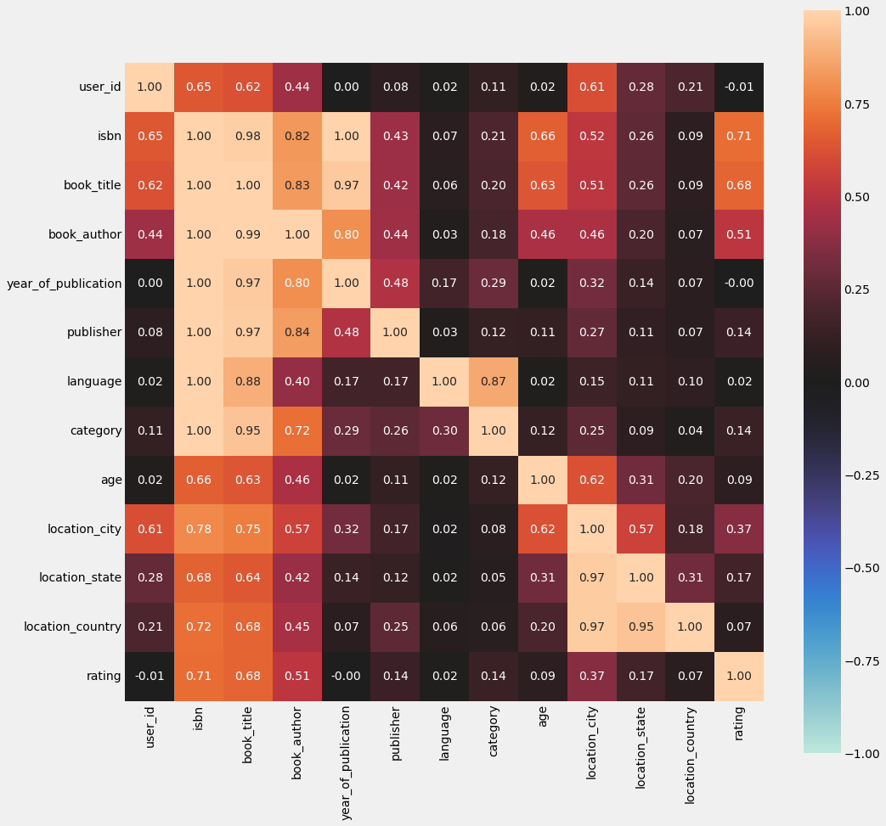

# boost-project-EDA

## 데이터 형태

- user
  -  약 6만8천명의 고객 메타데이터
    - user_id, location, age

- ratings
  - 총 30만개의 평점
  - user_id, isbn (책이름), **rating**

- books
  - 149570개의 책 정보 메타데이터
  - isbn, book_title, book_author, year_of_publication, publisher, img_url, language, category, summary, img_path
    - img_url은 이미지 정보
    - summary는 아마 서평일듯

## EDA 및 feature engineering의 방향?

EDA는 잘 되어 있으나, 어떻게 feature를 선택하고 조정할지 방향을 잡기 위해서 책 summary를 참고했다. https://machinelearningmastery.com/feature-engineering-and-selection-book-review/

- 이미지 및 책 요약은 따로 자연어처리 및 비전 쪽 접근이 필요함.
- 현재 feature만으로 target과의 유사성을 발견할 수 있는가?
- target과 직접적 연관이 있을 만한 새로운 feature를 만들 수 있는가?
  
- 코랩 데이터 랑 같은지?

- miss forest

[The Search for Categorical Correlation](https://towardsdatascience.com/the-search-for-categorical-correlation-a1cf7f1888c9)

- Cramer's V, Theil's U 에 대한 설명
  - Cramer's V 는 nominal features간의 상관관계를 설명할 수 있지만, xy = yx 라서 대칭적인 문제가 생긴다. 
  - Theil's U는 xy $\neq$ yx 인 형태의 좀더 보완적인 상관계수이다.

- Theil's U correlation heatmap 플롯 성공 (약 6분 걸림)
  