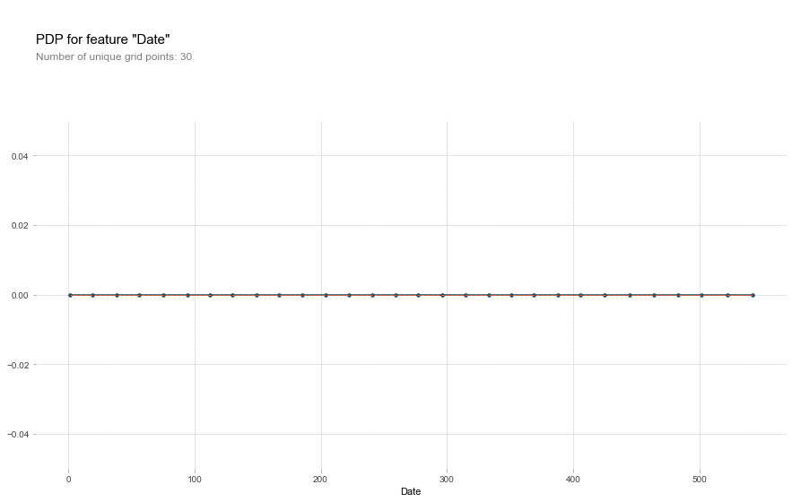

---
layout:	post
title: Project Section 2 - Machine Learning
categories: [projects]
tag: [machine learning, kaggle]

---


# Prediction : Rain in Australia

## 프로젝트 데이터 : Rain in Australia
호주의 여러 지역에서 측정된 온도, 풍향, 습도 등 주어진 데이터를 통해 다음날 비가 왔는지를 예측해 볼 수 있다.

**Target : RainTomorrow (Yes or No)**

### 데이터를 선정한 이유
기상청에서도 잘 예측하지 못하여 우리가 늘 불평하는 날씨 예보. 우리 스스로는 얼마나 정확하게 이를 예측할 수 있는지 머신러닝으로 확인해 보고 싶었다.

- 문제의 유형 -> yes or no 를 판별하는 것이므로 **Classification** 문제로 접근한다.


```python
import numpy as np
import pandas as pd
import matplotlib.pyplot as plt

from sklearn.model_selection import train_test_split, cross_val_score
from category_encoders import OneHotEncoder, TargetEncoder, OrdinalEncoder
from sklearn.feature_selection import f_regression, SelectKBest
from sklearn.impute import SimpleImputer
from sklearn.linear_model import Ridge, LogisticRegression, LinearRegression
from sklearn.pipeline import make_pipeline, Pipeline
from sklearn.preprocessing import StandardScaler
from sklearn.metrics import accuracy_score, f1_score, classification_report


from xgboost import XGBClassifier
from sklearn.tree import DecisionTreeClassifier
from sklearn.ensemble import RandomForestClassifier, RandomForestRegressor
from sklearn.model_selection import RandomizedSearchCV
from lightgbm import LGBMClassifier

import missingno as msno
import seaborn as sns

import imblearn
from imblearn.over_sampling import RandomOverSampler

from scipy.stats import randint, uniform


```


```python
pd.read_csv('/Users/wooseokpark/Documents/codestates/rain-in-aus/weatherAUS.csv').head()
```


<div>
<style scoped>
    .dataframe tbody tr th:only-of-type {
        vertical-align: middle;
    }

    .dataframe tbody tr th {
        vertical-align: top;
    }
    
    .dataframe thead th {
        text-align: right;
    }
</style>
<table border="1" class="dataframe">
  <thead>
    <tr style="text-align: right;">
      <th></th>
      <th>Date</th>
      <th>Location</th>
      <th>MinTemp</th>
      <th>MaxTemp</th>
      <th>Rainfall</th>
      <th>Evaporation</th>
      <th>Sunshine</th>
      <th>WindGustDir</th>
      <th>WindGustSpeed</th>
      <th>WindDir9am</th>
      <th>...</th>
      <th>Humidity9am</th>
      <th>Humidity3pm</th>
      <th>Pressure9am</th>
      <th>Pressure3pm</th>
      <th>Cloud9am</th>
      <th>Cloud3pm</th>
      <th>Temp9am</th>
      <th>Temp3pm</th>
      <th>RainToday</th>
      <th>RainTomorrow</th>
    </tr>
  </thead>
  <tbody>
    <tr>
      <th>0</th>
      <td>2008-12-01</td>
      <td>Albury</td>
      <td>13.4</td>
      <td>22.9</td>
      <td>0.6</td>
      <td>NaN</td>
      <td>NaN</td>
      <td>W</td>
      <td>44.0</td>
      <td>W</td>
      <td>...</td>
      <td>71.0</td>
      <td>22.0</td>
      <td>1007.7</td>
      <td>1007.1</td>
      <td>8.0</td>
      <td>NaN</td>
      <td>16.9</td>
      <td>21.8</td>
      <td>No</td>
      <td>No</td>
    </tr>
    <tr>
      <th>1</th>
      <td>2008-12-02</td>
      <td>Albury</td>
      <td>7.4</td>
      <td>25.1</td>
      <td>0.0</td>
      <td>NaN</td>
      <td>NaN</td>
      <td>WNW</td>
      <td>44.0</td>
      <td>NNW</td>
      <td>...</td>
      <td>44.0</td>
      <td>25.0</td>
      <td>1010.6</td>
      <td>1007.8</td>
      <td>NaN</td>
      <td>NaN</td>
      <td>17.2</td>
      <td>24.3</td>
      <td>No</td>
      <td>No</td>
    </tr>
    <tr>
      <th>2</th>
      <td>2008-12-03</td>
      <td>Albury</td>
      <td>12.9</td>
      <td>25.7</td>
      <td>0.0</td>
      <td>NaN</td>
      <td>NaN</td>
      <td>WSW</td>
      <td>46.0</td>
      <td>W</td>
      <td>...</td>
      <td>38.0</td>
      <td>30.0</td>
      <td>1007.6</td>
      <td>1008.7</td>
      <td>NaN</td>
      <td>2.0</td>
      <td>21.0</td>
      <td>23.2</td>
      <td>No</td>
      <td>No</td>
    </tr>
    <tr>
      <th>3</th>
      <td>2008-12-04</td>
      <td>Albury</td>
      <td>9.2</td>
      <td>28.0</td>
      <td>0.0</td>
      <td>NaN</td>
      <td>NaN</td>
      <td>NE</td>
      <td>24.0</td>
      <td>SE</td>
      <td>...</td>
      <td>45.0</td>
      <td>16.0</td>
      <td>1017.6</td>
      <td>1012.8</td>
      <td>NaN</td>
      <td>NaN</td>
      <td>18.1</td>
      <td>26.5</td>
      <td>No</td>
      <td>No</td>
    </tr>
    <tr>
      <th>4</th>
      <td>2008-12-05</td>
      <td>Albury</td>
      <td>17.5</td>
      <td>32.3</td>
      <td>1.0</td>
      <td>NaN</td>
      <td>NaN</td>
      <td>W</td>
      <td>41.0</td>
      <td>ENE</td>
      <td>...</td>
      <td>82.0</td>
      <td>33.0</td>
      <td>1010.8</td>
      <td>1006.0</td>
      <td>7.0</td>
      <td>8.0</td>
      <td>17.8</td>
      <td>29.7</td>
      <td>No</td>
      <td>No</td>
    </tr>
  </tbody>
</table>
<p>5 rows × 23 columns</p>
</div>


### Baseline model 설정 : 항상 비가 오지 않는 것으로 예측


```python
aus_base = pd.read_csv('/Users/wooseokpark/Documents/codestates/rain-in-aus/weatherAUS.csv')

# yes -> 1, no -> 0 으로 바꾸어줌
def yesno(x):
    if x == 'Yes':
        return 1
    elif x == 'No':
        return 0
    
aus_base['RainToday'] = aus_base['RainToday'].apply(yesno)
aus_base['RainTomorrow'] = aus_base['RainTomorrow'].apply(yesno)

# 결측치 제거
aus_base = aus_base.dropna(subset=['RainToday', 'RainTomorrow'])

# baseline model - 항상 비가 오지 않을 것으로 예측
y_pred_base = pd.DataFrame({'RainTomorrow':np.zeros(len(aus_base['RainToday']))})
y_test = aus_base[['RainTomorrow']]

accuracy = classification_report(y_test[:-1], y_pred_base[:-1])
print(accuracy)
```

                  precision    recall  f1-score   support
    
             0.0       0.78      1.00      0.88    109585
             1.0       0.00      0.00      0.00     31201
    
        accuracy                           0.78    140786
       macro avg       0.39      0.50      0.44    140786
    weighted avg       0.61      0.78      0.68    140786


    /Users/wooseokpark/miniforge3/envs/kaggle/lib/python3.8/site-packages/sklearn/metrics/_classification.py:1308: UndefinedMetricWarning: Precision and F-score are ill-defined and being set to 0.0 in labels with no predicted samples. Use `zero_division` parameter to control this behavior.
      _warn_prf(average, modifier, msg_start, len(result))
    /Users/wooseokpark/miniforge3/envs/kaggle/lib/python3.8/site-packages/sklearn/metrics/_classification.py:1308: UndefinedMetricWarning: Precision and F-score are ill-defined and being set to 0.0 in labels with no predicted samples. Use `zero_division` parameter to control this behavior.
      _warn_prf(average, modifier, msg_start, len(result))
    /Users/wooseokpark/miniforge3/envs/kaggle/lib/python3.8/site-packages/sklearn/metrics/_classification.py:1308: UndefinedMetricWarning: Precision and F-score are ill-defined and being set to 0.0 in labels with no predicted samples. Use `zero_division` parameter to control this behavior.
      _warn_prf(average, modifier, msg_start, len(result))


baseline model 결과:  
이미 accuracy가 78%에 달한다. 상당한 imbalance가 타겟에 존재하기 때문.  
averaged f1 score : 0.44

### EDA 및 데이터 전처리


```python
# feature 간의 correlation 파악하기 
# 높은 correlation 보이는 feature들은 통일하거나 없앤다.

plt.figure(figsize=(10,10))
sns.heatmap(aus_base.corr(),
           annot=True,
           cmap='rainbow')
```


    <AxesSubplot:>


​    


```python
aus_base_high = aus_base.corr().copy()
aus_base_high[~(aus_base_high > 0.7) ] = 0

plt.figure(figsize=(10,10))
sns.heatmap(aus_base_high,
           annot=True,
           )
```


    <AxesSubplot:>


​    


Temperature 그리고 pressure 끼리 상당히 높은 correlation을 보이고 있다.  
따라서 mean Temperature / mean pressure 지표를 만들어 통일한다.

#### 결측치 확인


```python
%matplotlib inline
msno.bar(aus_base)
```


    <AxesSubplot:>


​    


Evaporation, Sunshine, Cloud는 너무 결측치가 많고 유추하기도 힘들기 때문에 관련 파라미터는 모두 제거한다.

### 데이터 전처리


```python
aus = pd.read_csv('/Users/wooseokpark/Documents/codestates/rain-in-aus/weatherAUS.csv')
print(aus.shape)


#RainToday, RainTomorrow 결측치 행 제거
aus = aus.dropna(subset=['RainToday','RainTomorrow'])

# evaporation, sunshine, cloud는 너무 결측치가 많고 유추하기도 힘들다. 따라서 그냥 제거한다
aus = aus.drop(['Evaporation','Sunshine','Cloud9am','Cloud3pm'], axis=1)

#기타 결측치 제거
aus = aus.dropna()
print('After dropna:',aus.shape)


#RainToday and RainTomorrow values change to 0 and 1
def yesno(x):
    if x == 'Yes':
        return 1
    elif x == 'No':
        return 0
aus['RainToday'] = aus['RainToday'].apply(yesno)
aus['RainTomorrow'] = aus['RainTomorrow'].apply(yesno)

#meanTemp 계산
aus['MeanTemp'] = aus.loc[:,['MinTemp', 'MaxTemp', 'Temp9am', 'Temp3pm']].mean(axis=1)

#meanpressure 계산
aus['MeanPressure'] = aus.loc[:,['Pressure9am', 'Pressure3pm']].mean(axis=1)


```

    (145460, 23)
    After dropna: (112925, 19)


WindDir (바람의 방향) : 16가지 방향으로 나뉘어져 있다. 이를 manual 하게 동쪽 : 0 부터 시계방향으로 0~15까지 숫자를 매겼다


```python
aus.loc[:,['WindGustDir', 'WindDir9am', 'WindDir3pm']]
```


<div>
<style scoped>
    .dataframe tbody tr th:only-of-type {
        vertical-align: middle;
    }

    .dataframe tbody tr th {
        vertical-align: top;
    }
    
    .dataframe thead th {
        text-align: right;
    }
</style>
<table border="1" class="dataframe">
  <thead>
    <tr style="text-align: right;">
      <th></th>
      <th>WindGustDir</th>
      <th>WindDir9am</th>
      <th>WindDir3pm</th>
    </tr>
  </thead>
  <tbody>
    <tr>
      <th>0</th>
      <td>W</td>
      <td>W</td>
      <td>WNW</td>
    </tr>
    <tr>
      <th>1</th>
      <td>WNW</td>
      <td>NNW</td>
      <td>WSW</td>
    </tr>
    <tr>
      <th>2</th>
      <td>WSW</td>
      <td>W</td>
      <td>WSW</td>
    </tr>
    <tr>
      <th>3</th>
      <td>NE</td>
      <td>SE</td>
      <td>E</td>
    </tr>
    <tr>
      <th>4</th>
      <td>W</td>
      <td>ENE</td>
      <td>NW</td>
    </tr>
    <tr>
      <th>...</th>
      <td>...</td>
      <td>...</td>
      <td>...</td>
    </tr>
    <tr>
      <th>145454</th>
      <td>E</td>
      <td>ESE</td>
      <td>E</td>
    </tr>
    <tr>
      <th>145455</th>
      <td>E</td>
      <td>SE</td>
      <td>ENE</td>
    </tr>
    <tr>
      <th>145456</th>
      <td>NNW</td>
      <td>SE</td>
      <td>N</td>
    </tr>
    <tr>
      <th>145457</th>
      <td>N</td>
      <td>SE</td>
      <td>WNW</td>
    </tr>
    <tr>
      <th>145458</th>
      <td>SE</td>
      <td>SSE</td>
      <td>N</td>
    </tr>
  </tbody>
</table>
<p>112925 rows × 3 columns</p>
</div>


```python
# WindDir manual encoding

def dir_to_num(valdir):

    ref = {'E':0,
         'ESE':1,
         'SE':2,
         'SSE':3,
         'S':4,
         'SSW':5,
         'SW':6,
         'WSW':7,
         'W':8,
         'WNW':9,
         'NW':10,
         'NNW':11,
         'N':12,
         'NNE':13,
         'NE':14,
         'ENE':15
         }
    return ref[valdir]

aus['WindGustDir'] = aus['WindGustDir'].apply(dir_to_num)
aus['WindDir9am'] = aus['WindDir9am'].apply(dir_to_num)
aus['WindDir3pm'] = aus['WindDir3pm'].apply(dir_to_num)

aus.loc[:,['WindGustDir', 'WindDir9am', 'WindDir3pm']]


```


<div>
<style scoped>
    .dataframe tbody tr th:only-of-type {
        vertical-align: middle;
    }

    .dataframe tbody tr th {
        vertical-align: top;
    }
    
    .dataframe thead th {
        text-align: right;
    }
</style>
<table border="1" class="dataframe">
  <thead>
    <tr style="text-align: right;">
      <th></th>
      <th>WindGustDir</th>
      <th>WindDir9am</th>
      <th>WindDir3pm</th>
    </tr>
  </thead>
  <tbody>
    <tr>
      <th>0</th>
      <td>8</td>
      <td>8</td>
      <td>9</td>
    </tr>
    <tr>
      <th>1</th>
      <td>9</td>
      <td>11</td>
      <td>7</td>
    </tr>
    <tr>
      <th>2</th>
      <td>7</td>
      <td>8</td>
      <td>7</td>
    </tr>
    <tr>
      <th>3</th>
      <td>14</td>
      <td>2</td>
      <td>0</td>
    </tr>
    <tr>
      <th>4</th>
      <td>8</td>
      <td>15</td>
      <td>10</td>
    </tr>
    <tr>
      <th>...</th>
      <td>...</td>
      <td>...</td>
      <td>...</td>
    </tr>
    <tr>
      <th>145454</th>
      <td>0</td>
      <td>1</td>
      <td>0</td>
    </tr>
    <tr>
      <th>145455</th>
      <td>0</td>
      <td>2</td>
      <td>15</td>
    </tr>
    <tr>
      <th>145456</th>
      <td>11</td>
      <td>2</td>
      <td>12</td>
    </tr>
    <tr>
      <th>145457</th>
      <td>12</td>
      <td>2</td>
      <td>9</td>
    </tr>
    <tr>
      <th>145458</th>
      <td>2</td>
      <td>3</td>
      <td>12</td>
    </tr>
  </tbody>
</table>
<p>112925 rows × 3 columns</p>
</div>


```python
# train / test 나누기. 2016년부터 test data로 남겨둠
train = aus[aus['Date'] <= '2016']
test = aus[aus['Date'] > '2016']
train.shape, test.shape

# feature and target selection
features = train.columns.drop(['MinTemp', 'MaxTemp', 'Temp9am', 'Temp3pm', 
                               'Pressure9am', 'Pressure3pm',
                               'RainTomorrow'])
target = 'RainTomorrow'


X_train = train[features]
y_train = train[target]

X_test = test[features]
y_test = test[target]

```

### Oversampling

타겟 데이터의 불균형이 4:1 정도이므로, 모델 학습에서 불균형을 줄이기 위해   
적은 데이터(내일 비가 오는 데이터)를 oversampling 하여 **늘어난 훈련 데이터**를 만든다.


```python
# Oversample RainTomorrow = 1 data
oversample = RandomOverSampler(sampling_strategy='minority', random_state=33)

X_over, y_over = oversample.fit_resample(X_train, y_train)

X_train.shape, X_over.shape
```


    ((92513, 14), (144352, 14))


**Encoding and Scale**  

OrdinalEncoder : Date, Location  
Scale : Rainfall, WindGustSpeed, WindSpeed9am, WindSpeed3pm, Humidity9am, Humidity3pm,
MeanTemp, MeanPressure

### 머신러닝 모델 성능 비교

LogisticRegression / DecisionTree / LightGBM / RandomForestClassifier 로 모델 성능을 비교하였다.  
LogisticRegression은 파라미터 조정 없이 Cross-validation 진행.  
나머지 모델들은 RandomizedSearchCV 를 이용해 최적의 파라미터를 탐색하였다.

**Logistic Regression**


```python
pipe_logreg = make_pipeline(
        OrdinalEncoder(cols=['Date','Location']),
        StandardScaler(),
        LogisticRegression()
)
    

logreg_score = cross_val_score(
                    pipe_logreg,
                    X_over,
                    y_over,
                    cv=5,
                    n_jobs=-1,
                    verbose=0,
                    scoring='f1'
                )

print(logreg_score)
print('Logistic Regression average F1 score:', logreg_score.mean())
```

    [0.69937944 0.74522206 0.76719357 0.78049295 0.74465542]
    Logistic Regression average F1 score: 0.7473886885326441


**Decision Tree**


```python
pipe = make_pipeline(
        OrdinalEncoder(cols=['Date','Location']),
        StandardScaler(),
        DecisionTreeClassifier()
)
    
params = {
    'decisiontreeclassifier__max_depth': [1,3,5,7],
    'decisiontreeclassifier__min_samples_split': [2,4,6,8],

    
}
    
clf = RandomizedSearchCV(
            pipe,
            param_distributions=params,
            n_iter=50,
            cv=5,
            scoring='f1',
            verbose=1,
            n_jobs=-1
)
    
clf.fit(X_over, y_over)
```

    /Users/wooseokpark/miniforge3/envs/kaggle/lib/python3.8/site-packages/sklearn/model_selection/_search.py:292: UserWarning: The total space of parameters 16 is smaller than n_iter=50. Running 16 iterations. For exhaustive searches, use GridSearchCV.
      warnings.warn(


    Fitting 5 folds for each of 16 candidates, totalling 80 fits


    RandomizedSearchCV(cv=5,
                       estimator=Pipeline(steps=[('ordinalencoder',
                                                  OrdinalEncoder(cols=['Date',
                                                                       'Location'])),
                                                 ('standardscaler',
                                                  StandardScaler()),
                                                 ('decisiontreeclassifier',
                                                  DecisionTreeClassifier())]),
                       n_iter=50, n_jobs=-1,
                       param_distributions={'decisiontreeclassifier__max_depth': [1,
                                                                                  3,
                                                                                  5,
                                                                                  7],
                                            'decisiontreeclassifier__min_samples_split': [2,
                                                                                          4,
                                                                                          6,
                                                                                          8]},
                       scoring='f1', verbose=1)


```python
pd.DataFrame(clf.cv_results_).sort_values(by='rank_test_score').T
```


<div>
<style scoped>
    .dataframe tbody tr th:only-of-type {
        vertical-align: middle;
    }

    .dataframe tbody tr th {
        vertical-align: top;
    }
    
    .dataframe thead th {
        text-align: right;
    }
</style>
<table border="1" class="dataframe">
  <thead>
    <tr style="text-align: right;">
      <th></th>
      <th>0</th>
      <th>1</th>
      <th>2</th>
      <th>3</th>
      <th>4</th>
      <th>5</th>
      <th>6</th>
      <th>7</th>
      <th>8</th>
      <th>9</th>
      <th>10</th>
      <th>11</th>
      <th>12</th>
      <th>13</th>
      <th>14</th>
      <th>15</th>
    </tr>
  </thead>
  <tbody>
    <tr>
      <th>mean_fit_time</th>
      <td>0.22319</td>
      <td>0.209858</td>
      <td>0.179838</td>
      <td>0.166378</td>
      <td>0.253024</td>
      <td>0.242938</td>
      <td>0.256142</td>
      <td>0.23632</td>
      <td>0.445896</td>
      <td>0.494152</td>
      <td>0.485721</td>
      <td>0.467065</td>
      <td>0.535603</td>
      <td>0.606884</td>
      <td>0.651005</td>
      <td>0.524421</td>
    </tr>
    <tr>
      <th>std_fit_time</th>
      <td>0.027555</td>
      <td>0.017316</td>
      <td>0.032001</td>
      <td>0.020163</td>
      <td>0.009928</td>
      <td>0.010386</td>
      <td>0.016071</td>
      <td>0.005868</td>
      <td>0.070705</td>
      <td>0.026301</td>
      <td>0.01693</td>
      <td>0.042583</td>
      <td>0.06431</td>
      <td>0.020495</td>
      <td>0.025295</td>
      <td>0.066093</td>
    </tr>
    <tr>
      <th>mean_score_time</th>
      <td>0.020056</td>
      <td>0.019619</td>
      <td>0.016686</td>
      <td>0.01563</td>
      <td>0.015374</td>
      <td>0.013213</td>
      <td>0.013777</td>
      <td>0.013032</td>
      <td>0.01918</td>
      <td>0.024833</td>
      <td>0.020666</td>
      <td>0.022771</td>
      <td>0.019853</td>
      <td>0.022331</td>
      <td>0.01678</td>
      <td>0.014882</td>
    </tr>
    <tr>
      <th>std_score_time</th>
      <td>0.004059</td>
      <td>0.007369</td>
      <td>0.003456</td>
      <td>0.001711</td>
      <td>0.002222</td>
      <td>0.000935</td>
      <td>0.001083</td>
      <td>0.001224</td>
      <td>0.003779</td>
      <td>0.011583</td>
      <td>0.006651</td>
      <td>0.011298</td>
      <td>0.002675</td>
      <td>0.005866</td>
      <td>0.001942</td>
      <td>0.002268</td>
    </tr>
    <tr>
      <th>param_decisiontreeclassifier__min_samples_split</th>
      <td>2</td>
      <td>4</td>
      <td>6</td>
      <td>8</td>
      <td>2</td>
      <td>4</td>
      <td>6</td>
      <td>8</td>
      <td>2</td>
      <td>4</td>
      <td>6</td>
      <td>8</td>
      <td>2</td>
      <td>4</td>
      <td>6</td>
      <td>8</td>
    </tr>
    <tr>
      <th>param_decisiontreeclassifier__max_depth</th>
      <td>1</td>
      <td>1</td>
      <td>1</td>
      <td>1</td>
      <td>3</td>
      <td>3</td>
      <td>3</td>
      <td>3</td>
      <td>5</td>
      <td>5</td>
      <td>5</td>
      <td>5</td>
      <td>7</td>
      <td>7</td>
      <td>7</td>
      <td>7</td>
    </tr>
    <tr>
      <th>params</th>
      <td>{'decisiontreeclassifier__min_samples_split': ...</td>
      <td>{'decisiontreeclassifier__min_samples_split': ...</td>
      <td>{'decisiontreeclassifier__min_samples_split': ...</td>
      <td>{'decisiontreeclassifier__min_samples_split': ...</td>
      <td>{'decisiontreeclassifier__min_samples_split': ...</td>
      <td>{'decisiontreeclassifier__min_samples_split': ...</td>
      <td>{'decisiontreeclassifier__min_samples_split': ...</td>
      <td>{'decisiontreeclassifier__min_samples_split': ...</td>
      <td>{'decisiontreeclassifier__min_samples_split': ...</td>
      <td>{'decisiontreeclassifier__min_samples_split': ...</td>
      <td>{'decisiontreeclassifier__min_samples_split': ...</td>
      <td>{'decisiontreeclassifier__min_samples_split': ...</td>
      <td>{'decisiontreeclassifier__min_samples_split': ...</td>
      <td>{'decisiontreeclassifier__min_samples_split': ...</td>
      <td>{'decisiontreeclassifier__min_samples_split': ...</td>
      <td>{'decisiontreeclassifier__min_samples_split': ...</td>
    </tr>
    <tr>
      <th>split0_test_score</th>
      <td>0.711589</td>
      <td>0.711589</td>
      <td>0.711589</td>
      <td>0.711589</td>
      <td>0.599446</td>
      <td>0.599446</td>
      <td>0.599446</td>
      <td>0.599446</td>
      <td>0.572485</td>
      <td>0.572485</td>
      <td>0.572485</td>
      <td>0.572485</td>
      <td>0.568051</td>
      <td>0.568051</td>
      <td>0.568051</td>
      <td>0.568051</td>
    </tr>
    <tr>
      <th>split1_test_score</th>
      <td>0.677544</td>
      <td>0.677544</td>
      <td>0.677544</td>
      <td>0.677544</td>
      <td>0.725957</td>
      <td>0.725957</td>
      <td>0.725957</td>
      <td>0.725957</td>
      <td>0.745404</td>
      <td>0.745404</td>
      <td>0.745404</td>
      <td>0.745404</td>
      <td>0.644303</td>
      <td>0.644303</td>
      <td>0.644303</td>
      <td>0.644303</td>
    </tr>
    <tr>
      <th>split2_test_score</th>
      <td>0.700325</td>
      <td>0.700325</td>
      <td>0.700325</td>
      <td>0.700325</td>
      <td>0.737965</td>
      <td>0.737965</td>
      <td>0.737965</td>
      <td>0.737965</td>
      <td>0.753299</td>
      <td>0.753299</td>
      <td>0.753299</td>
      <td>0.753299</td>
      <td>0.737473</td>
      <td>0.737473</td>
      <td>0.737473</td>
      <td>0.737473</td>
    </tr>
    <tr>
      <th>split3_test_score</th>
      <td>0.721713</td>
      <td>0.721713</td>
      <td>0.721713</td>
      <td>0.721713</td>
      <td>0.759908</td>
      <td>0.759908</td>
      <td>0.759908</td>
      <td>0.759908</td>
      <td>0.723223</td>
      <td>0.723223</td>
      <td>0.723223</td>
      <td>0.723223</td>
      <td>0.699072</td>
      <td>0.699072</td>
      <td>0.699072</td>
      <td>0.699072</td>
    </tr>
    <tr>
      <th>split4_test_score</th>
      <td>0.724821</td>
      <td>0.724821</td>
      <td>0.724821</td>
      <td>0.724821</td>
      <td>0.52958</td>
      <td>0.52958</td>
      <td>0.52958</td>
      <td>0.52958</td>
      <td>0.528457</td>
      <td>0.528457</td>
      <td>0.528457</td>
      <td>0.528457</td>
      <td>0.553491</td>
      <td>0.553491</td>
      <td>0.553491</td>
      <td>0.553491</td>
    </tr>
    <tr>
      <th>mean_test_score</th>
      <td>0.707198</td>
      <td>0.707198</td>
      <td>0.707198</td>
      <td>0.707198</td>
      <td>0.670571</td>
      <td>0.670571</td>
      <td>0.670571</td>
      <td>0.670571</td>
      <td>0.664574</td>
      <td>0.664574</td>
      <td>0.664574</td>
      <td>0.664574</td>
      <td>0.640478</td>
      <td>0.640478</td>
      <td>0.640478</td>
      <td>0.640478</td>
    </tr>
    <tr>
      <th>std_test_score</th>
      <td>0.01713</td>
      <td>0.01713</td>
      <td>0.01713</td>
      <td>0.01713</td>
      <td>0.090031</td>
      <td>0.090031</td>
      <td>0.090031</td>
      <td>0.090031</td>
      <td>0.094714</td>
      <td>0.094714</td>
      <td>0.094714</td>
      <td>0.094714</td>
      <td>0.07165</td>
      <td>0.07165</td>
      <td>0.07165</td>
      <td>0.07165</td>
    </tr>
    <tr>
      <th>rank_test_score</th>
      <td>1</td>
      <td>1</td>
      <td>1</td>
      <td>1</td>
      <td>5</td>
      <td>5</td>
      <td>5</td>
      <td>5</td>
      <td>9</td>
      <td>9</td>
      <td>9</td>
      <td>9</td>
      <td>13</td>
      <td>13</td>
      <td>13</td>
      <td>13</td>
    </tr>
  </tbody>
</table>
</div>


```python
pipe = make_pipeline(
        OrdinalEncoder(cols=['Date','Location']),
        StandardScaler(),
        LGBMClassifier()
)
    
params = {
    'lgbmclassifier__num_leaves': [10,30,50,70,100],
    'lgbmclassifier__max_depth': [3,5,10,-1],
    'lgbmclassifier__n_estimators': randint(50,500),
    
}
    
clf = RandomizedSearchCV(
            pipe,
            param_distributions=params,
            n_iter=50,
            cv=5,
            scoring='f1',
            verbose=1,
            n_jobs=-1
)
    
clf.fit(X_over, y_over)
```

    Fitting 5 folds for each of 50 candidates, totalling 250 fits


    RandomizedSearchCV(cv=5,
                       estimator=Pipeline(steps=[('ordinalencoder',
                                                  OrdinalEncoder(cols=['Date',
                                                                       'Location'])),
                                                 ('standardscaler',
                                                  StandardScaler()),
                                                 ('lgbmclassifier',
                                                  LGBMClassifier())]),
                       n_iter=50, n_jobs=-1,
                       param_distributions={'lgbmclassifier__max_depth': [3, 5, 10,
                                                                          -1],
                                            'lgbmclassifier__n_estimators': <scipy.stats._distn_infrastructure.rv_frozen object at 0x17cc6c7c0>,
                                            'lgbmclassifier__num_leaves': [10, 30,
                                                                           50, 70,
                                                                           100]},
                       scoring='f1', verbose=1)


```python
pd.DataFrame(clf.cv_results_).sort_values(by='rank_test_score').T
```


<div>
<style scoped>
    .dataframe tbody tr th:only-of-type {
        vertical-align: middle;
    }

    .dataframe tbody tr th {
        vertical-align: top;
    }
    
    .dataframe thead th {
        text-align: right;
    }
</style>
<table border="1" class="dataframe">
  <thead>
    <tr style="text-align: right;">
      <th></th>
      <th>37</th>
      <th>24</th>
      <th>41</th>
      <th>2</th>
      <th>40</th>
      <th>10</th>
      <th>33</th>
      <th>17</th>
      <th>49</th>
      <th>5</th>
      <th>...</th>
      <th>28</th>
      <th>23</th>
      <th>16</th>
      <th>14</th>
      <th>3</th>
      <th>7</th>
      <th>18</th>
      <th>42</th>
      <th>29</th>
      <th>13</th>
    </tr>
  </thead>
  <tbody>
    <tr>
      <th>mean_fit_time</th>
      <td>4.219508</td>
      <td>3.764854</td>
      <td>4.306744</td>
      <td>3.156075</td>
      <td>2.349996</td>
      <td>2.541239</td>
      <td>4.259221</td>
      <td>1.800981</td>
      <td>1.66846</td>
      <td>1.34132</td>
      <td>...</td>
      <td>2.759526</td>
      <td>2.395341</td>
      <td>2.256996</td>
      <td>2.123278</td>
      <td>1.988234</td>
      <td>1.834243</td>
      <td>1.680075</td>
      <td>1.553194</td>
      <td>1.528168</td>
      <td>1.032888</td>
    </tr>
    <tr>
      <th>std_fit_time</th>
      <td>0.025445</td>
      <td>0.042325</td>
      <td>0.067512</td>
      <td>0.085179</td>
      <td>0.087475</td>
      <td>0.409916</td>
      <td>0.706967</td>
      <td>0.022493</td>
      <td>0.162522</td>
      <td>0.020239</td>
      <td>...</td>
      <td>0.04435</td>
      <td>0.056451</td>
      <td>0.057923</td>
      <td>0.056624</td>
      <td>0.056956</td>
      <td>0.04116</td>
      <td>0.061096</td>
      <td>0.06149</td>
      <td>0.210253</td>
      <td>0.114712</td>
    </tr>
    <tr>
      <th>mean_score_time</th>
      <td>1.094693</td>
      <td>0.974488</td>
      <td>1.090016</td>
      <td>0.74212</td>
      <td>0.541942</td>
      <td>0.58872</td>
      <td>0.896226</td>
      <td>0.403414</td>
      <td>0.304468</td>
      <td>0.236299</td>
      <td>...</td>
      <td>0.32611</td>
      <td>0.302356</td>
      <td>0.271547</td>
      <td>0.226404</td>
      <td>0.220156</td>
      <td>0.227446</td>
      <td>0.209443</td>
      <td>0.175871</td>
      <td>0.149758</td>
      <td>0.132405</td>
    </tr>
    <tr>
      <th>std_score_time</th>
      <td>0.076576</td>
      <td>0.089018</td>
      <td>0.048744</td>
      <td>0.044101</td>
      <td>0.090773</td>
      <td>0.043904</td>
      <td>0.067684</td>
      <td>0.051595</td>
      <td>0.060979</td>
      <td>0.070231</td>
      <td>...</td>
      <td>0.018696</td>
      <td>0.012853</td>
      <td>0.011062</td>
      <td>0.024468</td>
      <td>0.030404</td>
      <td>0.008416</td>
      <td>0.01983</td>
      <td>0.026374</td>
      <td>0.009124</td>
      <td>0.02512</td>
    </tr>
    <tr>
      <th>param_lgbmclassifier__max_depth</th>
      <td>10</td>
      <td>10</td>
      <td>10</td>
      <td>10</td>
      <td>10</td>
      <td>10</td>
      <td>10</td>
      <td>10</td>
      <td>10</td>
      <td>10</td>
      <td>...</td>
      <td>3</td>
      <td>3</td>
      <td>3</td>
      <td>3</td>
      <td>3</td>
      <td>3</td>
      <td>3</td>
      <td>3</td>
      <td>3</td>
      <td>3</td>
    </tr>
    <tr>
      <th>param_lgbmclassifier__n_estimators</th>
      <td>422</td>
      <td>401</td>
      <td>482</td>
      <td>376</td>
      <td>166</td>
      <td>238</td>
      <td>478</td>
      <td>162</td>
      <td>149</td>
      <td>84</td>
      <td>...</td>
      <td>370</td>
      <td>331</td>
      <td>337</td>
      <td>309</td>
      <td>290</td>
      <td>279</td>
      <td>238</td>
      <td>166</td>
      <td>160</td>
      <td>145</td>
    </tr>
    <tr>
      <th>param_lgbmclassifier__num_leaves</th>
      <td>70</td>
      <td>70</td>
      <td>50</td>
      <td>50</td>
      <td>100</td>
      <td>70</td>
      <td>30</td>
      <td>70</td>
      <td>70</td>
      <td>100</td>
      <td>...</td>
      <td>50</td>
      <td>70</td>
      <td>10</td>
      <td>70</td>
      <td>30</td>
      <td>50</td>
      <td>30</td>
      <td>30</td>
      <td>10</td>
      <td>70</td>
    </tr>
    <tr>
      <th>params</th>
      <td>{'lgbmclassifier__max_depth': 10, 'lgbmclassif...</td>
      <td>{'lgbmclassifier__max_depth': 10, 'lgbmclassif...</td>
      <td>{'lgbmclassifier__max_depth': 10, 'lgbmclassif...</td>
      <td>{'lgbmclassifier__max_depth': 10, 'lgbmclassif...</td>
      <td>{'lgbmclassifier__max_depth': 10, 'lgbmclassif...</td>
      <td>{'lgbmclassifier__max_depth': 10, 'lgbmclassif...</td>
      <td>{'lgbmclassifier__max_depth': 10, 'lgbmclassif...</td>
      <td>{'lgbmclassifier__max_depth': 10, 'lgbmclassif...</td>
      <td>{'lgbmclassifier__max_depth': 10, 'lgbmclassif...</td>
      <td>{'lgbmclassifier__max_depth': 10, 'lgbmclassif...</td>
      <td>...</td>
      <td>{'lgbmclassifier__max_depth': 3, 'lgbmclassifi...</td>
      <td>{'lgbmclassifier__max_depth': 3, 'lgbmclassifi...</td>
      <td>{'lgbmclassifier__max_depth': 3, 'lgbmclassifi...</td>
      <td>{'lgbmclassifier__max_depth': 3, 'lgbmclassifi...</td>
      <td>{'lgbmclassifier__max_depth': 3, 'lgbmclassifi...</td>
      <td>{'lgbmclassifier__max_depth': 3, 'lgbmclassifi...</td>
      <td>{'lgbmclassifier__max_depth': 3, 'lgbmclassifi...</td>
      <td>{'lgbmclassifier__max_depth': 3, 'lgbmclassifi...</td>
      <td>{'lgbmclassifier__max_depth': 3, 'lgbmclassifi...</td>
      <td>{'lgbmclassifier__max_depth': 3, 'lgbmclassifi...</td>
    </tr>
    <tr>
      <th>split0_test_score</th>
      <td>0.630437</td>
      <td>0.629394</td>
      <td>0.626181</td>
      <td>0.619804</td>
      <td>0.618312</td>
      <td>0.616617</td>
      <td>0.613681</td>
      <td>0.609884</td>
      <td>0.608624</td>
      <td>0.604069</td>
      <td>...</td>
      <td>0.585883</td>
      <td>0.584696</td>
      <td>0.585227</td>
      <td>0.584149</td>
      <td>0.583905</td>
      <td>0.583432</td>
      <td>0.582553</td>
      <td>0.580554</td>
      <td>0.580219</td>
      <td>0.579771</td>
    </tr>
    <tr>
      <th>split1_test_score</th>
      <td>0.632802</td>
      <td>0.631683</td>
      <td>0.623159</td>
      <td>0.61674</td>
      <td>0.617589</td>
      <td>0.616696</td>
      <td>0.605544</td>
      <td>0.606989</td>
      <td>0.605156</td>
      <td>0.600612</td>
      <td>...</td>
      <td>0.574079</td>
      <td>0.574688</td>
      <td>0.574118</td>
      <td>0.573405</td>
      <td>0.572888</td>
      <td>0.572411</td>
      <td>0.571254</td>
      <td>0.568521</td>
      <td>0.567693</td>
      <td>0.566418</td>
    </tr>
    <tr>
      <th>split2_test_score</th>
      <td>0.650821</td>
      <td>0.650056</td>
      <td>0.645726</td>
      <td>0.640243</td>
      <td>0.637135</td>
      <td>0.635962</td>
      <td>0.629665</td>
      <td>0.627273</td>
      <td>0.626521</td>
      <td>0.620158</td>
      <td>...</td>
      <td>0.596098</td>
      <td>0.595005</td>
      <td>0.594382</td>
      <td>0.596393</td>
      <td>0.595068</td>
      <td>0.594655</td>
      <td>0.595327</td>
      <td>0.596965</td>
      <td>0.59694</td>
      <td>0.595247</td>
    </tr>
    <tr>
      <th>split3_test_score</th>
      <td>0.670301</td>
      <td>0.669457</td>
      <td>0.667275</td>
      <td>0.660928</td>
      <td>0.653284</td>
      <td>0.652239</td>
      <td>0.641967</td>
      <td>0.645451</td>
      <td>0.643125</td>
      <td>0.64577</td>
      <td>...</td>
      <td>0.599586</td>
      <td>0.599917</td>
      <td>0.600114</td>
      <td>0.598865</td>
      <td>0.59828</td>
      <td>0.598807</td>
      <td>0.599095</td>
      <td>0.599812</td>
      <td>0.599645</td>
      <td>0.600063</td>
    </tr>
    <tr>
      <th>split4_test_score</th>
      <td>0.640071</td>
      <td>0.638424</td>
      <td>0.632721</td>
      <td>0.625411</td>
      <td>0.622127</td>
      <td>0.620179</td>
      <td>0.615748</td>
      <td>0.609611</td>
      <td>0.607448</td>
      <td>0.604228</td>
      <td>...</td>
      <td>0.579559</td>
      <td>0.578751</td>
      <td>0.579036</td>
      <td>0.578725</td>
      <td>0.57817</td>
      <td>0.577957</td>
      <td>0.576805</td>
      <td>0.572829</td>
      <td>0.573238</td>
      <td>0.573202</td>
    </tr>
    <tr>
      <th>mean_test_score</th>
      <td>0.644886</td>
      <td>0.643803</td>
      <td>0.639012</td>
      <td>0.632625</td>
      <td>0.629689</td>
      <td>0.628338</td>
      <td>0.621321</td>
      <td>0.619841</td>
      <td>0.618175</td>
      <td>0.614967</td>
      <td>...</td>
      <td>0.587041</td>
      <td>0.586611</td>
      <td>0.586575</td>
      <td>0.586307</td>
      <td>0.585663</td>
      <td>0.585453</td>
      <td>0.585007</td>
      <td>0.583736</td>
      <td>0.583547</td>
      <td>0.58294</td>
    </tr>
    <tr>
      <th>std_test_score</th>
      <td>0.014554</td>
      <td>0.014702</td>
      <td>0.016121</td>
      <td>0.016296</td>
      <td>0.013749</td>
      <td>0.01392</td>
      <td>0.012917</td>
      <td>0.014697</td>
      <td>0.014615</td>
      <td>0.016828</td>
      <td>...</td>
      <td>0.009641</td>
      <td>0.009541</td>
      <td>0.009572</td>
      <td>0.00988</td>
      <td>0.009696</td>
      <td>0.009934</td>
      <td>0.010653</td>
      <td>0.012602</td>
      <td>0.012706</td>
      <td>0.012826</td>
    </tr>
    <tr>
      <th>rank_test_score</th>
      <td>1</td>
      <td>2</td>
      <td>3</td>
      <td>4</td>
      <td>5</td>
      <td>6</td>
      <td>7</td>
      <td>8</td>
      <td>9</td>
      <td>10</td>
      <td>...</td>
      <td>41</td>
      <td>42</td>
      <td>43</td>
      <td>44</td>
      <td>45</td>
      <td>46</td>
      <td>47</td>
      <td>48</td>
      <td>49</td>
      <td>50</td>
    </tr>
  </tbody>
</table>
<p>16 rows × 50 columns</p>
</div>


```python
pipe = make_pipeline(
        OrdinalEncoder(cols=['Date','Location']),
        StandardScaler(),
        RandomForestClassifier()
)
    
params = {
    'randomforestclassifier__max_depth': [5, 10, 15, 20, None],
    'randomforestclassifier__n_estimators': [20,50,100,200], #50, 500
    'randomforestclassifier__max_features': uniform(0,1)

    
}
    
clf = RandomizedSearchCV(
            pipe,
            param_distributions=params,
            n_iter=20,
            cv=3,
            scoring='f1',
            verbose=1,
            n_jobs=-1
)
    
clf.fit(X_over, y_over)
```

    Fitting 3 folds for each of 20 candidates, totalling 60 fits


    RandomizedSearchCV(cv=3,
                       estimator=Pipeline(steps=[('ordinalencoder',
                                                  OrdinalEncoder(cols=['Date',
                                                                       'Location'])),
                                                 ('standardscaler',
                                                  StandardScaler()),
                                                 ('randomforestclassifier',
                                                  RandomForestClassifier())]),
                       n_iter=20, n_jobs=-1,
                       param_distributions={'randomforestclassifier__max_depth': [5,
                                                                                  10,
                                                                                  15,
                                                                                  20,
                                                                                  None],
                                            'randomforestclassifier__max_features': <scipy.stats._distn_infrastructure.rv_frozen object at 0x17ddd3a90>,
                                            'randomforestclassifier__n_estimators': [20,
                                                                                     50,
                                                                                     100,
                                                                                     200]},
                       scoring='f1', verbose=1)


```python
pd.DataFrame(clf.cv_results_).sort_values(by='rank_test_score').T
```


<div>
<style scoped>
    .dataframe tbody tr th:only-of-type {
        vertical-align: middle;
    }

    .dataframe tbody tr th {
        vertical-align: top;
    }
    
    .dataframe thead th {
        text-align: right;
    }
</style>
<table border="1" class="dataframe">
  <thead>
    <tr style="text-align: right;">
      <th></th>
      <th>3</th>
      <th>9</th>
      <th>16</th>
      <th>2</th>
      <th>19</th>
      <th>1</th>
      <th>14</th>
      <th>17</th>
      <th>4</th>
      <th>11</th>
      <th>12</th>
      <th>7</th>
      <th>0</th>
      <th>6</th>
      <th>10</th>
      <th>15</th>
      <th>8</th>
      <th>13</th>
      <th>5</th>
      <th>18</th>
    </tr>
  </thead>
  <tbody>
    <tr>
      <th>mean_fit_time</th>
      <td>4.050528</td>
      <td>20.172477</td>
      <td>59.841853</td>
      <td>17.109839</td>
      <td>16.343223</td>
      <td>6.83256</td>
      <td>95.6871</td>
      <td>2.475331</td>
      <td>77.207505</td>
      <td>17.910049</td>
      <td>47.169729</td>
      <td>10.570477</td>
      <td>10.100644</td>
      <td>8.240047</td>
      <td>77.194378</td>
      <td>13.478534</td>
      <td>24.702126</td>
      <td>29.732548</td>
      <td>20.515289</td>
      <td>5.366548</td>
    </tr>
    <tr>
      <th>std_fit_time</th>
      <td>0.063132</td>
      <td>0.211569</td>
      <td>2.238457</td>
      <td>0.364082</td>
      <td>0.096798</td>
      <td>0.150363</td>
      <td>0.967968</td>
      <td>0.05469</td>
      <td>1.523949</td>
      <td>0.352815</td>
      <td>1.450605</td>
      <td>0.373929</td>
      <td>0.55232</td>
      <td>0.399419</td>
      <td>2.451861</td>
      <td>0.395503</td>
      <td>0.780268</td>
      <td>1.131228</td>
      <td>1.145458</td>
      <td>0.161022</td>
    </tr>
    <tr>
      <th>mean_score_time</th>
      <td>0.508217</td>
      <td>0.327155</td>
      <td>0.478551</td>
      <td>0.310827</td>
      <td>0.759938</td>
      <td>0.14836</td>
      <td>0.620624</td>
      <td>0.170673</td>
      <td>1.267898</td>
      <td>0.337097</td>
      <td>1.304811</td>
      <td>1.175422</td>
      <td>0.316759</td>
      <td>0.177816</td>
      <td>0.871294</td>
      <td>0.283727</td>
      <td>0.496786</td>
      <td>1.050092</td>
      <td>0.355683</td>
      <td>0.130447</td>
    </tr>
    <tr>
      <th>std_score_time</th>
      <td>0.063103</td>
      <td>0.044059</td>
      <td>0.050219</td>
      <td>0.056991</td>
      <td>0.107923</td>
      <td>0.010833</td>
      <td>0.059589</td>
      <td>0.017972</td>
      <td>0.184956</td>
      <td>0.049118</td>
      <td>0.174867</td>
      <td>0.118506</td>
      <td>0.024334</td>
      <td>0.01063</td>
      <td>0.142835</td>
      <td>0.02784</td>
      <td>0.058514</td>
      <td>0.106238</td>
      <td>0.066154</td>
      <td>0.019752</td>
    </tr>
    <tr>
      <th>param_randomforestclassifier__max_depth</th>
      <td>None</td>
      <td>None</td>
      <td>20</td>
      <td>20</td>
      <td>20</td>
      <td>20</td>
      <td>15</td>
      <td>15</td>
      <td>15</td>
      <td>15</td>
      <td>15</td>
      <td>10</td>
      <td>5</td>
      <td>5</td>
      <td>10</td>
      <td>10</td>
      <td>10</td>
      <td>10</td>
      <td>5</td>
      <td>10</td>
    </tr>
    <tr>
      <th>param_randomforestclassifier__max_features</th>
      <td>0.080046</td>
      <td>0.60764</td>
      <td>0.958576</td>
      <td>0.641576</td>
      <td>0.220544</td>
      <td>0.582523</td>
      <td>0.96526</td>
      <td>0.170668</td>
      <td>0.703753</td>
      <td>0.594817</td>
      <td>0.363315</td>
      <td>0.087454</td>
      <td>0.467111</td>
      <td>0.762574</td>
      <td>0.896585</td>
      <td>0.609305</td>
      <td>0.544591</td>
      <td>0.354559</td>
      <td>0.959535</td>
      <td>0.576953</td>
    </tr>
    <tr>
      <th>param_randomforestclassifier__n_estimators</th>
      <td>50</td>
      <td>50</td>
      <td>100</td>
      <td>50</td>
      <td>100</td>
      <td>20</td>
      <td>200</td>
      <td>20</td>
      <td>200</td>
      <td>50</td>
      <td>200</td>
      <td>200</td>
      <td>100</td>
      <td>50</td>
      <td>200</td>
      <td>50</td>
      <td>100</td>
      <td>200</td>
      <td>100</td>
      <td>20</td>
    </tr>
    <tr>
      <th>params</th>
      <td>{'randomforestclassifier__max_depth': None, 'r...</td>
      <td>{'randomforestclassifier__max_depth': None, 'r...</td>
      <td>{'randomforestclassifier__max_depth': 20, 'ran...</td>
      <td>{'randomforestclassifier__max_depth': 20, 'ran...</td>
      <td>{'randomforestclassifier__max_depth': 20, 'ran...</td>
      <td>{'randomforestclassifier__max_depth': 20, 'ran...</td>
      <td>{'randomforestclassifier__max_depth': 15, 'ran...</td>
      <td>{'randomforestclassifier__max_depth': 15, 'ran...</td>
      <td>{'randomforestclassifier__max_depth': 15, 'ran...</td>
      <td>{'randomforestclassifier__max_depth': 15, 'ran...</td>
      <td>{'randomforestclassifier__max_depth': 15, 'ran...</td>
      <td>{'randomforestclassifier__max_depth': 10, 'ran...</td>
      <td>{'randomforestclassifier__max_depth': 5, 'rand...</td>
      <td>{'randomforestclassifier__max_depth': 5, 'rand...</td>
      <td>{'randomforestclassifier__max_depth': 10, 'ran...</td>
      <td>{'randomforestclassifier__max_depth': 10, 'ran...</td>
      <td>{'randomforestclassifier__max_depth': 10, 'ran...</td>
      <td>{'randomforestclassifier__max_depth': 10, 'ran...</td>
      <td>{'randomforestclassifier__max_depth': 5, 'rand...</td>
      <td>{'randomforestclassifier__max_depth': 10, 'ran...</td>
    </tr>
    <tr>
      <th>split0_test_score</th>
      <td>0.666261</td>
      <td>0.664125</td>
      <td>0.661308</td>
      <td>0.662193</td>
      <td>0.663834</td>
      <td>0.661172</td>
      <td>0.64391</td>
      <td>0.636981</td>
      <td>0.645065</td>
      <td>0.644456</td>
      <td>0.644456</td>
      <td>0.600122</td>
      <td>0.57333</td>
      <td>0.570751</td>
      <td>0.603448</td>
      <td>0.601968</td>
      <td>0.601252</td>
      <td>0.600739</td>
      <td>0.569348</td>
      <td>0.600421</td>
    </tr>
    <tr>
      <th>split1_test_score</th>
      <td>0.783653</td>
      <td>0.692561</td>
      <td>0.688598</td>
      <td>0.685062</td>
      <td>0.678993</td>
      <td>0.684658</td>
      <td>0.674265</td>
      <td>0.696467</td>
      <td>0.672339</td>
      <td>0.671863</td>
      <td>0.665242</td>
      <td>0.715848</td>
      <td>0.718688</td>
      <td>0.704288</td>
      <td>0.62734</td>
      <td>0.622831</td>
      <td>0.621373</td>
      <td>0.618884</td>
      <td>0.688599</td>
      <td>0.619213</td>
    </tr>
    <tr>
      <th>split2_test_score</th>
      <td>0.684615</td>
      <td>0.668362</td>
      <td>0.665963</td>
      <td>0.666481</td>
      <td>0.668776</td>
      <td>0.665048</td>
      <td>0.639773</td>
      <td>0.623604</td>
      <td>0.638032</td>
      <td>0.636995</td>
      <td>0.635437</td>
      <td>0.579328</td>
      <td>0.539807</td>
      <td>0.537055</td>
      <td>0.577316</td>
      <td>0.575807</td>
      <td>0.574401</td>
      <td>0.575641</td>
      <td>0.536944</td>
      <td>0.574558</td>
    </tr>
    <tr>
      <th>mean_test_score</th>
      <td>0.711509</td>
      <td>0.675016</td>
      <td>0.671956</td>
      <td>0.671245</td>
      <td>0.670534</td>
      <td>0.670293</td>
      <td>0.65265</td>
      <td>0.652351</td>
      <td>0.651812</td>
      <td>0.651105</td>
      <td>0.648378</td>
      <td>0.631766</td>
      <td>0.610609</td>
      <td>0.604031</td>
      <td>0.602701</td>
      <td>0.600202</td>
      <td>0.599009</td>
      <td>0.598421</td>
      <td>0.598297</td>
      <td>0.598064</td>
    </tr>
    <tr>
      <th>std_test_score</th>
      <td>0.05156</td>
      <td>0.012526</td>
      <td>0.01192</td>
      <td>0.009925</td>
      <td>0.006312</td>
      <td>0.01028</td>
      <td>0.015378</td>
      <td>0.031669</td>
      <td>0.014796</td>
      <td>0.014991</td>
      <td>0.01248</td>
      <td>0.060058</td>
      <td>0.077639</td>
      <td>0.072214</td>
      <td>0.020429</td>
      <td>0.019238</td>
      <td>0.019242</td>
      <td>0.01773</td>
      <td>0.06521</td>
      <td>0.018306</td>
    </tr>
    <tr>
      <th>rank_test_score</th>
      <td>1</td>
      <td>2</td>
      <td>3</td>
      <td>4</td>
      <td>5</td>
      <td>6</td>
      <td>7</td>
      <td>8</td>
      <td>9</td>
      <td>10</td>
      <td>11</td>
      <td>12</td>
      <td>13</td>
      <td>14</td>
      <td>15</td>
      <td>16</td>
      <td>17</td>
      <td>18</td>
      <td>19</td>
      <td>20</td>
    </tr>
  </tbody>
</table>
</div>


### Best model : RandomForestClassifier - Test set에 적용하여 성능 평가


```python
best_pipe = clf.best_estimator_
```


```python
y_pred = best_pipe.predict(X_test)
print(classification_report(y_test, y_pred))
```

                  precision    recall  f1-score   support
    
               0       0.85      0.96      0.90     15730
               1       0.74      0.43      0.55      4682
    
        accuracy                           0.84     20412
       macro avg       0.80      0.69      0.72     20412
    weighted avg       0.82      0.84      0.82     20412


```python
'''
[Baseline Model classification report]
              precision    recall  f1-score   support

         0.0       0.78      1.00      0.88    109585
         1.0       0.00      0.00      0.00     31201

    accuracy                           0.78    140786
   macro avg       0.39      0.50      0.44    140786
weighted avg       0.61      0.78      0.68    140786
'''
```


    '\n[Baseline Model classification report]\n              precision    recall  f1-score   support\n\n         0.0       0.78      1.00      0.88    109585\n         1.0       0.00      0.00      0.00     31201\n\n    accuracy                           0.78    140786\n   macro avg       0.39      0.50      0.44    140786\nweighted avg       0.61      0.78      0.68    140786\n'


## 최종 모델 test 결과
baseline model 에 비해 test set 에서 accuracy 0.78 -> 0.84 로 상승.   
average f1-score 은 **0.44 -> 0.72** 로 상승.

## 머신러닝 모델 해석 - PDP Plot으로 특성들의 모델에 대한 기여도 확인


```python
y_pred = best_pipe.predict(X_test)
print(classification_report(y_test, y_pred))
```

                  precision    recall  f1-score   support
    
               0       0.86      0.95      0.90     15730
               1       0.74      0.47      0.58      4682
    
        accuracy                           0.84     20412
       macro avg       0.80      0.71      0.74     20412
    weighted avg       0.83      0.84      0.83     20412


```python
X_test.columns
```


    Index(['Date', 'Location', 'Rainfall', 'WindGustDir', 'WindGustSpeed',
           'WindDir9am', 'WindDir3pm', 'WindSpeed9am', 'WindSpeed3pm',
           'Humidity9am', 'Humidity3pm', 'RainToday', 'MeanTemp', 'MeanPressure'],
          dtype='object')


```python
X_test.Rainfall.max()
```


    225.0


```python
from pdpbox.pdp import pdp_isolate, pdp_plot

X_test_encoded = OrdinalEncoder(cols=['Date','Location']).fit_transform(X_test)

def pdpplot(feature):
    
    isolated = pdp_isolate(
        model=best_pipe, 
        dataset=X_test_encoded, 
        model_features=X_test_encoded.columns, 
        feature=feature,
        grid_type='percentile', # default='percentile', or 'equal'
        num_grid_points=30 # default=10
    )
    pdp_plot(isolated, feature_name=feature)

pdpplot('Rainfall')
```


​    


```python
pdpplot('Date')
```



​    


```python
pdpplot('MeanTemp')
```


​    


## Conclusion

- 호주 기상 데이터를 바탕으로 다음날 비가 내렸는지를 예측해 보았다.
- EDA 로 결측치 및 feature correlation 확인하였고, 특성공학을 수행하였다.
- Imbalanced 되어 있는 Target 에 대해 oversampling하여 훈련셋을 만들었다.
- LogisticRegression, DecisionTree, LightGBM, RandomForestClassifier 로 각각 CV를 적용한 모델 훈련 결과를 비교하였다.
- 가장 결과가 잘 나온 RandomForest 로 test 데이터에 적용해 보았고, baseline model 보다 상당한 성능 향상을 보였다.
- PDP Plot으로 몇 가지 feature들이 타겟 예측에 어떻게 기여했는지 살펴보았다.
- **모델이 어느 정도 날씨 예측 향상에 기여했다는 것을 확인했다.**

**아쉬운 점**
- feature importance를 살펴보지 못했다.
- 여전히 비가 오는 경우 예측의 recall 점수가 너무 낮았다.
- 좀더 다양한 모델과 hyperparameter 튜닝을 해보지 못해 아쉬웠다.
