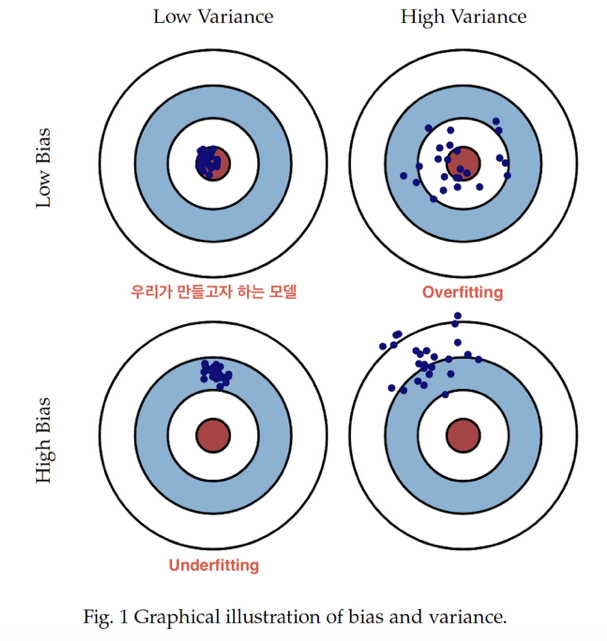

# Today I Learned - 211116

## Section 2. Machine Learning Section Challenge

챌린지 퀴즈 오답노트

1. 다항회귀모델은 선형모델이라고 볼 수 없다. -> X. 다항회귀 또한 선형모델을 포함하고 있다.

2. 분산이 크고 편향이 작은 모델은 과적합일 가능성이 크다 -> O. 과적합을 피하기 위해 분산을 줄이는 전략을 택한다.

   

   

3. 릿지 회귀모델 : 과적합을 피하기 위한 방법이므로 편향이 늘더라도 **분산을 줄이는** 방식을 수행하여 정규화를 진행한다.

4. pdp 라이브러리의 pdp_interact 를 통해 **두 가지**의 상관관계가 타겟에 미치는 영향을 살펴볼 수 있다. 세개는 4차원이라 시각화하기 힘들다.