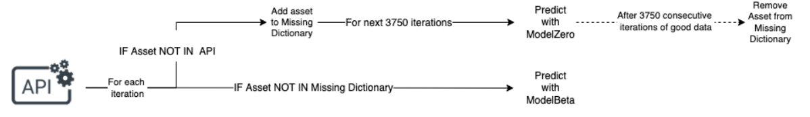

---
image:
  path:    /study/images/bitcoin-gold-cryptocurrency-trading-chart-smartphone-close-up-183385019.jpeg

layout: post

description: 캐글 G-research 암호화폐 예측 대회 공개 solution 학습 내용
---

# Kaggle G-research Winner's solutions 학습

Kaggle의 [G-research crypto forecasting](https://www.kaggle.com/competitions/g-research-crypto-forecasting) 대회에 참여하였고, Koreancow 팀명으로 참여하여 815/1947등 (상위 42%)의 성적을 거두었다. 처음으로 진행중인 competition에 참여하여 모델을 설계하고, 제출에 성공하여 evaluate 까지 받아 본 매우 뜻깊은 경험이었다. 아직 나의 데이터 분석 및 ML 모델링 능력이 많이 부족함을 여실히 깨달았지만, 좋은 첫 발이다. 

조만간 내가 제출한 notebook을 정리하여 포스팅할 예정이다.

submission 기한이 지나고 나서 solution 들이 공개되었는데, 그 중에서 Tom Forbes (최종 13등)와 sugghi (최종 3등)의 솔루션을 공부해 보았다. 참여한 대회의 솔루션을 공부해 보는 것은 처음이었고, 그래서 매우 집중이 잘 되었고 내가 무엇을 보완해야 하는지, 무엇이 부족했는지 생각해 볼 수 있었다.

아래는 간략한 정리 내용이다. 

## [Solution of 3rd](https://www.kaggle.com/competitions/g-research-crypto-forecasting/discussion/323703)

### Overview of the model

- 종가 (Close)만 사용됨.
- 7-fold cv with LightGBM
- 앙상블을 limited inference time 때문에 쓰지 못했다. 

### About the data used for training

- train 의 start date가 화폐마다 많이 달랐다.
- 빌드한 모델은 각 화폐 변동의 평균을 다루기 때문에, 훈련과 평가셋에서 크게 다르면 안된다고 생각했다.
- 결측치는 많지 않기 때문에 충분히 화폐들이 존재하는 기간만 가지고 훈련했다.
- 결측치를 forward fill (앞으로 채우기)로 채워서 rolling window 를 이용할때 오류가 나지 않게 했다. 이 때, 전체에서 forward fill 을 쓰면 긴 결측기간 때문에 데이터 질이 나빠질 것을 우려하여 fill의 limit 을 설정하였다 (*어떻게?*) 

### Feature engineering

- 암호화폐 가치가 증가하는 추세이기 때문에, 평가 기간에 상관없이 변화의 크기를 확실히 파악하려 했다.

- 다수의 lag period ? 를 보기 위해 두가지 feature을 추가했다. 

  1. log (현재가 / 특정 기간의 평균)
     기간 - 60, 300, 900 으로 설정함 (아마 60분, 300분, 900분인듯)

  2. log (현재가 / 어떤 기간 이전의 가격)

  이를 만들기 위해 모든 암호화폐를 평균내었다.

- 특정 암호화폐와 전체 암호화폐 평균의 차이도 feature로 추가되었다. 

  

## [Solution - Tom Forbes](https://www.kaggle.com/code/tomforbes/1st-place-6-weeks-in-final-submission)

### Summary

**17 features with lagged and timestamp averages for all models.**

- 기존의 9개 feature (timestamp를 포함시킴) 에 EMA (Exponential Moving Average), historical returns and historical volatility over various lookback periods를 추가했다.  
  8 개의 추가 feature: 

  - return30, return120 : 30분, 120분 전 시점에 비한 수익률
  - volatility15, 200 : 15 - 500분전 동안의 변동성 / 200 - 2000분전 동안의 변동성

  - ema21, 35, 80, 250 : 21분, 35분, 80분, 250분 전부터 현 시점까지의 EMA (즉 21,35,80,250분 동안의 EMA)

**Ensembles of LGBM and Keras NN models.** 

- ensemble 은 복잡한 것이 아니고 단순 평균 내는 방식이다. 

**Target Engineering and prediction switching.**

*( based on[ link](https://www.kaggle.com/code/gengdaiziwang/are-we-training-models-on-an-inaccurate-target/notebook) )* 

- TargetZero = A target based on 15 minute Forward Return only
- TargetBeta = TargetZero + Beta Component
- ModelZero = Model(s) trained on TargetZero
- ModelBeta = Model(s) trained on TargetBeta

train 내 결측치는 이전값으로 채워진 것으로 보이나, train 내 target은 단지 NaN padding된 데이터로부터 계산된 것으로 보여짐. 이에 따라 타겟을 2개로 분할하여 독립된 모델로 학습시킴.

1. 기존 15분 이후 수익률
2. [beta component] 주어진 자산과 시장과의 관계. 관계없을시 0이 됨.

**Some training on extra cryptos outside competition scope.**