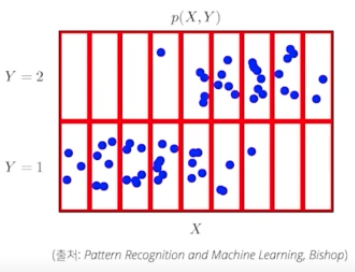

# 2022-09-22 Naver boostcamp 일일노트

## 확률론

### 확률분포는 데이터의 초상화

- X 공간에서 Y가 라벨링 될때, 결합분포 P(x,y)를 구할 수 있고 이를 통해 D를 모델링 할 수 있다. D는 이산확률분포/연속확률분포 둘 다로 모델링 할 수 있다.
- P(x)는 입력 x에 대한 확률분포인데 y에 대한 정보를 주지 않는다.
- 로지스틱 회귀에서 사용한 선형모델 + 소프트맥스 함수 (신경망) 은
  데이터에서 추출된 패턴을 기반으로 확률을 해석한다.
- 분류 문제에서는, softmax($$W \phi + b$$) 가 데이터 x로부터 "x일때 정답이 y일 확률" = P(y \| x) 를 특징패턴 $$\phi(x)$$ 와 가중치행렬 W를 통해 계산한다. 
- 회귀 문제의 경우, y가 이산적으로 분포하지 않고 연속적이기 때문에 연속확률분포를 통해 조건부기대값 E(y \| x)를 계산한다.
조건부기대값을 사용하는 이유? -- L2 norm을 최소화하는 함수 f(x)가 곧 조건부기대값이기 때문이다. (잘 이해안됨. 증명되었다고 함.)  

## Lecture : AI & Math FAQ , 임성빈 마스터

- Problem Solving Loop

  다 풀수 있는 문제 말고, 처음 보는 문제를 접하는 것이 중요
  Define -> Brainstorm -> Implement -> Analyze
  문제를 정의하고 -> 솔루션 구하고 -> 기술적으로 구현 -> 결과 테스트 및 문서화

- 추천시스템 공부할 때 알아야 할 내용?

  Dive into Deep Learning 16장 - 관련 내용이 많이 나옴.

- Multi-Armed Bandit
  중요한 테크닉이니 공부하는 것이 좋음. 해볼것.

