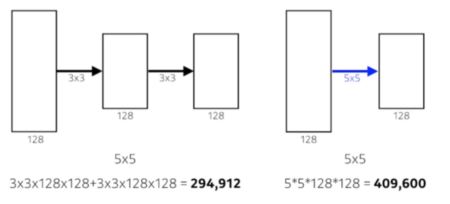
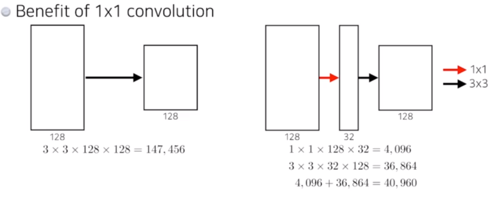
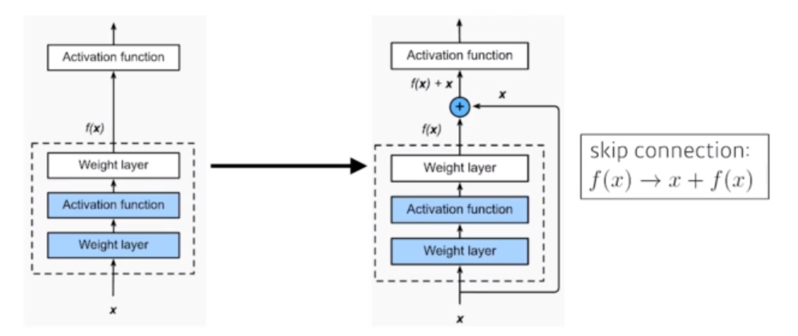
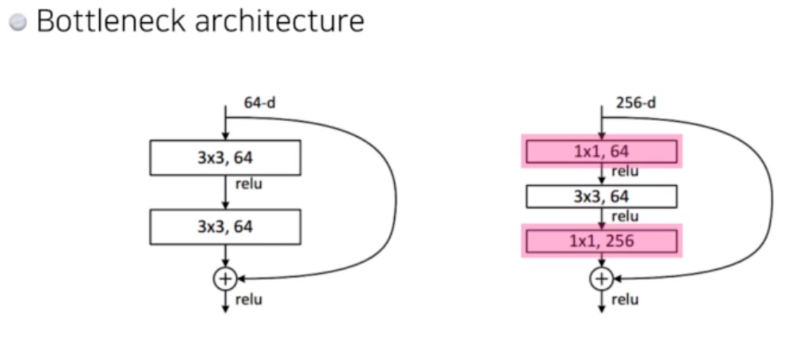
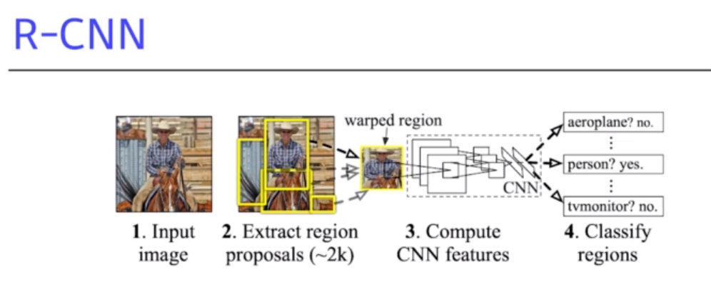
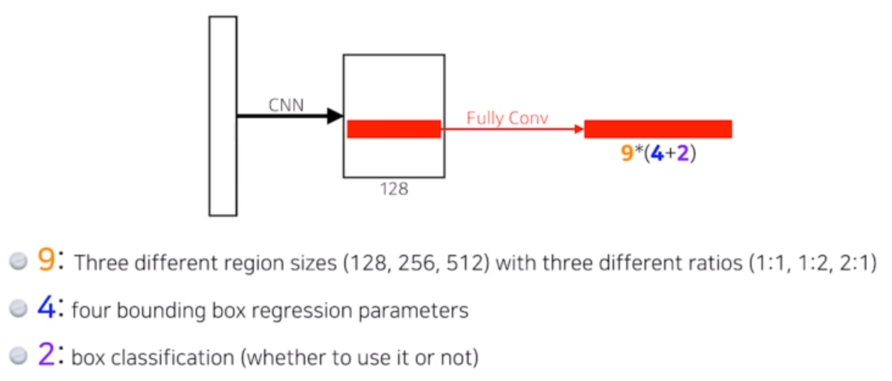
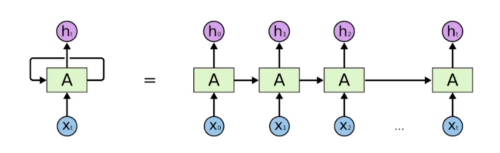
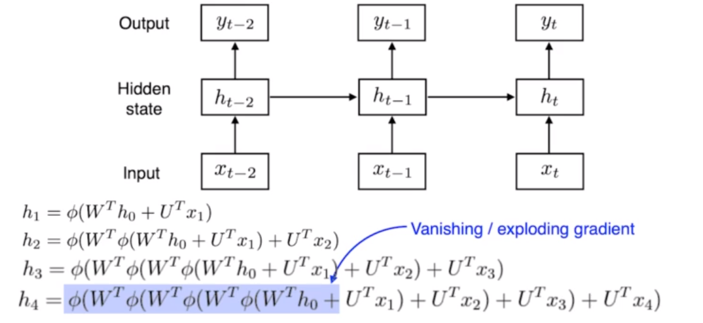
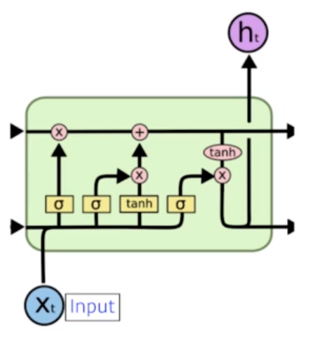

# 2022-10-06 Naver boostcamp 일일노트

## Convolutional Neural Networks

- 최근에는 끝단의 Fully Connected Layer을 줄이고 있는 추세. FCL에서는 파라미터의 급격한 증가로 이는 실제 데이터 적용했을때 성능의 저하를 불러옴.
- Deep한 뉴럴넷이면서 파라미터 개수를 줄이는 식으로 딥러닝 모델이 발전된다. 

### Parameter number
- padding, striding은 파라미터 숫자와 **무관**
- 인풋과 아웃풋의 채널 이것이 파라미터 숫자에 어떻게 적용되는지 아직 이해가 안됨. 추가 학습하기.
- 1x1 convolution
	+ 1x1xC 로 아웃풋 채널을 C 로 줄일 수 있다. 
	+ 파라미터 숫자를 줄일 수 있다.
	
### Modern Convolutional Neural Networks
- ILSVRC

- AlexNet
	+ 왜 성공했는지?
		* ReLU 사용 
			- linear 모델의 좋은 성질들을 보존함.
			- 작은 slope 가 누적되어 생기는 그래디언트 감소 현상을 극복함
		* GPU 사용
		* Data augmentation, Dropout 활용
	
- VGGNet
	+ 중요한점 : 3x3 convolution filter만 사용함
		* 왜?
		
		* 인식 필드, Receptive field는 필터 크기가 커질수록 커짐. 인식하는 크기가 커지기 때문. 
		
		* 3x3 두개 활용하면 Receptive field가 5x5 와 같지만, 파라미터 수는 훨씬 적다. 
		
		  
		
		  
	
- GoogLeNet
	+ Network in Network (NIN) 구조 
	
	+ ILSVRC 2014년 우승
	
	+ 1x1 Conv Inception block 사용 
	
	  
	
- ResNet
	+ Deeper NN 은 많은 파라미터 때문에 오버피팅이 발생함.
	
	+ 네트워크가 커질수록 학습 효과를 기대하기 어려워짐
	
	+ **Skip connection** - 그래서 identity map 을 더함   
    $$ f(x) \rightarrow x + f(x) $$  
    
  	
  	연결을 skip하여 입력 데이터를 출력 데이터에 **더해줌**. x는 이미 전달되므로 모델은 차이점을 학습하게 됨
  	
		- 그 효과로 **더 깊은 모델에서의 학습을 용이**하게 함.
		
		- identity map을 nonlinear activation 뒤에도 더하게 되는데, 이때 차원을 맞춰야 더하는게 됨. 그렇기 때문에 1x1 convolution으로 입력과 출력의 차원을 맞춰줌.
		
		- Bottleneck architecture
			+ 1x1 을 앞뒤로 넣어주어서, 파라미터를 줄이고 + identity map 을 더하기 위해 차원 맞추는 것 까지 수행함. 
			
			  
			
			  
			
	
- DenseNet
	+ ResNet에서 사용했던 addition 대신에, concatenation을 수행함. 
	+ 그럼 concat 수행이 누적되면서 뒷채널이 급격히 커지게 된다. 채널을 줄여야 함. 
		* Dense Block으로 concat 축적. 
		* Transition Block 으로 채널 수를 줄임
		  - BatchNorm -> 1x1 Conv -> 2x2 AvgPooling
		* 늘였다 - 줄였다 를 반복하면서 진행 
	+ 븐류 문제에 있어서 매우 강력한 성능.
		* ResNet, DenseNet을 활용하면 중간 이상은 간다! 

### Computer Vision applications
- Semantic Segmentation
	+ 이미지의 모든 픽셀이 어떤 라벨인지 분류하는 것.
	+ Fully Convolutional Network
		* 뒤의 Dense Layer를 없애고, 1x1xlabel output을 만드는 것.
		* Dense Layer과 파라미터 개수는 정확히 같음.
		* FC를 Convolution layer로 바꿈으로써 아웃풋을 heatmap으로 바꿀 수 있다. 
		* 아웃풋 이미지는 일반적으로 사이즈는 줄어들게 되는데, 이를 upsampling하여 사이즈를 늘리는 것이 필요함.
	- Deconvolution
		+ 엄밀하게는 정확히 역과정은 아니다. padding을 많이 해서 적용시킴. 

- Semantic Detection
	+ R-CNN (Regional CNN)
		
		
		
		* 단점 : 이미지당 bounding box를 2000개 뽑았다면, 2000번 CNN 을 돌려야 하는 연산적 문제가 있다. 
		
	+ SPPNet
		* CNN을 먼저 돌리고, bounding box로 그 지역의 tensor를 갖고 오는 방식 (이미지 당 CNN 한 번만 연산)
		
	
	- Fast R-CNN
	
	- Faster R-CNN
		+ Region proposal (bounding box를 뽑아내는 방법) 도 네트워크로 학습함. -> Region Proposal Network
		
		+ bbox 안에 유의미한 물체가 있을지 없을지를 판별
		
		+ Region Proposal Network
			
			
			
			
		
	- YOLO
		+ 아주 빠름. "You Only Look Once"
		+ bounding box와 class 분류를 동시에 진행함 
		+ [원리에 대해 추가 학습 필요]
	

## Recurrent Neural Network (RNN)

### Sequential Model
- Sequential Data
	+ 데이터의 길이가 정해져 있지 않음.
	+ 데이터의 길이와 상관없이 모델이 동작해야 함.
- Markov Model 
	+ 직전 데이터에만 의존하는 특징
	+ 장점 : Joint Distribution 을 표현하기 쉬움 
- Latent autoregressive model
	- 중간에 hidden state가 들어가며, 이는 과거의 정보 요약을 담고 있다. 

### Recurrent Neural Network

- 단점 : short-term dependencies
	+ 먼 과거인 정보일수록 다음으로 넘어가기 힘듬. 
	 
	- ReLU는 exploding gradient 문제로 인해 RNN에서 잘 쓰지 않는다. 
	
- LSTM (Long-Short Term Memory)
	
	
	
	+ Previous cell state - 밖으로 안나가는 이전 정보들의 요약
	+ Previous hidden state - 이전에서의 output