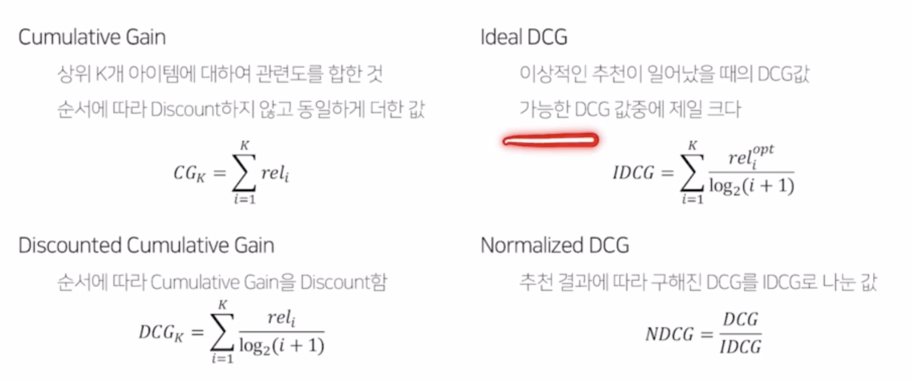

# 2022-10-12 Naver boostcamp 일일노트 

## 추천 시스템이란

- Long tail 추천 : 
  수요가 많은 대중적인 상품이 아니라, 수요가 적은 소수의 선호 상품들을 많이 소비하게 됨. 이를 예측하는 것이 중요

  - 사례 : 조회수 적어도 유튜브에서 관련 영상을 추천하는 경우

- 사용 데이터

  - 유저 관련 정보
    - 식별자 
    - 데모그래픽 정보
      (성별, 연령, 지역, 관심사 - 요즘은 동의해야하만 수집 가능하므로 '추정'으로 정보를 수집하기도 함)
    - 유저 행동 정보(페이지 방문 기록, 구매 등 기록)
  - 아이템 관련 정보
    - 아이템 id, 고유 정보 (장르, 출연 배우, 상품 카테고리, 작곡가 등

  - 유저 - 아이템 상호작용 정보
    - Feedback (Explicit, Implicit)
      - Explicit - 아이템에 대한 만족도를 직접 물어본 경우
      - Implicit - 유저가 직접 평가한게 아니라, 클릭하거나 구매한 경우
      - Implicit 데이터가 압도적으로 많음 

### 추천 문제: 랭킹 또는 예측 

- 랭킹 : 유저에게 적합한 아이템 Top K개를 추천하는 문제  ->  분류와 비슷
  - Top K개를 선정하기 위한 스코어가 필요
  - 평가 지표: Precision, Recall, MAP 등
- 예측 
  - 유저가 아이템을 가질 선호도를 정확하게 예측  -> 회귀와 비슷
    - Explicit Feedback 예측 - 영화에 내릴 평점값 예측
    - Implicit Feedback 예측 - 스마트폰을 조회하거나 구매할 확률 예측
    - 평가 지표 : MAE, RMSE, AUC

### 추천 시스템의 성능 평가는 어떻게?

- 비즈니스 / 서비스 관점

  - 매출, PV의 증가 
  - CTR의 상승 (Click-Through Rate)

- 품질 관점

  - 연관성 : 추천된 아이템이 유저에게 연관이 있는가?
  - 다양성 : 얼마나 다양한 아이템이 Top-K에 들어가는가?
  - 새로움 : 얼마나 새로운 아이템이 추천되는가?
  - 참신함 : 유저가 기대하지 못한 뜻밖의 괜찮은 아이템이 잘 추천되는가?

- Offline Test

  - 추천 모델을 검증하기 위해 **가장 우선적**으로 수행되는 단계

  - Serving bias 존재

    - 오프라인 데이터는 업데이트가 없지만, 실제 온라인 데이터는 지속적으로 업데이트가 되는 차이가 있기 때문

  - Precision

    - Precision@K - K 개 가운데 실제 유저가 관심있는 아이템

      ^

      |

      v

    - Recall@K - 유저가 관심있는 전체 아이템 가운데 우리가 추천한 비율 

    - Mean Average Precision(MAP) @K

      - AP@K : 유저 당 Precision 1~K 까지의 평균값
      - MAP@K : 모든 유저에 대한 AP값의 평균

    - **NDCG (Normalized Discounted Cumulative Gain)**

      - 추천 시스템에 가장 많이 사용되는 지표

      - Formula

        

  - Online A/B Test

    - 오프라인에서 검증된 가설이나 모델을 이용해 실제 추천 결과를 서빙하는 단계
      - 대조군(A)와 실험군(B)에서 실제 서빙으로 성능을 평가. AB 두 실험 환경은 최대한 동일해야 함 
      - 실제 서비스를 통해 결과로 최종 의사결정이 이루어짐
    - 현업에서 최종 지표는 모델 성능이 아닌, CTR, 매출 등의 비지니스 지표 (결국 돈이 되어야 결정하는듯)

### 인기도 기반 추천

- 인기도의 척도?
  - 조회수, 좋아요 수 등

  - 어떻게 스코어를 만들어야 할까?
    - 조회수가 가장 많은 아이템을 추천 (뉴스)
    - 평균 평점이 가장 높은 아이템을 추천 (맛집)
    - score 방식
      - Hacker News Formula
      - Reddit Formula - vote가 늘어날 수록 score의 증가폭이 작아짐
        ( 오래된 포스팅일수록 아주 많은 vote가 있어야 우선순위 score를 가짐)
      - Steam Rating Formula
        - 좋아요, 싫어요 로 rating 구성

### 연관 분석  -  고전적인 추천 방식

- 추천 시스템에서는 여전히 딥러닝보다는 전통적인 머신러닝 기법을 많이 이용함

  - 많은 유저가 사용하는 서비스에서 큰 트래픽과 latency를 감당하기가 어렵다. 
  - CV, NLP 보다 딥러닝이 크게 차별성을 보이지 않기 때문에, 전통적 머신러닝 기법이 아직 많이 쓰이고 있다.

- 연관 규칙 분석

  - 장바구니 분석 혹은 서열 분석이라고도 불림
    - 상품의 구매 조회 등 연속된 거래들 사이의 규칙을 찾는 것.
  - 규칙
    condition -> result
  - 연관 규칙
    특정 사건이 발생했을 때 함께 frequent하게 발생하는 사건의 규칙
  - antecedent: {빵, 버터} - consequent: {우유}
    서로 겹치면 안된다는 규칙이 있음

- 연관 규칙 척도

  - **support, confidence, lift** (개별적으로 공부해 볼 것)

    

- Mining Association Rules

  - 주어진 트랜잭션 가운데 가능한 모든 연관 규칙을 찾는다

    - support > minimum support
    - conf >= minimum confidence
    - 이를 만족하는 모든 연관 규칙 어떻게 찾음?
      - Brute-force approach 로 모든 규칙에 대해서 개별 계산 -> 많은 계산량 요구

  - 그럼 효율적인 Association Rule mining 어떻게?

     AR mining에서는  두가지 스텝이 필수다

    1. Frequent Itemset Generation
       : minimum support 이상의 모든 itemset 생성 -> **가장 많은 연산**
    2. Rule Generation
       : association rule 을 생성 -> {antecedent} - {consequent}

    - **Aprioiri 알고리즘** : 가지치기를 활용하여 탐색해야 하는 M을 줄인다.
    - 이외 여러 알고리즘이 있음

### TF-IDF를 활용한 컨텐츠 기반 추천

- 컨텐츠 기반 추천

  - 유저 x가 과거에 선호한 아이템과 비슷한 아이템을 유저 x에게 추천
    (같은 감독의 영화나, 같은 장르의 음악)
  - 컨텐츠 기반 추천의 장단점
    - 장점 : 다른 유저 데이터가 필요  추천 아이템에 대한 설명이 가능
    - 단점 : 아이템의 적합한 feature를 찾는 것이 어려움 - feature란 이미지, 텍스트 등 여러 종류가 있을 수 있기 때문에 전처리에 시간 소요
      / 한 분야, 장르의 추천 결과만 계속 나올 수 있음.
      다른 유저 데이터를 활용할 수 없음.

- Item Profile

  - 아이템의 feature로 구성된 item profile을 만들어야 함
  - 다양한 속성을 표현하는 방법 -> **Vector 형태**

- TF-IDF for text feature

  - 아이템의 벡터화

- User Profile 기반 추천하기

  - 유저가 과거 선호했던 item list 가 있고 이는 TF-IDF로 vector화 됨

  - 유사도 - Cosine Similarity 
    두 벡터의 각도를 이용하여 구할 수 있는 유사도
    (두 벡터의 차원이 같아야 계산 가능함)

    - 이것으로 유저 벡터 u와 아이템 벡터 i에 대해서 거리를 계산함

      $$ score(u,i) = cos(u,i) = { {u \cdot i} \over {|u| \cdot |i|} } $$

      그러면 예측은 어떻게?
    
    - 유저가 선호하는 아이템의 vector를 사용해서,
      새로운 아이템 $$i'$$ 가 들어왔을때 이를 벡터화하여 아이템끼리 유사도 측정 가능. 이를 가중평균하여 $$i'$$의 평점을 추론한다.

