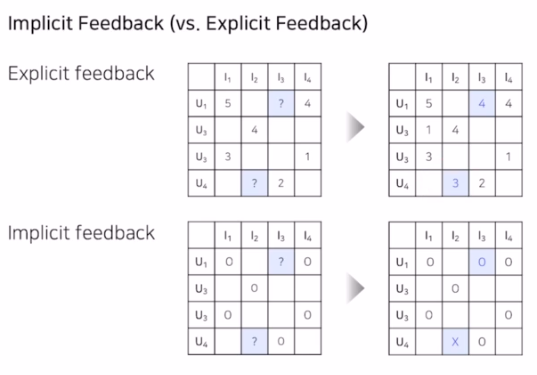
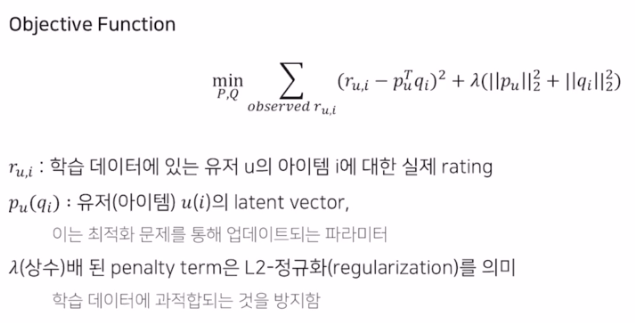

# 2022-10-13 Naver boostcamp 일일노트

## Collaborative Filtering (CF)

### 협업 필터링, CF

- 많은 유저들로부터 얻은 정보를 이용해 유저의 관심사를 자동으로 예측
- 더 많은 유저/아이템 데이터가 축적될수록 협업효과 커지고 추천이 정확해질것이란 가정에서 출발함
- 최종목적 : 유저 u가 아이템 i에 부여할 평점을 예측하는 것
- 원리 : 서로 비슷한 취향의 유저들이 선호하는 아이템을 추천

- User-based CF 유저 기반 협업 필터링
  - 유저들끼리의 유사도 구함
- Item-based CF
  - 아이템끼리의 유사도를 구함. 

### Neighborhood-based CF

- Sparsity - 대부분의 행렬 원소는 비어 있다. (유저가 모든 영화를 보는게 아니기 때문)
- NBCF를 적용하려면 적어도 sparsity ratio < 99.5% 이어야 함. 이보다 더 sparse하면 모델 기반 CF (MF 등)를 이용해야 함.

### K-Nearest Neighbors CF (KNN CF) & 유사도 측정

- $$\Omega_i $$ (아이템 $$i$$에 대해 평가를 한 유저 집합) 에 속한 **유저 $$u$$와 가장 유사한 K명의 유저**를 이용해 평점을 예측 
- 유사도 측정법 - 정확한 유사도의 수치를 나타내는 방법
  - 일반적으로는 **거리의 역수** 개념을 사용
  - Mean Squared Difference Similarity
    - 주어진 유저-아이템 rating에 대하여, distance의 평균을 구하고 이를 역수 취함.
    - 역수이므로 분모가 0이 되면 안되므로 1이 더해짐
  - 코사인 유사도
    - 두 벡터의 각도를 이용하여 유사도 구함
  - 피어슨 유사도 (Pearson similarity)
    - 각 벡터를 표본평균으로 정규화한 뒤에 코사인 유사도를 구함
      - 벡터의 크기 차이를 보정해 주는 효과 (3.5~4.0만 주로 레이팅하는 유저 예)
  - 자카드 유사도 (Jaccard similarity) - 집합을 활용한 유사도
    - 두 집합이 같은 아이템을 얼마나 공유하고 있는지를 나타냄
    - 코사인, 피어슨과 달리 차원이 달라도 유사도 계산 가능

어떤 유사도를 사용하는지는 해당 추천시스템의 특징에 따라 정하는 것이 적합하고, 
오프라인 테스트로 가장 좋은 효과를 보이는 유사도를 보통 정한다. 

### Rating

- User Based CF - Absolute Rating

  - 다른 유저들의 아이템에 대한 rating 평균을 냄
  - 나랑 비슷한 유저들에게 가중치를 주어야 하지 않나?
  - Weighted Average 
    - rating을 가중평균 내서 유사도를 구함
  - rating 점수를 그대로 활용하기 때문에, 
    늘 긍정적인 유저, 혹은 늘 부정적인 유저에 따른 rating 차이를 보정하기 힘듬.

- Relative Rating

  - 유저의 평균 평점에서 얼마나 높은지 혹은 낮은지 그 편차(deviation)를 사용함

  - 모든 평점 데이터를 편차 값으로 바꾼 뒤 원래 rating이 아닌 편차 값을 예측한다.

    $$ dev(u,i) = r(u,i) - avg(r_u) $$

- Item based CF

  - User 방식과 거의 동일함. 아이템에 대한 유저들에 대한 rating 평균을 낸다. 

이렇게 평점 계산 완료되면, Top-N 개만 뽑아서 추천해주면 된다.

### Neighbor based CF의 한계
- 희소성 문제
  + 데이터가 충분하지 않다면 추천 성능이 떨어지며, 아예 없는 유저의 경우 추천이 불가능하다 (Cold Start)
- 확장성 문제 
  + 유저와 아이템이 늘어날수록 유사도 계산이 늘어나며, 많아야 정확한 예측을 하지만 오래 걸림

### Model Based Collaborative Filtering
1. 모델 기반 협업. 항목 간 유사성 단순 비교에서 벗어나 데이터에 내재한 **패턴**을 이용해 추천하는 CF
1. 데이터에 숨겨진 유저-아이템 관계의 잠재적 특성/패턴을 찾음
1. NBCF와 비교 - 이웃 기반 CF는 유저/아이템 벡터를 데이터를 통해 계산된 형태로 저장 (Memory-based CF)
1. MBCF의 경우 유저, 아이템 벡터는 학습을 통해 변화하는 파라미터
1. 현업에서는 Matrix Factorization 기법이 가장 많이 사용됨. 특히 MF를 DL에 응용하는 기법이 최근에는 높은 성능을 냄 

- MBCF의 장점
  1. 모델 학습/서빙
    * 유저-아이템 데이터가 학습에만 사용되고 모델은 압축된 형태 저장. 이미 학습된 모델로 추천하기 때문에 속도 빠름
  2. Sparsity / Scalability 문제 개선 
  3. Overfitting 방지 
    + 특정 이웃에 의해 크게 영향받는 NBCF에 비해 전체 데이터의 패턴을 학습하도록 모델 작동됨.
  4. Limited Coverage 극복  
    NBCF의 경우 공통의 유저/아이템이 많아야 정확하고, 자체 유사도 값이 안 정확하면 이웃 효과를 보기 어려움. MBCF는 이를 극복.

- Implicit Feedback vs Explicit Feedback
  + explicit feedback 예측은 평점 그자체를 예측 
  + implicit feedback 예측은 유저의 아이템에 대한 선호도 예측 (정확한 rating은 아님)
  

### Latent Factor Model (embedding)
- 저차원의 행렬로 유저-아이템 행렬을 분해. 잠재적 요인으로 표현할 수 있다고 봄
- 같은 벡터 공간에서 유저와 아이템 벡터가 놓일 경우 유사하다고 볼 수 있다. 
  
#### Singular Value Decomposition (SVD)
  + 행렬 분해 
    * 유저 잠재 요인
    * 잠재 요인 대각행렬
    * 아이템 잠재 요인 행렬
  + 차원 축소 기법 중 하나로 분류됨
  + SVD 원리 
    * U - 유저와 Latent Factor의 관계
    * V - 아이템과 Latent Factor의 관계
    * $$\Sigma$$ : Latent Factor의 중요도를 나타냄 
    - Truncated SVD
      + 대표값으로 사용될 k개의 특이치만 사용함. R_hat은 축소된 U_hat, V_hat, sigma_k 에 의해 계산됨 
      - 몇 개의 특이치만을 가지고도 유용한 정보를 유지하므로 
        분해된 행렬이 부분복원되면서 가장 중요한 정보로 요약됨.

  - SVD 한계점
    + 분해하려는 행렬이 거의 비어 있는 경우 (sparse) 작동하지 않음. 
    + 따라서 Imputation으로 결측치 채울 때 SVD가 수행. 
    + 이는 정확하지 않은 값일 수 있으므로 데이터 왜곡. 양 증가. -> 예측 성능을 떨어뜨림.
    + SVD의 원리를 차용하되, 다른 접근 방법 -> MF의 등장 

#### Matrix Factorization
- SVD의 개념과 유사하나, 관측된 선호도만 모델링에 활용하여 관측되지 않은 선호도를 예측 
- 실제 Rating R과 R_hat을 이용하여 loss를 줄이도록 학습
- 목적함수  
  

#### Matrix Factorization Techniques for Recommender Systems
  + 여러가지 MF 방법을 적용한 논문
  1. Adding Bias
    * 전체 평균, 유저/아이템의 bias를 추가하여 예측 성능을 높임
    * bias란? 아이템, 유저 자체가 갖는 편향 (짠돌이 평점 유저, 평이 계속 안좋은 아이템)
    * 목적함수에 유저 bias, 아이템 bias 를 추가 
    
  2. Adding Confidence Level
    - 모든 평점이 동일한 신뢰도를 갖지 않음을 고려함 
      + 대규모 광고 집행과 같이 특정 아이템 많이 노출됨
      + 유저의 아이템에 대한 평점이 정확하지 않은 경우
    
  3. Adding Temporal Dynamics
    - 시간에 따라 변하는 유저, 아이템의 특성을 반영함 
    - 학습 파라미터가 시간을 반영하도록 모델을 설계함 (f(t))

### MF for Implicit Feedback
