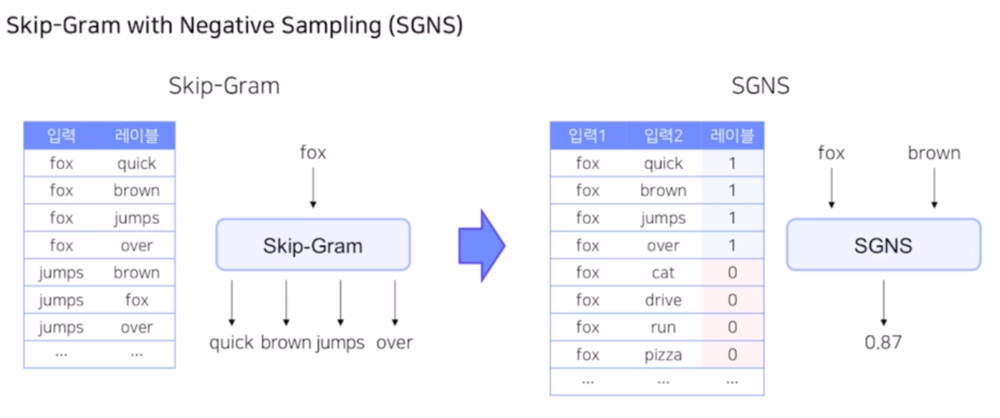
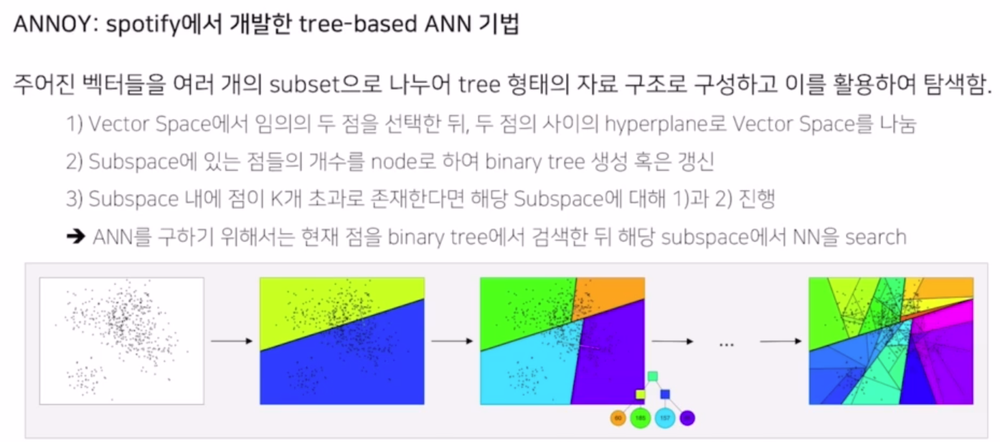

# 네이버 부스트캠프

Item2Vec and ANN

## 1. Word2Vec
- 임베딩## 박우석 - Book Ratings Prediction 대회 개인 회고

### 대회에서의 나의 목표 및 수행 결과

- EDA를 통해 모델링 성능을 향상시킬 수 있는 유의미한 인사이트를 얻고, 이를 적용해 보기
    - EDA 과정에서 첫 접근은 우리가 예측해야 할 rating과 다른 feature들의 연관성을 보는 것이었다. 이를 통해 모델링을 시작할 때 방향을 설정할 수 있으리라 판단했다.
    - Feature 간의 연관성을 살펴볼 때의 문제점은, Numerical 한 feature 간에는 알고 있는 correlation 계산 방법들이 있으나 Nominal 한 Categorical Feature 간에는 correlation을 어떻게 계산할 수 있는지 알지 못했다. 탐색 결과 Theil’s U 등의 방법을 이용해 Categorical Feature 들 사이에도 correlation을 계산할 수 있음을 확인했다.
    - Dython 패키지의 [associations](https://shakedzy.xyz/dython/modules/nominal/) 메서드를 활용하여 Numeric - Category Feature 들의 모든 상관관계를 표현하는 데 성공하였고 이를 도식화하였다. Dython 소스코드 분석 결과 Feature의 Data type 조합 마다(Num - Cat / Num - Num / Cat - Cat) 다른 상관계수를 이용하여 나타내는 것이 구현됨을 확인했다 (여기에서 시간을 너무 많이 할애했던 것 같다)
        
        
        
    - 위 작업을 통해 Rating 과 연관 있는 Feature들을 찾아낼 수 있었고, Feature끼리도 어느 정도의 ## 박우석 - Book Ratings Prediction 대회 개인 회고

### 대회에서의 나의 목표 및 수행 결과

- EDA를 통해 모델링 성능을 향상시킬 수 있는 유의미한 인사이트를 얻고, 이를 적용해 보기
    - EDA 과정에서 첫 접근은 우리가 예측해야 할 rating과 다른 feature들의 연관성을 보는 것이었다. 이를 통해 모델링을 시작할 때 방향을 설정할 수 있으리라 판단했다.
    - Feature 간의 연관성을 살펴볼 때의 문제점은, Numerical 한 feature 간에는 알고 있는 correlation 계산 방법들이 있으나 Nominal 한 Categorical Feature 간에는 correlation을 어떻게 계산할 수 있는지 알지 못했다. 탐색 결과 Theil’s U 등의 방법을 이용해 Categorical Feature 들 사이에도 correlation을 계산할 수 있음을 확인했다.
    - Dython 패키지의 [associations](https://shakedzy.xyz/dython/modules/nominal/) 메서드를 활용하여 Numeric - Category Feature 들의 모든 상관관계를 표현하는 데 성공하였고 이를 도식화하였다. Dython 소스코드 분석 결과 Feature의 Data type 조합 마다(Num - Cat / Num - Num / Cat - Cat) 다른 상관계수를 이용하여 나타내는 것이 구현됨을 확인했다 (여기에서 시간을 너무 많이 할애했던 것 같다)
        
        
        
    - 위 작업을 통해 Rating 과 연관 있는 Feature들을 찾아낼 수 있었고, Feature끼리도 어느 정도의 연관성이 있는지 한눈에 파악할 수 있었다. 
    대부분의 Feature들이 서로 연관성이 있어 다중공선성 문제가 큰 데이터임을 알 수 있었다.
    - 여기에서 가장 독립적인 Feature만 가지고 예측을 수행했을 때와 여기의 Feature를 모두 이용했을때의 모델 성능을 비교해 볼 수 있을 것이다. 하지만 이번 프로젝트에서는 수행하지 못했다. [[참고 링크]](https://datascienceschool.net/03%20machine%20learning/06.04%20%EB%8B%A4%EC%A4%91%EA%B3%B5%EC%84%A0%EC%84%B1%EA%B3%BC%20%EB%B3%80%EC%88%98%20%EC%84%A0%ED%83%9D.html)의 방법으로 이를 추후 수행해 보고 결과를 비교해 볼 것이다.
    - Rating과 상관성이 가장 높은 세 가지의 Feature(isbn, book_title, book_author)를 Rating과 비교하여 시각화하여 보았다.
        - 같은 isbn에서의 rating 평균값을 도출할 수 있고, 이를 시각화하였다. (book_title, book_author도 마찬가지 방법 적용)
            
            
            
        - 대조를 위해 rating과 상관성이 없어 보이는 location_country도 같은 방법으로 시각화하였다.
            
            
            
        - rating과 상관성이 높은 feature들은 고유값마다 데이터들이 상대적으로 고르게 분포하고 있어서, 평균 rating이 각 고유값마다 유의미한 분포를 보였다. 반대로 rating과 상관성이 낮은 feature들은 고유값에 따른 데이터의 분포가 크게 불균형해서 유의미한 rating의 분포를 보기 힘들었다.
    - 이러한 유의미한 결과를 도출할 수 있었지만, 시간 배분을 잘 지키지 못하여 위 결과를 성공적으로 모델링에 적용 및 테스트하지 못하였다.
- 기타 시도해 본 것들
    - GBDT 계열 머신러닝 모델을 이용한 예측 및 하이퍼파라미터 튜닝 - 성능 향상에 실패
    - Feature Engineering에서 author 부분의 개선
    - 베이스라인 템플릿 코드에서 앙상블 시 validation score 도출하는 기능 구현

### 프로젝트 수행에서의 잘한 점과 그렇지 못한 점, 개선 방향

- EDA로 유의미한 인사이트를 도출할 수 있었다.
- 시간 배분을 잘 지키지 못하여 모델링에 있어서 위 결과를 잘 적용하지 못하였다.
- 딥러닝 모델을 좀 더 공부하고 이에 위의 인사이트를 적용해 보았으면 더욱 좋은 결과를 도출할 수 있었을 것 같은데 그것이 아쉽다.
- EDA 및 하이퍼파라미터 튜닝을 좀더 효율적으로 진행하도록 해야 겠다.
- 하나의 방법이 최선이라 생각하지 말고, 넓고 얕게 우선 다양한 방식으로 접근하는 게 필요함을 깨달았다. 데이터마다 너무나 다양한 방법이 존재하고, 정답은 없다 라는 것을 느꼈다.
- 이번에 git을 통한 협업을 처음 접할 수 있었고 팀원들과 같이 정말 제대로 된 협업을 할 수 있어서 아주 기뻤다. git pull, push, merge 등을 이용하여 동료들의 작업을 손쉽게 가져와 적용하고, 이를 업데이트할 수 있었다.연관성이 있는지 한눈에 파악할 수 있었다. 
    대부분의 Feature들이 서로 연관성이 있어 다중공선성 문제가 큰 데이터임을 알 수 있었다.
    - 여기에서 가장 독립적인 Feature만 가지고 예측을 수행했을 때와 여기의 Feature를 모두 이용했을때의 모델 성능을 비교해 볼 수 있을 것이다. 하지만 이번 프로젝트에서는 수행하지 못했다. [[참고 링크]](https://datascienceschool.net/03%20machine%20learning/06.04%20%EB%8B%A4%EC%A4%91%EA%B3%B5%EC%84%A0%EC%84%B1%EA%B3%BC%20%EB%B3%80%EC%88%98%20%EC%84%A0%ED%83%9D.html)의 방법으로 이를 추후 수행해 보고 결과를 비교해 볼 것이다.
    - Rating과 상관성이 가장 높은 세 가지의 Feature(isbn, book_title, book_author)를 Rating과 비교하여 시각화하여 보았다.
        - 같은 isbn에서의 rating 평균값을 도출할 수 있고, 이를 시각화하였다. (book_title, book_author도 마찬가지 방법 적용)
            
            
            
        - 대조를 위해 rating과 상관성이 없어 보이는 location_country도 같은 방법으로 시각화하였다.
            
            
            
        - rating과 상관성이 높은 feature들은 고유값마다 데이터들이 상대적으로 고르게 분포하고 있어서, 평균 rating이 각 고유값마다 유의미한 분포를 보였다. 반대로 rating과 상관성이 낮은 feature들은 고유값에 따른 데이터의 분포가 크게 불균형해서 유의미한 rating의 분포를 보기 힘들었다.
    - 이러한 유의미한 결과를 도출할 수 있었지만, 시간 배분을 잘 지키지 못하여 위 결과를 성공적으로 모델링에 적용 및 테스트하지 못하였다.
- 기타 시도해 본 것들
    - GBDT 계열 머신러닝 모델을 이용한 예측 및 하이퍼파라미터 튜닝 - 성능 향상에 실패
    - Feature Engineering에서 author 부분의 개선
    - 베이스라인 템플릿 코드에서 앙상블 시 validation score 도출하는 기능 구현

### 프로젝트 수행에서의 잘한 점과 그렇지 못한 점, 개선 방향

- EDA로 유의미한 인사이트를 도출할 수 있었다.
- 시간 배분을 잘 지키지 못하여 모델링에 있어서 위 결과를 잘 적용하지 못하였다.
- 딥러닝 모델을 좀 더 공부하고 이에 위의 인사이트를 적용해 보았으면 더욱 좋은 결과를 도출할 수 있었을 것 같은데 그것이 아쉽다.
- EDA 및 하이퍼파라미터 튜닝을 좀더 효율적으로 진행하도록 해야 겠다.
- 하나의 방법이 최선이라 생각하지 말고, 넓고 얕게 우선 다양한 방식으로 접근하는 게 필요함을 깨달았다. 데이터마다 너무나 다양한 방법이 존재하고, 정답은 없다 라는 것을 느꼈다.
- 이번에 git을 통한 협업을 처음 접할 수 있었고 팀원들과 같이 정말 제대로 된 협업을 할 수 있어서 아주 기뻤다. git pull, push, merge 등을 이용하여 동료들의 작업을 손쉽게 가져와 적용하고, 이를 업데이트할 수 있었다.
	+ 주어진 데이터를 낮은 차원의 벡터로 만들어서 표현하는 방법. (차원 감소 기법)
	+ Sparse Representation : 아이템의 전체 가짓수와 차원의 수가 동일
		* one-hot encoding
		* 아이템 개수가 많아질수록 차원이 커지고 공간 낭비
	+ Dense Representation : 아이템의 가짓수보다 훨씬 작은 차원으로 표현 
- 워드 임베딩
	+ 텍스트 분석을 위해 단어를 벡터로 표현 
	+ one-hot encoding -> dense representation
	
- Word2Vec
	+ 뉴럴넷 기반 
	+ Word2Vec 학습 방법
		1. CBOW : Continuous Bag of Words
			- 주변에 있는 단어를 가지고 중앙 단어를 예측하는 방법 
			- 앞뒤로 n개 총 2n개의 주변 단어를 활용.

			- 학습 파라미터 - $$W, W'$$ 2가지
				1. $$V$$ : 단어의 총 개수, $$M$$ : 임베딩 벡터의 사이즈  
				학습 파라미터: $$W_{V \times M}, W'_{M \times V}$$ 
			- 각각의 단어가 Embedding matrix를 통해 lookup table이 되고, 이들의 평균이 Projection layer이 됨. 
			- 실제 단어와 예측한 데이터가 비교되어야 하기 때문에 원래 원핫벡터의 크기와 동일한 벡터로 반환되고 이는 softmax 층을 통과하여 각 클래스별 확률 벡터로 반환. 이가 실제 단어 벡터와 비교됨. 
		2. Skip-Gram
			- CBOW 의 **입력층과 출력층이 반대**로 구성. 벡터의 평균을 구하는 과정이 없음. 
			- 한 단어를 가지고 주변 단어를 예측하는 방식.
			- 일반적으로 CBOW보다 Skip-gram의 임베딩 표현력이 더 좋음 
			
		3. Skip-Gram with Negative Sampling (SGNS)
		

			-입력값과 레이블을 모두 입력1, 2로 주고 레이블을 0, 1의 binary 로 바꾸어서 1로 예측하도록 문제를 바꿈. 
			- 그런데 레이블은 모두 1이 될수밖에 없음. 주변 단어들을 사용했기 때문
			- 주변에 있지 않은 단어들을 강제로 샘플링해서 가져와서 레이블을 0으로 함. (Negative sampling)
			- positive sample 하나당 k개의 negative sampling
				+ 이 k는 데이터가 적은 경우 5-20, 충분히 큰 경우 2-5가 적당하다 (- 논문)
			- 중심 단어와 주변 단어가 각각 임베딩 파라미터를 따로 가짐 (다른 변환표!)
			- 학습 과정
				1. 중심 단어를 주변단어들과 내적한 각각 내적값을 sigmoid를 통해 0, 1로 분류 
				--> 왜 내적? 코사인 유사도? 
				2. cross-entropy로 loss를 구하고, 이를 역전파를 통해 임베딩 matrix 업데이트 
				3. 최종 생성된 워드 임베딩은 2개이므로 선택적으로 하나만 사용하거나 평균을 사용 (성능차이가 크진 않다.)
			- **학습의 결과로 생성된 워드 임베딩 matrix를 이용하여, 다음 task에 활용하는 것이 일반적인 방법이다.**
			

## 2. Item2Vec
- 단어가 아닌 추천 아이템을 Word2Vec으로 임베딩
	+ 기존 MF도 유저와 아이템을 임베딩하는 방법임.
	+ 유저가 소비한 아이템 리스트를 문장으로, 아이템을 단어로 가정하여 Word2Vec 사용
		* 유저-아이템 관계를 사용하지 않기 때문에 유저 식별 없이 데이터 생성 가능 
	+ SGNS 기반의 Word2Vec을 사용하여 아이템을 벡터화하는 것이 최종 목표 
		* MF기반 IBCF보다 더 높은 성능과 양질의 추천 아이템 제공 
- 유저 혹은 세션 별로 소비한 아이템 집합을 생성
	+ 공간적/시간적 정보는 사라짐
	+ 집합 안의 아이템들은 서로 유사하다고 가정 
	+ Skip-gram 과 달리 모든 단어쌍을 사용
- Item2Vec 활용 사례
	+ 아프리카 TV의 Live2Vec
		* [문장] 유저의 시청 이력 [단어] 라이브 방송 
	+ Spotify의 Song2Vec
		* [문장] 유저의 플레이리스트 [단어] 노래
	+ Criteo의 Meta-Prod2Vec
		* [문장] 유저의 쇼핑 세션 [단어] 상품
	
## 3. Approximate Nearest Neighbor
- Nearest Neighbor (NN)
	+ Vector Space Model에서 내가 원하는 Query vector와 가장 유사한 Vector을 찾는 알고리즘 
	
- Brute Force KNN
	+ NN을 정확하게 구하기 위해서는 나머지 모든 Vector와의 유사도 비교를 수행해야 함. 
	+ Vector의 차원과 개수에 비례해서 연산이 늘어남.

- ANNOY : spotify에서 개발한 tree-based ANN 기법 
	+ 주어진 벡터를 여러 subset으로 나누어 tree 형태의 자료 구조로 구성하고 이를 활용하여 탐색. 
	
	- ANNOY의 문제점 : 가장 근접한 점이 다른 지역(node)에 있을 경우 후보 subset에 그 점이 포함되지 못함.
		+ 해결 방안 : priority queue를 이용하여 가까운 다른 노드 탐색 / binary tree를 여러 개 생성하여 병렬적 탐색 - 앙상블 기법 
	- ANNOY 파라미터 
		1. number_of_trees : 생성하는 binary tree의 개수
		2. search_k: NN을 구할 때 탐색하는 node의 개수 
	- 요약 :
		+ Search Index 생성하는 것이 다른 ANN 기법에 비해 간단하고 가벼움. but GPU 연산 지원하지 않음. 작은 데이터의 수는 ANNOY로 사용해 보는 경우가 많다. 
		+ Search 해야할 이웃의 개수를 알고리즘에서 보장함. 
		+ 파라미터 조정 통해 accuracy / speed trade-off 조정 가능 
		+ 단, 기존 성된 트리에 새로운 데이터를 추가할 수 없음. (트리를 다시 만들어야 하니까)
		

- 질문 리스트 
	+ KNN 과 K-means clustering의 차이 ? 
  