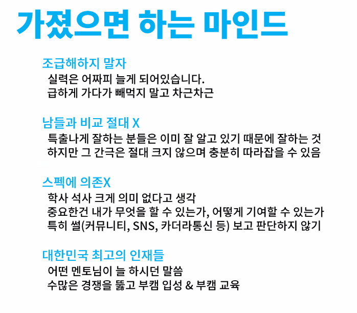

# 통합멘토링 3기 선배 강의

1. 기본이 제일 중요
	- 하나의 지식에 대해 얼마나 깊이 있게 생각했나가 더 중요
	- 기본 개념은 쉽게 설명할 수 있을 정도로 이해하고 있으면 좋음. 예) 회귀분석, collaborative filtering에 대해 중학생한테 설명하듯이 해봐라. 
	- 신입에게 필요한 것은 급격한 러닝커브와 탄탄한 기본기 
2. 사이드로 어떤걸 할까?
	- 복습하면서 기본을 더 탄탄히 하는게 중요. 
	- 블로그에 상세히 정리해둘것. 
	- 논문을 너무 훑듯이 넘어가지 말고, 차라리 하나의 논문에 대해 스스로 **재정의**하는 것이 훨씬 좋다.
	- 기본 논문에 대해 열심히 공부할 것 
	
3. 대회 때 스코어에 목메지 않기
	- 내가 팀에서 무엇을 ,어떤 의도를 가지고 했는가
	- 왜 그렇게 했는가?
	- 명확히 이해, 결과에 대한 해석
	- 업무일지 개념으로 일과 겪은 문제에 대해 기록해 놓으면 좋음 
	
4. 취업 프로세스 미리 경험해보기 
	- 어차피 잘 안붙여줌!
	- 자가 피드백으로 부족한 점 보완 

5. 회고 꾸준히 작성하고, 연구자를 목표로 한다면  연구일지를 작성하는 것도 좋다. 

6. 부스트캠프에서 제공하는 것만 잘 소화해도 충분하다! 

7. **최종 프로젝트가 가장 중요하다.** 

8. 이력서 
	- 나를 어필할 수 있어야
	- 왜? 뽑아야 하는지 이유를 댈 수 있어야
	- 나의 장점을 파악하고 그것을 드러낼 수 있어야 함 
	
9. 면접 
	- 면접에서 함정에 빠지지 말자 (너무 긍정적인 태도 속에 날카로운 질문이 있을 수 있음)
	- 결국 채용하고자 하는 사람과 내가 fit해야 뽑아주는 것. 너무 실망하지 말고 다양하게 지원하자. 
	- 신입은 태도가 제일 중요하다. 
	
	- 직무 관련 프로젝트 아니면 별 관심 없다... 
	- 직무 이해도는 필수
	- 핵심을 간단하게 말할 수 있는 역량 기르기 
	- 다시 같은질문은 위험신호. 빠르게 의도 파악하기
	- 면접 전 꼭 가져가야 할 것 3가지! 
		1. 자기소개 - 질문과 면접을 이끌어 가는 수단
		2. 이력서에 대한 답변
			- 면접에서 질문지의 역할
			- 제대로 답변 못하면 떨어짐 
			- 생각지 못한 문제점 물어봄
			- 반대로 이력서 기반 질문 토대로 회사 수준을 파악 가능 
		3. 기업에 대한 마지막 질문 
			- 기업에 관심 있고, 깊이 있는 질문은 플러스. 자신의 역량과 고민 어필 가능.
			

