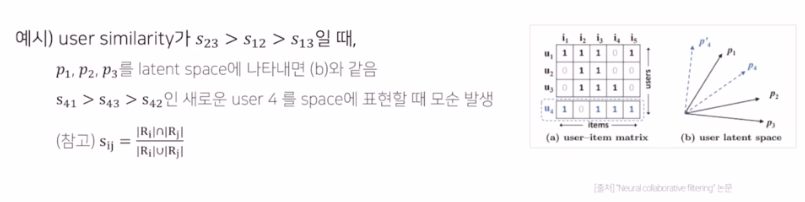
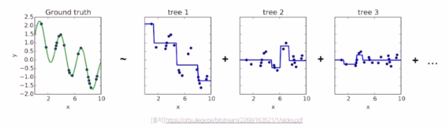

## Neural Collaborative Filtering

- MF의 한계 
	+ user와 item embedding의 선형 조합을 구한다. -> user과 item 사이의 복잡한 관계를 표현하는 것에 한계를 가짐 .
	

- 모델 
	

## Youtube Recommendation
- 2단계의 추천 시스템
	1. Candidate Generation
		- High Recall 목표로 Top N 추천 아이템을 주어진 사용자에 대해 생성
		- Model
			- Watch Vector and Search Vector
				+ 행동 이력을 임베딩. 
				+ 마지막 검색어가 너무 큰 힘을 갖지 않게 평균 냄. 
			- 인구통계적 정보 + 지리적 정보도 특성으로 포함 
			- Example Age feature
			
			* 다양한 특성들을 한번에 concat
			* n개의 dense layer을 거쳐 user vector 생성
			* 최종 output: 비디오 분류하는 softmax function을 통과 
		* Serving
			- 유저 input으로 상위 N개 비디오 추출
			- 학습 후, 유저 벡터와 모든 비디오 벡터의 내적 계산해야 하는데, 너무 많으니까 Annoy, Faiss 같은 ANN 라이브러리를 이용하여 유사하고 빠르게 서빙.
	
	2. Ranking
		- 유저, 비디오 피쳐 좀더 풍부하게 사용.
		- 스코어를 구하고 최종 추천 리스트를 제공 
		- feature engineering - 도메인 전문가의 많은 역량이 필요함.
		

## Recommender system with Autoencoder
- 오토인코더
	+ 입력 데이터를 출력으로 복원하는 비지도 학습 모델 
	+ 주요 활용 분야
		* 이상치 탐지
		* 노이즈 제거 
		* 표현 학습 
- 디노이징 오토인코더 
	+ 입력 데이터에 랜덤 노이즈나 dropout을 추가하여 학습
- AutoRec : Autoencoders Meet Collaborative Filtering
	+ 아이디어 
		* Rating vector를 **입력과 출력 둘 다**로 하여 Reconstruction 과정을 수행 
		* MF는 linear, low-order interaction 하지만 이 경우 nonlinear 학습 가능 
	- 모델 
		- 학습
			+ 기존의 rating과 reconstructed rating의 RMSE를 최소화하는 방향으로 학습 
		- 결과 
			+ RBM, MF보다 좋은 성능
			+ Hidden unit (노드) 의 개수가 많아질수록 RMSE가 감소함
+ 본 논문 이후 고급 AE 기법을 CF 에 활용한 후속 연구가 나옴
	- CDAE (Collaborative Denoising Auto-Encoders .. )
		+ Ranking을 통해 유저에게 Top-N 추천을 제공 
		+ 모델 
			* AutoRec과 다르게 DAE를 사용하여 noise 추가 (일정확률로 0으로 drop-out)
			* 개별 유저에 대해서 Vu를 학습 (Collaborative) - 유저에 따른 특징을 학습 
		+ 결과 
			* top-N 에서 N에 관계없이 다른 모델에 비해 더 높은 MAP와 Recall을 보임 
			

## Recommender system with Graph Neural Network
- 그래프를 사용하는 이유 - 관계, 상호작용을 나타내기 적합
- non-euclidean space의 표현 및 학습이 가능 
	+ table, sequence 데이터가 아닌, 분자 데이터나 sns 데이터 
- 그래프 데이터에 적용 가능한 신경망 
	+ Naive 한 방법 : 그래프 및 피쳐 데이터를 인접행렬 변환 
		- 단점 : Node가 많아질수록 연산량이 기하급수적. 노드의 순서가 바뀌면 의미가 달라질 수 있음 
	- Graph Convolution Network (GCN)
		- Local connectivity
			+ 이미지 컨볼루션 같이, 그래프 해당 노드의 주변을 같이 컨볼루션 수행. 
		- Shared Weights
			+ 주변 노드와 같은 weight를 공유한다. 
		- multi-layer
			+ 다층 레이어로 성능 높임 

+ Neural Graph Collaborative Filtering
	- 유저 아이템 상호작용을 GNN 으로 임베딩 과정에서 인코딩하는 접근법을 제시한 논문
	- 학습 가능한 CF 모델의 키포인트 2개
		1. 유저와 아이템의 임베딩
		2. 상호작용 모델링
	- 기존 cf 모델들은 유저-아이템 상호작용을 임베딩 단계에서 접근하지 못하고 임베딩과 상호작용이 분리돼 있음
	- Collaborative Signal
		+ **유저-아이템 상호작용이 임베딩 단에서부터 학습**될 수 있도록 접근
		+ 하지만 유저-아이템 상호작용은 가짓수 많아질수록 많이 늘어나 한계 존재. 
			* GNN을 통해 High-order Connectivity를 임베딩 (경로가 1보다 큰 연결을 의미)
			
	- 전체 구조 (상세한 단계 복습하기)
		1. 임베딩 레이어
			- 유저-아이템 초기 임베딩 제공 
			

		2. **임베딩 전파 레이어**
			- High-order connectivity 학습    
			(수식 좀더 이해 필요)
		
		3. 유저-아이템 선호도 예측 레이어
			- L차까지의 임베딩 벡터를 concat하여 최종 임베딩 벡터를 계산 후, 유저-아이템 벡터를 내적하여 최종 선호도 예측값 계산  
		
	- 결과 및 요약
		+ 임베딩 전파 레이어가 많아질수록 모델 추천 성능 향상, 다만 너무 많으면 overfitting. 적당한 레이어는 3-4개 
		+ MF보다 더 빨리 수렴하고 recall 도 높음 
		+ 유저-아이템이 임베딩 공간에서 더 명확히 구분됨 
		
		
	
- LightGCN
	- Light Graph Convolution
		+ 이웃 노드의 임베딩을 가중합하는 것이 convolution의 전부. 학습 파라미터와 연산량 감소
	- Layer Combination
		+ 레이어가 깊어질수록 강도가 약해질 것이라는 아이디어 이용. 단순화 함 
	- LGCN Propagation Rule (vs. NGCF)
		+ feature transformation이나 nonlinear activation을 제거하고 가중합으로 GCN 적용 
	- 결과 및 요약
		+ 학습을 통한 손실함수와 추천성능 모두 NGCF보다 뛰어남. 
		+ training loss가 낮으면서 성능이 좋다는 것은 모델이 Generalization power가 크다. (강건하다)
		
## Recommender system with RNN
- RNN
	+ 시퀀스 데이터의 처리와 이해에 좋은 성능을 보이는 신경망 구조 
	- 현재 상태가 그 다음 상태에 영향을 주도록 루프 구조 고안 
	- LSTM
		- 장기 기억이 전달되도록 하기 위해 Cell State라는 구조를 고안
		- Forget gate & input gate & output gate & cell state 
	* GRU
		- LSTM의 변형 중 하나로, 출력 게이트가 따로 없어 파라미터와 연산량이 더 적음 
		- Reset gate & update gate
- RNN과 추천 시스템
	+ Session based Recommendation system
		* 고객 선호는 고정된 것이 아님 -> **지금** 고객이 좋아하는 것은 무엇인가?
		* session : 유저가 서비스를 이용하는 동안의 행동을 기록한 데이터 
- GRU4Rec
	+ 추천 시스템에 RNN을 적용한 논문 - '지금' 고객이 원하는 상품을 추천하자.
	+ Session이라는 시퀀스를 GRU 레이어에 입력. 가장 가능성 높은 것을 추천 
	+ 모델 구조 :
		* one-hot encoding된 세션 입력 
		* GRU 레이어를 통과하며 시퀀스 상 모든 아이템들에 대한 맥락적 관계 학습
		* 출력 : 다음에 골라질 아이템에 대한 선호도 스코어 
	- 학습 : Session Parallel Mini batches
		+ 세션이 짧은, 긴 모두 존재함. 
		+ 짧은 세션은 다른 세션 뒤에 붙여서 세션 병렬적 구성. 미니배치 학습 
		+ Sampling on the output
			* 아이템의 인기에 기반한 Negative Sampling 제시 
			* 인기가 높은데도 상호작용 없으면 사용자가 관심이 없는 아이템이라고 가정 
	- 결과 및 요약
		+ GRU 레이어의 hidden unit이 클 때 더 좋은 추천 성능을 보임.
	
## Context-aware Recommendation
### What is Context-aware Rec.
	- 문제 정의
		- MF 를 활용한 CF의 한계
			- 유저-아이템 간 상호작용을 2차원 행렬로 표현 -> 여러 특성들을 추천시스템에 반영할 수 없음.
			- cold-start 에 대한 대처가 어려움 
	- 컨텍스트 기반 추천시스템
		- 유저 아이템 간 상호작용 정보뿐 아니라, 맥락적 정보도 함께 반영함.  
	- CTR Prediction
		- 유저가 주어진 아이템을 클릭할 확률을 예측하는 문제 
		- 클릭 여부 0/1 분류하는 이진분류 문제 
		- sigmoid 함수 이용 
		- Sparsity : CTR 예측 문제에 사용되는 데이터는 대부분 Sparse Feature로 구성됨.
	- Embedding을 어떻게 했는지, interaction을 어떻게 다루었는지 확인하는 것이 해당 추천시스템을 이해하는 열쇠.

### Factorization Machine
	- 등장 배경 
		- 딥러닝 이전에는 SVM이 가장 많이 사용됨
		- CF 환경에서는 sparsity 때문에 SVM보다 MF 모델이 더 높은 성능
		- MF는 특별한 환경 혹은 데이터에만 적용할 수 있음. -> X:(유저, 아이템) , Y:(rating)
	- Logistic Regression에 Factorization term 이 추가된 형태. 
	- 영화의 평점 데이터는 대표적인 High sparsity 데이터. 

	- 모델의 SVM, MF 대비 장점 

### Field-aware Factorization Machine
	- 특징 
		- 입력 변수를 필드로 나누어, 필드별로 서로 다른 latent factor를 가지도록 factorize함. 
		- 기존의 FM은 하나의 변수에 대해서 k개로 factorize 했으나 FFM은 필드에 대해서 factorize함 

### Gradient Boosting Machine
	- 다양한 오픈 CTR 데이터셋에 대해 FM 계열 모델보다 높은 성능을 보임.
	- Boosting
		- 앙상블 기법의 일종 
		- decision tree로 된 weak learners들을 **연속적으로 학습하여 결합**
			- 연속적 : 이전 단계의 weak learner가 취약했던 부분을 위주로 데이터를 샘플링하거나 가중치를 부여해 다음 단계의 learner 학습. (약한 곳 위주로 추가학습 하는 느낌!)

	- Gradient Boosting
		- Gradient Descent를 사용하여 loss function이 줄어드는 방향으로 weak learner들을 반복적으로 결합함으로써 성능을 향상시키는 Boosting 알고리즘
		- 통계학적 관점에서 GB는 잔차를 적합하는 것으로 이해할 수 있음.   
		

