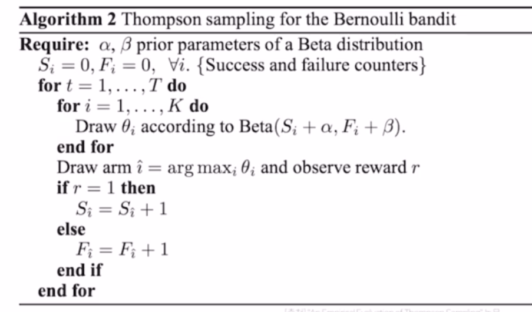
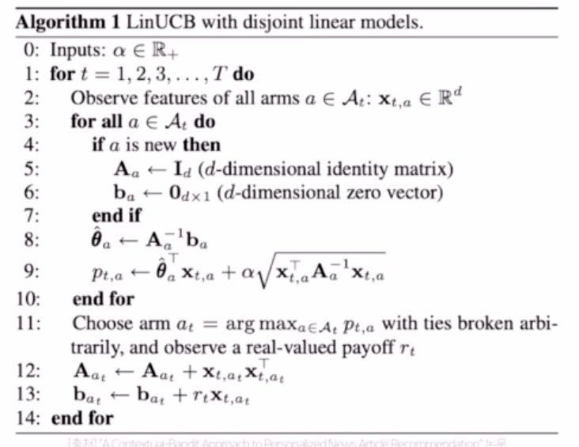

## CTR prediction with deep learning

## Wide & Deep
- 추천시스템에서 해결해야 할 두 과제
	1. Memorization
		- 함께 빈번히 등장하는 아이템 또는 특성 관계를 과거 데이터로부터 학습 
		- Logistic Regression과 같은 선형 모델 사용됨 
			+ 단순하고 확장 및 해석이 용이하나, 학습 데이터에 없는 feature 조합에 취약

	2. Generalization
		- 드물게 발생하거나 전혀 발생한 적 없는 아이템/특성 조합을 기존 관계로부터 발견 (=일반화)
		- FM, DNN 같은 임베딩 기반 모델
			+ 고차원의 희소 데이터로부터 저차원의 임베딩을 만들기 어려움 
			
- 본 논문에서는 이 두 문제를 결합하여 사용자의 검색 쿼리에 맞는 앱을 추천하는 모델을 제안  
- The Wide Component
	+ 선형 모델. 
	+ 변수들간의 관계를 학습하기 위한 Cross-Product Transformation 사용 
		* gender=female, language=en -> AND(gender=female, language=en) 특성을 추가 
		* 가능한 cross-product의 수가 너무 많으므로 주요 피쳐 두개에 대한 second-order cross-product만 사용. (이게 뭐지?)
- The Deep Component
	+ Neural Network
		* 3-layer with ReLU
- 전체 구조 
	+ 이미지. 

## DeepFM
- Wide & Deep 과 유사한 구조이나, 앞과 달리 두 요소(wide, deep)가 입력값을 공유하도록 한 end-to-end방식의 모델 
- A Factorization-Machine based Neural Network for CTR Prediction
- 추천 시스템에서는 implicit feature interaction 학습이 중요함 
	+ 예) 식사 시간에 배달앱 다운로드 수 증가 (order-2 interaction)
	+ 10대 남성은 슈팅 / RPG 게임을 선호 (order-3 interaction)
- 기존 모델들을 low- 나 high-order interaction 중 한쪽에만 강한 경향이 있음. 
- Wide & Deep 모델은 둘을 통합하여 문제를 해결했으나, wide component에 feature engineering이 필요하다는 단점
- DeepFM에서는 FM 을 wide component로 사용하여 입력값을 공유하도록 함.
- 구조 
	+ FM for low-order feature extraction
	- 타 모델과의 비교 (이미지)
	
## Deep Interest Network (DIN)
- User behavior feature를 처음 사용함 
- DIN 의 등장 배경 
	+ 기존 딥러닝 모델들은 모두 유사한 Embedding & MLP 를 따름 
	+ 이러한 방식은 다양한 사용자의 관심사를 반영할 수 없음. 
	+ 사용자가 기존 소비한 아이템 리스트로 User Behavior feature를 만들어, 예측 대상과 이미 소비한 물건 사이 관계를 학습. 
- 모델 구성
	1. Embedding Layer
	2. Local activation layer
		- transformer의 attention과 유사 
		- 후보군이 되는 광고를 기존에 본 광고들의 연관성을 계산하여 가중치로 표현 
	3. Fully-connected layer
	

## Behavior sequence transformer (BST)
- Transformer 리뷰 
	+ Attention Mechanism
		* 입력 값의 어떤 부분에 주의를 기울일 것인지 찾는 원리
		* Key-Value 쌍이 주어질 때, 알고자 하는 query (Q)에 대응되는 value를 query와 key 들의 연관성을 가중치로 하여 value들의 가중합으로 계산   
		$$ Attention(Q, K, V) = Value of Q = similarity(Q, K) \times V $$

		- 주어진 단어가 전체 단어와 얼마나 관계가 있는지를 가중치로 사용. 전체 단어에 대응되는 값들의 가중 합으로 주어진 단어에 대응되는 결과를 도출 
		- Scale Dot-product Attention
		- Multi-head Attention
- BST 전체 구조
- BST vs. DIN
	+ DIN에서는 local activation layer만을 사용했는데, BST는 과거에 어떤 순서대로 아이템을 소비했는지 까지 이용. -> Transformer layer
	
- vs. Transformer
	+ BST에서는 dropout과 leakyReLU 추가. 
	+ Custom Positional Encoding 
	+ CTR 예측 task의 sequence는 NLP sequence보다는 덜 복잡한 것으로 보여짐 -> Transformer block을 2개 이상 쌓을때 성능이 오히려 감소.

## Bandit for Recommendation

## 1. Multi-Armed Bandit
- one-armed bandit
	+ 카지노에 있는 슬롯머신 
- multi-armed bandit 
	+ k-개의 슬롯머신에서 얻을 수 있는 reward의 화귤ㄹ이 모두 다를때, 수익을 최대화하기 위해서는 어떤 순서 및 법칙을 따라야 하는가? 
- Challenge in MAB
	+ 문제점 : 슬롯머신의 reward 확률을 정확히 알 수 없다. 
	+ Exploration & Exploitation Trade-off 발생   
	  (모든 머신을 당겨볼 것이냐, 높은 확률을 가진 것만 계속 당길 것이냐)
	
- MAB formula 
	+ 액션 a에 따른 q(a)의 기댓값을 찾는 것 
	+ 시간 t에서의 추정치 Qt(a)를 최대한 정밀하게 구하는 것이 목표. 
	
## 2. MAB Algorithm
1. Simple Average Method (Greedy Algorithm)

2. Epsilon-Greedy Algorithm
	- Random으로 슬롯머신을 선택하도록 함 
	- Exploration과 Exploitation을 어느정도 보장함. 

3. Upper Confidence Bound (UCB)
	- 새로운 term : 해당 action이 최적의 action이 될수도 있는 가능성 (불확실성)
	

## 3. MAB 추천 예시
- 기존 추천시스템과 어떤 차이?
	+ case1. 유저에게 아이템 추천 
	+ case2. 주어진 아이템과 유사한 아이템 추천 
- Bandit 문제로 바꾼다면
	+ 실제 서비스 지표인 클릭/구매를 reward로 가정. 
	+ reward를 최대화하는 방향으로 모델이 학습되고 추천 수행.
	+ 모델링에 비해 구현이 훨씬 간단하고 이해가 쉬움. 실제 비지니스에 적용하기 좋다. 
	
- 유저 추천 
	+ 개별 유저에 대해서 모든 아이템의 bandit을 구하는 것은 데이터의 부족으로 불가능 
	+ 클러스터링을 통해 비슷한 유저끼리 그룹화 -> 그룹 내에서 Bandit 구축 
	
- 유사한 아이템 추천 
	+ 우선 유사한 후보 아이템 리스트를 생성하고 그 안에서 bandit 적용 
	

## 4. MAB 알고리즘 - 심화
- Thompson Sampling
	+ 주어진 k개의 action 에 해당하는 확률분포를 구하는 문제 
	+ Beta 확률 (알파, 베타 파라미터 필요)
	+ 배너를 보고 클릭한 횟수 (alpha), 배너를 보고 클릭하지 않은 횟수 (beta)
	
	- 유사코드 
	

- LinUCB (다시 듣고 정리하기)
	+ Contextual Bandit
		* Context-free Bandit
			- 유저의 context정보에 관계없이 항상 동일한 reward를 가짐 
		- Contextual Bandit 
			+ context도 고려함 
			
	- LinUcB 유사코드 
	
	- 예시 - Naver AiRS 추천 시스템 
		+ 인기도 기반 필터링으로 탐색 대상을 축소
		+ Contextual Bandit 알고리즘을 통해 유저 취향을 탐색 및 활용.
