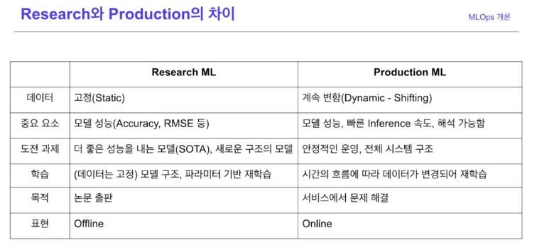

# AI 서비스 개발 기초 - Naver boostcamp 8주차 

MLOps, Model Serving, Product Serving, 

## *추천 학습 방법
- 1회 강의 들으며 키워드 위주로 필기. 복습.
- 자신의 언어로 꼭 정리하기!
- 뼈대가 있는 강의의 경우 자료를 보지 않고 뼈대를 스스로 떠올려보기
- 뼈대가 없는 강의의 경우 프레임워크의 사용 방법을 충분히 경험하기.
- [오픈소스 코드 분석하기 (참고)](https://zzsza.github.io/development/2020/07/19/opensource-analysis/)
- 수평 학습을 통해 넓게 배우고, 수직 학습을 통해 중요한 곳을 깊이 파기

## MLOps
### MLOps 개론 
1. MLOps란?
   - ML (Machine Learning) + Ops (Operations)
   - 머신러닝 모델 운영하면서 반복적으로 필요 업무를 **자동화**하는 과정
   
   - 연구와 다르게, Production ML은 안정적인 운영 그리고 전체 시스템 구조가 더 중요함.
   - 학습 또한 고정된 구조 및 고정된 데이터는 연구 ML이지만 Production ML은 계속 바뀐다. 

2. MLOps Component  - 타코를 통한 예시
  
  - 인프라
    - 클라우드 / 온 프레미스(직접 서버 설치)
  - Serving
    - Batch Serving : 정기적
    - Online Serving : 실시간
    동시에 여러 경우의 주문이 들어올 수 있는데 이 경우 확장 가능하고 병목 현상 없도록 조치해야함.

  - Experiment / Model Management
    - 실험의 기록 (파라미터, 모델 구조 등) 저장
    - 모델 생성일, 성능, 모델 메타정보 등
    - Experiment management tool
      - **mlflow**
        - 로깅 기능. 협업할 시 도움.
  - Feature store
    - 모델을 만들 때 feature를 추출해 오기 쉬움. 전처리 시간 절약
    - 아직 정형 데이터에서만 많이 쓰이고 있음.
    - [Practitioners Guide to MLOps](https://cloud.google.com/resources/mlops-whitepaper)
    - **feast** 
  - Data Validation
    - (비유) 재료들이 예전에 요리할 때 사용한 재료와 비슷한지 확인할 필요
    - Feature의 분포가 research와 production 사이에 얼마나 다른지 확인
      - Data Drift
        - 시간의 흐름에 따라 모델 성능이 계속 하락함. 즉 refreshing이 필요.
    - **Tensorflow Data Validation (TFDV)**
  - Continuous Training
    - 신선한 재료로 요리를 다시 만든다
    - 학습을 다시 진행
  - Monitoring
    - 모델 지표, 성능 지표 등을 잘 기록해야 함
  - AutoML
    - 시대가 좋아져서 에어프라이어처럼 자동으로 음식 만듬. -> 자동 ML 시스템 구축
  
  >즉 머신러닝 모델을 직접 운영하는 것은 레스토랑 운영과 어느정도 비슷하다.
  
  MLOps는 회사의 상황에 따라 우선순위가 달라지며, 먼저 꼭 진행해야 하는 것은 아니다.
  작은 단위의 MVP(Minimal Value Product)로 시작해서 점차 구축해 나가는 것이 보통이다.

  - 개인 과제 - 강의에서 보고 조금씩 해볼것

## Model Serving
### Web Server Basic
- 크롬에서 유튜브에 접근하는 경우, Request
- 유튜브는 메인 페이지를 반환, Response
- 즉 웹 서버는 HTTP를 통해 웹 브라우저에서 요청하는 HTML 문서나 오브젝트를 전송해 주는 서비스 프로그램
- 요청(Request)를 받으면 요청한 내용을 보내주는 (Response) 프로그램
- **머신러닝 모델 서버**
  - 어떤 데이터를 제공하여 예측해달라고 요청 (Request)하면, 모델을 사용해 예측값을 반환하는 프로그램
### API
- 운영체제나 프로그래밍 언어가 제공하는 기능을 제어할 수 있게 만든 인터페이스
- 비유 : 리모컨 (TV와 사람을 연결해줌)
- 기상청 API, 지도 API 도 있고 Pandas, Tensorflow 등 라이브러리의 함수는 모두 API라고 함

### Online Serving
구현 방식
  1. 직접 API 웹 서버 개발 - Flask, FastAPI
  2. 클라우드 서비스 활용 - AWS의 SageMaker, GCP의 Vertex AI
  3. Serving 라이브러리 활용 - Tensorflow serving, torch serve, MLFlow, BentoML 
      - BentoML예시 - 코드 네 줄로 모델 저장과 배포까지 편리함. 

다양한 Serving 방법을 선택하는 순서 가이드
  1. 프로토타입 모델을 클라우드 서비스를 활용해 배포
  2. 직접 FastAPI 를 사용해 서버 개발
  3. Serving 라이브러리를 활용해 개발 (이것이 사용하기는 편하지만, 왜를 알기 어렵다)

  - 라이브러리에 종속되지 말기. 
  - Low-level 오픈소스에 먼저 익숙해질것. 

재현 가능해야 함. 재현 못하는 코드는 쓸 수 없다. -> 컨테이너 기반 Docker 등이 필요함.

실시간 예측을 하기 때문에 예측할 때 **지연시간**을 최소화해야 함.
  1. Input 데이터를 추출하기 위해 쿼리 실행, 결과 받는 시간이 소요될 수 있음
  2. 모델이 수행하는 연산 - RNN, LSTM 등이 오래 걸릴 수 있기 때문에 모델 경량화, 간단한 모델의 사용으로 연산시간 줄임.
  3. 결과 값에 대한 보정이 필요한 경우
     - 전처리 뿐만 아니라 후처리 (집값이 마이너스 가 나오면 0으로 보정하는 등)
  4. 앞 문제에 대한 여러가지 해결방법이 존재한다.

### Batch Serving
Online Serving 과 다르게 실시간 처리가 아닌 특정 기간, 시간에 한번씩 주기적으로 실행한다.
Workflow Scheduler - 위 작업을 주기적으로 할 수 있게.   
  - 데이터 엔지니어링에서 자주 활용되는 Apache Airflow
  - Linux의 Cron Job
  
Batch Serving 관련한 라이브러리는 따로 존재하지 않으며, 함수 단위를 **주기적**으로 실행하는 방식을 쓴다.
실시간이 필요 없는 대부분의 방식에서 활용 가능
- 장점 : Jupyter Notebook에 작성한 코드를 함수화하여 주기적으로 실행하기만 하면 됨. 매우 간단.
- 단점 : 실시간 활용 불가. Cold Start 문제 - 새로 생긴 컨텐츠는 추천 불가

예시 : Spotify - Discover Weekly 
  - 일주일 단위로 학습

Online Serving vs. Batch Serving
- 선택기준 : Input 관점, Output 관점에서 선택. 
- 즉 실시간 모델 결과가 어떻게 활용되는지에 대한 생각과 그에 따른 적절한 Serving이 필요하다.
- Batch Serving 을 먼저 만들고 이것을 API로 발전시켜 Online Serving으로 만들어 갈수도 있다. 

### 과제 
1. Rules of Machine Learning : Best Practices for ML Engineering - 문서 읽고 정리
2. Online Serving / Batch Serving 기업들의 use case 찾아서 정리

## Product Serving
### 머신러닝 프로젝트 flow
**문제 설정**
- 구체적인 문제 정의 필요
- 간단한 방법부터 점진적인 접근이 필요함 (간단한 해결방법 -> 알고리즘 구현 필요한 방법)
- 문제를 쪼개서 파악해보자
> 문제 정의 후, 프로젝트의 설계를 최대한 구체적으로 하는 것이 좋다 - 많은 것을 미리 대비한 상황
- 머신러닝 문제를 고려할 때는, **얼마나 흥미로운지** 가 아니라 **제품, 비즈니스에서 어떤 가치**를 줄 수 있는지 고려해야 함.
- 복잡성 : 패턴이 있으되 복잡해야 머신러닝의 효용성이 증가함. 그냥 알 수 있는 패턴이면 머신러닝을 적용할 필요가 없음.

**목표 설정**
- 최적화하고 싶은 목적함수가 여러가지 있는 경우 서로 충돌할 수 있음
- 매력적인 게시물, 그러나 품질이 좋지 않은 경우 -> 어떤 것을 우선순위로 해야 할지 설정
  - 게시물 품질 예측 / 게시물 클릭 수 예측
  - 방법 1. 단일 모델 - 두 loss가 있을 때 이것을 하나의 loss로 결합하고 이를 최소화하는 방향으로 모델 학습 
  $\alpha$ quality_model(post) + $\beta$ engagement_model(post)
- Objective 가 여러 개인 경우 분리하는 것이 좋음.
  - 각 목적에 따라 유지보수 일정이 다를 수 있다. 
  
- 시간과 예산 등 제약 조건을 확인

**성능**
- Baseline: 새로 만든 모델을 무엇과 비교할 것인가? 
  - Baseline은 꼭 모델일 필요는 없다.
  - 최악의 성능 : 허수아비 모델로 시작 (하나로만 찍는 모델 등)

- Threshold: 어느 값을 threshold로 둘 것인지
- Performance Trade-off
- 해석 가능 여부
- Confidence Measurement: 오탐이 있어도 되는지? False-Negative 가 있으면 안 되는 경우인지?
- 유사한 문제를 해결하고 있는 SOTA 논문 파악 - 우리는 어떠한 시도를 할 수 있는가?

**프로토타입**
- Voila, Streamlit, Gradio 등으로 프로토타입 제작 가능

**Metric Evaluation**
- 문제 해결할 경우 어떤 지표가 향상될지를 고민해야 함. RMSE인지, 재방문율이나 매출인지.
- 지표를 잘 정의해야 우리의 노력이 성과를 냈는지 아닌지를 판단 가능.

### 비즈니스 모델
**Uber Case Study**
서비스 파악을 위해 [홈페이지](www.uber.com/kr/ko/about) 탐색 
수익 창출을 위한 플라이휠 파악 -> 엔지니어링 블로그를 참조
산업에 대해 정리해둔 paper을 찾아봅기 -> 해당 산업군에서 사용하는 기술을 파악. AI가 비즈니스에 영향을 주는 과정을 이해

