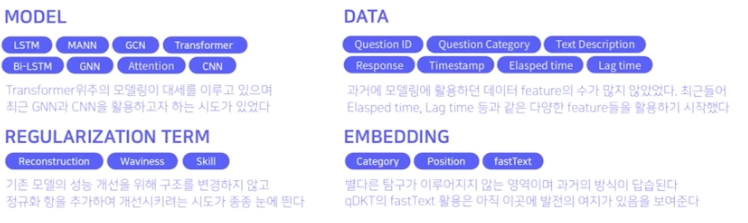
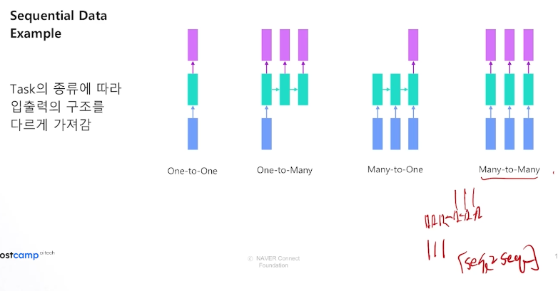
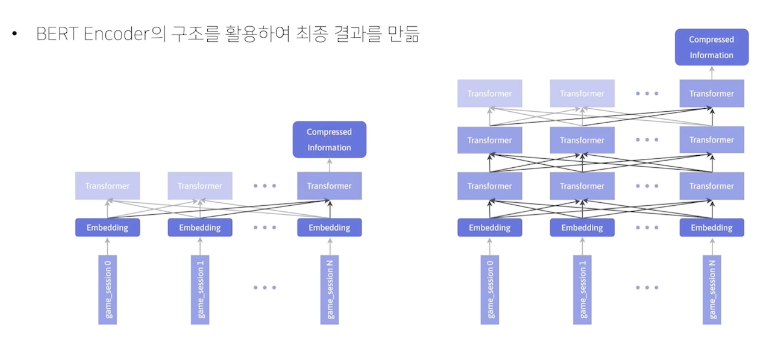
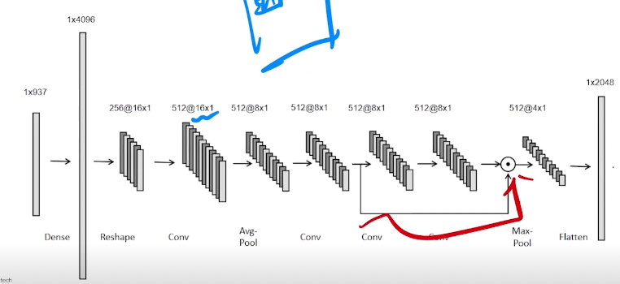

# Deep Knowledge Tracing (DKT) - Naver Boostcamp 9주차

DKT 의 기본 개념 및 발전방향, i-Scream 데이터 분석, Baseline 모델 설명, Transformer Architecture 설계

## 분류에서의 Confusion Matrix
Area Under the ROC Curve (AUC) 
- x축은 FPR, y축은 TPR
- 밑부분 면적이 넓을 수록 모형 성능이 좋아진다.
- "맞으면 위로 올라가고, 틀리면 오른쪽으로 간다" 로 이해하면 편하다.

AUC가 좋은 2가지 이유 (이상적)
    1. 척도 불변.
    2. 분류 임계값(proba) 불변

그런데 척도 불변, Proba 불변이 항상 이상적이진 않다.
- 잘 보정된 확률 결과가 필요한 경우가 있는데 AUC로는 이 정보를 알 수 없다.  **질문: 말뜻?**
- FN, FP 비용에 큰 차이가 있는 경우, 비용이 큰 것을 우선시하고자 할때 AUC는 최적화에 유용한 방법이 아닐 수 있다. (스팸 메일 감지)
- Imbalanced Data에서 AUC가 높게 측정되는 경향이 있다. 그래도 모델끼리 상대적 성능은 동일한 test data 하에 비교 가능.

## DKT History 및 Trend
DKT는 Sequence Data를 다루는 만큼 자연어 처리에 많은 영향을 받아왔다.

### Sequence Data
RNN
- 장문장에서 학습이 어려움. 거리가 먼 단어와의 관계 정보가 소실됨.

LSTM
- 장기기억 저장

SEQ2SEQ
- Encoder and Decoder
- 그 사이에 **Context Vector** 존재

LSTM, SEQ2SEQ도 결국 아주 긴 문장에 대해서는 한계가 있음

Attention
- 어텐션 메커니즘을 더해줌.
- Seq 방식의 한계가 여전함. 학습속도가 느림.

Transformer
- 병렬 처리 방식을 적용. 
- 그럼 말의 어순정보는? **Positional Encoding** 으로 해결함!
- \+ Self-attention

크게 Sequence 모델링에는, 
1. LGBM
2. LSTM
3. 1D-CNN
4. Transformer

이렇게 쓰일 수 있다고 알아두자.

**History of deep knowledge tracing (연도별 정리 자료) 참고**

## i-Scream 데이터 분석
- DKT에서 보통 하나의 행을 "Interaction"이라 부름.

- UserID - 7442 명의 유저 존재
- answerCode - 65.45%가 정답 맞춤. 0은 틀린것, 1은 맞은것
- 어느 정도 balanced 데이터라 할수있음.
- assessmentItemID : 푼 문항의 일련번호
일련번호의 규칙
    - 첫자리는 항상 A
    - 다음 6자리는 시험지 번호
    - 마지막 3자리는 시험지 내 문항 번호
- testId
    - 첫자리는 항상 A
    - 다음 3자리, 마지막 3자리 총 6자리가 시험지 번호 (가운데는 000으로 되어있음.)
    앞에 3자리중 가운데 자리만 1~9값을 가지며 이를 대분류라는 Feature로 활용 가능.
> 어떤 기준점이 있다면, 그것을 바탕으로 나눌 수 있는 feature는 일단 생성해서 적용해 보는 것이 좋다.

### 기술 통계량이란?
- 데이터 자체의 정보를 수치로 요약, 단순화하는 것을 목표.
- 평균, 중앙값, 최대, 최소와 같은 값들을 뽑아내고, 유의미하게 시각화하는 작업
- 분석 최종 목표인 정답률과 연관지어 진행하는 것이 유리하다.

1. 사용자 분석
    - 한 사용자가 몇 개의 문항 풀었는지 groupby로 찾아낼 수 있음.
    - Histogram + KDE plot 같이 그려볼것.
    - 학생 별 / 문항 별 / 시험지 별 정답률 분석
    - 0/1 문제에서는 단순히 평균을 구하면 그것이 정답률이 됨.

2. 일반적 EDA, 인사이트
    - 문항을 더 많이 푼 학생이 문제를 더 잘 맞추는가?
        - 정답률에는 0.171의 상관계수를 가지지만, 그렇다고 많이 풀수록 더 잘 맞춘다고 설명하긴 애매하다. 

    - 문항을 풀수록 실력이 늘어나는가?
        - 앞의 N개 문항에 대한 정답률과 비례할 수도 있다.

    - 문항을 푸는 데 걸린 시간과 정답률 사이 관계는?

## DKT Baseline Model
Tabular Approach
- Feature Engineering
    - 현재까지 푼 문제 대비 맞은 문제 피쳐 추가
    - 문제 및 시험 별 난이도
    
- Train/Valid data split
    - 사용자 단위로 split해야 유저의 실력 보존
- Model Training
    - HP Tuning은 마지막 성능 올리기 이외에는 시간을 너무 쏟지 말것.
    - Feature engineering이 더 중요하다.

Sequential Approach

- LSTM
    - input: Batch size, seq_len, hidden_size
- Embedding
- Input Transformation
    - 사용자 별로 embedding sequence 생성
    - padding 은 앞 혹은 뒤로 가능.

- LSTM, LSTM + Attention, BERT 

- **모델링 전체 scheme**
    1. Ground baseline with no FE(Feature Engineering) (이거는 빠르게 진행)
    2. small FE and try to understand data
    3. Find good CV K-fold, Stratified K-fold, time-series split 등 -> CV vs. LB를 살펴볼것.
    4. Feature Selection
    5. Make deeper FE
    6. Tune model (crude tuning, 큰 틀에서 모델 튜닝)
    7. Try other models (NN은 늘 시도해볼것)
    8. Try Blending / Stacking / Ensembling
    9. Final Tuning (HP tuning, seed ensemble 등)

## Sequence Data 문제 정의에 맞는 Transformer Architecture 설계 사례
Transformer는 다양한 sequence data에 있어 강점을 보이지만 모델 구조상 많은 데이터와 연산량 요구함. 이 때문에 종종 상황에 맞게 Transformer을 변형하여 사용함.
### 1. Data Science Bowl
- 3-5세 영유아들의 게임을 활용 학습하도록 만든 교육과정
- 여기에서 개념을 정확히 배웠는지 맞추는 것이 대회의 목표

How to embed cat / num features for transformers
- Categorical은 embedding, Numerical은 linear transformation -> concat 으로 합침
- Bert encoder 의 구조를 활용, 마지막 layer에서는 마지막 sequence만 사용하여 output을 냄.

### 2. Riiid
- 토익 시험에 대비하여 공부한 학생들의 학습 과정을 모아둔 데이터로, 최종적으로 어떤 학생이 마지막 푼 문항을 맞출지 틀릴지를 맞추는 대회
- 전체 interaction의 수 ~ 1억개 로 상당히 많은 편
- i-Scream은 답 맞춘 여부만 이진으로 target인데, Riiid는 어떤 답을 냈는지에 대한 데이터도 포함.
- Using half-sequence 
훈련할 수 있는 데이터 수가 많지 않아서 임베딩 된 2개의 Sequence를 하나로 이어붙여 하나의 임베딩 차원을 2배로 늘려 학습시킴 (대신 Sequence 길이는 1/2)

### 3. Predicting Molecular Properties
- 분자의 여러 정보들을 통해 원자간 결합 상수를 찾는 대회. Sequence 우선이 존재하지 않는 sequence 데이터다.
- Riiid와 다르게, 마지막 레이어에 있는 모든 sequence를 이용하여 output 도출.
- 분자 별로 원자쌍이 최대 135개였기 때문에 고정 seq_len = 135로 생각 가능.
- 최종적으로 예측해야 하는 scaling constant는 Fc, sd, pso, dso라는 값의 합으로 이루어져 있어서 scaling constant를 예측하는 부분과 / 요소 4개를 각각 예측하여 이를 합하는 두 종류의 최종 결과를 얻을 수 있다. 
이에 따라 두 모델을 각각 훈련시켜 결과의 평균을 최종 예측으로 제출함.

### 4. Mechanisms of Actions (MoA)
- Transformer가 잘 작동하지 않음!
    - Sequence Data가 아니었다.
    - 너무 많은 수의 Feature과 예측해야할 Classes (875개, 207개)
- **1D-CNN** 이 의미있는 solution이었음.
- Conv layer 전에 linear 를 한번 거치는 이유는, 이미지처럼 활용하려면 많은 pixel을 만들어 주어야 하기 때문에 차원 늘려주는 역할 그리고 생성 데이터 안에서 feature가 정렬된 효과를 기대할 수 있음 - Learning Feature ordering

- Conv1d는 emb_dim 과 커널 사이즈가 동일한 게 논리적으로 맞음 (아닐수도?)
 