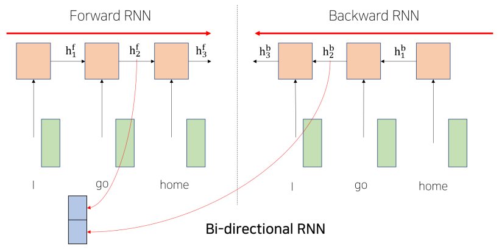
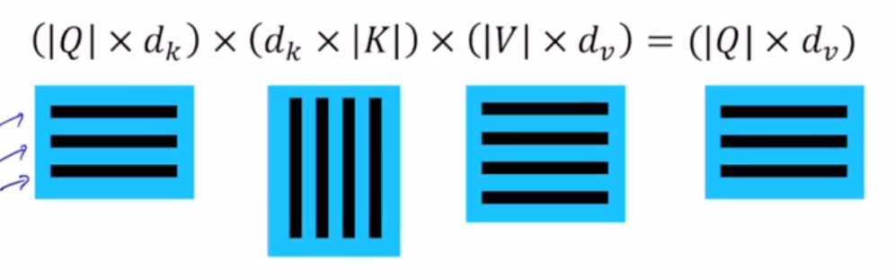
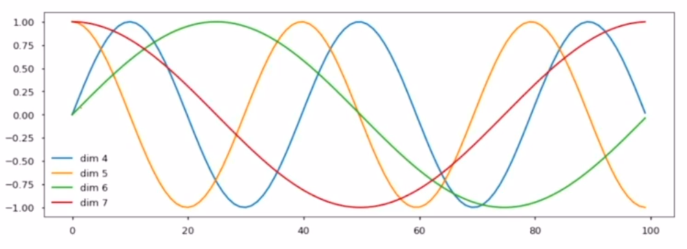

# Transformer - Naver Boostcamp 9주차 개인 보충학습 

## RNN
직렬적인 구조로 인해 초기 sequence 정보가 손실, 왜곡될 우려가 있음.
- Bi-directional RNNs
  Backward RNN 을 생성. Forward RNN(기존)과 함께 동일한 단어에 대하여 두개의 hidden state를 가져옴(이전단어들 + 이후단어들 -> Concat) 
  그러면 sequence 전체를 고려하게 됨
  

## Transformer
attention에서도 입력과 출력의 세팅은 동일함. 즉 단어를 인코딩하는 것은 같다.
### QKV
  - attention을 더 유연하게 확장하는 방식
  - 주어진 벡터중 어느것을 선별적으로 가져올지 -> Query
  - Query 벡터가 각 벡터와 내적해서 유사도 구함 -> 내적을 하는 재료 벡터들은 Key 
  - Query를 가지고 Key 중 어느것이 유사도가 높은지 결정
  - Wq, Wk, Wv로 모든 sequence 벡터를 변환함. 모든 단어가 q, k, v 중 하나가 될 수 있음.
  - key와 value의 개수는 같아야 함. (왜?)

### Scaled Dot-Product Attention
  - Output 은 values의 weighted sum
  - weights는 Query * Key 

$$ A(Q, K, V) = softmax({{Q \cdot K^{T}} \over {\sqrt{d_{k}}}} {})V $$ 
  - why 'Scaled'?
    - length of query가 길어질수록 분산이 증가한다. 이는 softmax를 통과할때 큰 값에 굉장히 확률이 몰리는 결과를 만들 수 있다. 따라서 $\sqrt{d_{k}}$로 나누어 주면 분산을 1로 만들 수 있다.
    - softmax 값이 너무 편중되어 있으면 gradient vanishing이 발생할 위험성이 있어서 학습이 거의 되지 않을 수 있다. 이를 방지해줌.\

### Multi-head Attention
- 다수 버전의 attention을 수행한다. (**질문: 다른 버전을 어떻게??**)
- 서로 다른 측면의 정보를 병렬적으로 추출 가능.
- 다른 버전의 attention으로 인코딩된 벡터를 모두 concat 시키고, 그것을 linear 변환 시킴.
- 행렬 연산의 병렬화로 GPU에서 연산속도 극대회시킬 수 있음. Sequential Operations: $O(1)$

### Add & Normalization
residual connection 으로 입력값을 출력값에 더해준다.
이를 통해 모델은 출력값 - 입력값 만을 학습하여 gradient vanishing 도 없애고 학습이 더 잘 되도록 함.

layer normalization (BN과 비슷) 적용.

### Positional Encoding
sequence에서의 해당 단어의 위치를 알 수 있게 특정한 상수 벡터를 각 입력 벡터에 더해주어 위치정보를 추가. (완전히 이해하지는 못함). sin, cos 함수를 이용하여 positional encoding 해줌.

