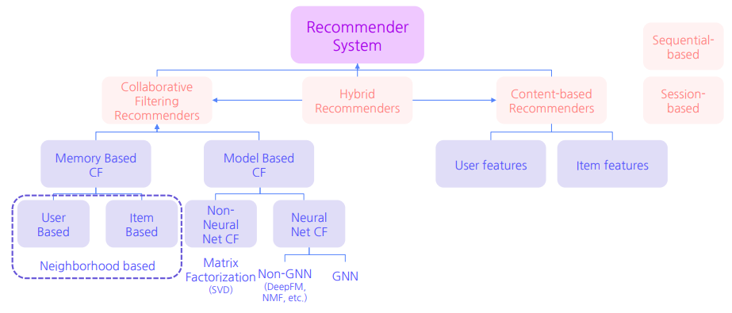

# Deep Knowledge Tracing (DKT) - Naver Boostcamp 10주
Riiid Solution, DKT with RecSys, Graph Neural Network on RecSys

## Riiid Solution
### Feature Engineering
- Bottom-up : Data 부터 시작하여 EDA - 모델링 으로 이어지는 방식
- Top-Down : 도메인 지식을 바탕으로 가설 검증부터 시작하여 접근하는 방식. 컨설팅 기반.
- Numerical and Categorical
    - Numerical : 결측치, min, max, 1Q, median, range, mean, std, kurtosis, skew
    feature vs. target 분포 - histogram
    - Categorical : 결측치, 범주들의 개수, percent, 최빈도 등.
    feature vs. target - value별 target bar plot

- 상위 솔루션들의 FE 특징
    1. 사용자 별 문항 푸는 패턴 다를 수 있다.
    i-Scream에서는 선택지 정보가 없이 정답 여부만 나와있으므로 적용하기 힘듬.
    2. 문항 푸는데 걸린 평균 시간보다 특정 사용자가 오래 걸렸을 경우
    해당 문항 맞춘 학생의 평균 시간과 / 틀린 학생의 평균 시간 을 feature로 활용 가능
    3. 최근 정답률 / 문제 총 정답률
    - (내 의견) EMA 처럼 기간에 따른 정답률 부여
    4. 문항 별 특징
    직접적 정보 : 문항의 정답률 / 문항이 가진 태그의 정답률
    간접적 정보 : 
        - 문항-태그 정보 content2vec
        - 사용자-문항 정보 SVD, LDA, item2vec
        - 문항을 특징화하는 IRT, ELO
    
    5. 문항과 태그가 등장한 횟수가 정답률과 어느 정도 상관관계 있음.  
- 문항 별 특징
    1. 다양한 방법을 통한 문항 고유의 Feature 뽑아내기
        - MF 로 사용자의 벡터와 문항의 벡터를 생성
        추천 문제는 결국 비어있는 matrix를 완성시키는 matrix completion 문제이다. 
        **(얼마나 sparse 한지 파악해 보자!)**
        - SVD - sparse 한 행렬에는 적용할 수 없음.
    2. ELO, IRT를 활용
        - 학생과 문항 별로 고유한 특성이 있다는 가정을 하는 이론.
        - 한 접근 방법
            - 학생의 $\theta$ 와 문항의 $\beta$를 0으로 초기화하여, 수식에 맞춰 $\theta$ 와 $\beta$를 업데이트 한다. 
            

    3. 시간 데이터 임베딩
        - Continuous Embedding
            주변값들에 가중치를 부여하여 임베딩 행렬의 특정 열들을 가중합한 벡터를 임베딩으로 사용. (완전히 이해하지는 못함)

### Riiid 1st Solution
LGBM, DNN 의 Feature 많이 만들어야 하는 문제 + Transformer의 아주 많은 데이터 요구와 큰 시간 복잡도 (Sequence 길이의 제곱에 비례) 를 **모두 해결**하여 1등

#### Last Query Transformer RNN 사용
1. Feature 생성을 거의 하지 않음
    - 5개의 feature 만 사용
    - LGBM 시도 경우에는 70~80개의 feature 를 생성해야 하는데 시간 절약 가능. (모델링에 시간 더 투자)

2. 마지막 Query만 사용하여 시간 복잡도 낮춤
    - 두 행렬 A, B가 각각 nxm, mxl 일때 두 행렬 
    곱의 시간 복잡도는 $O(nml)$
    - 시간 복잡도가 $O(L^{2}d)$
    
    - 이때 query 행렬에서 마지막 query만 사용한다면, Q행렬의 차원이 (1, d)로 줄어듬. 따라서 최종적 연산의 시간 복잡도는 $O(Ld)$로 줄어듬.

3. **문제간 특징을 Transformer로 파악하고
일련의 Sequence 사이 특징들을 LSTM으로 뽑아낸 뒤 마지막에 DNN을 통해 정답 예측**
    - Transformer에서 Positional Embedding과 Look-ahead masking을 제거하여 순서 관계없이 입력사이의 관계만 파악하였다.
    - 순서를 이용한 학습은 LSTM으로.

### Why Kaggle?
현실적으로 Bottom-up은 힘들다. 모든 지식을 알고 접근하기는 불가능하다. 그래서 **Top-down** 방식의 접근이 필요하고. 이를 익히기 위해서는 Kaggle이 필수적이다. 
- 도메인에서 필요한 지식을 모두 알 순 없다. 그때그때 필요한것을 agile 하게 익히면서 시도하여 솔루션을 내 보아야 한다.

## DKT with RecSys

추천 시스템을 이용하여 라벨을 뽑아내고 이것을 토대로 AUC 계산 가능하다.

### DKT + RS

DKT task는 inductive 한 방법
Recommendation Task
- Non-Graph based - MF 로 행렬을 채우는 문제
- Graph based - Link prediction

### 추천 시스템의 4가지 Frame

- Stage
  - Ranking : "정렬을 잘 해보겠다"
  - Re-ranking : "순서를 바꿔 보겠다" , 후처리

- Scenario
    - 어떤 Rec 문제로 볼 것인가

- Objective
- Application
  
### Taxonomy of RecSys

- 크게 Collaborative Filtering 과 Content-based 로 나뉘고 이를 Hybrid 하기도 한다.

### RS Research Trend

### DKT with RS - MF
MF에서는 유저-아이템 상호작용 행렬을 가지고 user X item 으로 행렬분해하는 방법. 다시 곱해서 원래 행렬과 비교하여 학습 진행
- 단점 : Sequence 정보를 얻을 수 없음.

### DKT with RS - Sequential
- Next Item prediction : t-1 까지의 정보만 주어짐
- CTR prediction : t까지 정보도 주어지는데 마지막 클릭 여부 (0/1)만 예측하는 것.

### DKT with RS - Graph Neural Network
사용자와 문제 사이의 관계를 AnswerCode라고 정의할 수 있음. 

## Graph Neural Network on RecSys
### 그래프의 종류 
- node-feature matrix
- structure matrix
  - adjacency matrix (연결여부 1)
  - degree matrix (몇개 연결)
  - laplacian matrix (degree 에서 adjacent를 뺀 matrix)

### GNN Architecture
그래프 데이터를 Node-feature 그리고 structure matrix로 정의하고, 이것들을 NN에 적합하게 input으로 만들어서 문제를 해결.

이미지와의 차이점?
- 이미지는 Euclidean 공간 상에서의 격자 형태
- 그래프는 Non-Euclidean 이라 거리는 상관없고 상호 관계성이 중요.

GCN
일반적 CNN이 인접한 픽셀 정보를 모으듯이, GCN도 주변 정보를 모아서 Target Node의 데이터를 업데이트함.

학습
Adjacent matrix * Node-feature matrix * Weight
노드 자신 정보도 포함해야 하기 때문에, Self-loop 으로 A* = A + I 로 표현해줌.
GCN은 transductive 하다. test data도 안에 포함되어 있어야 한다. 이는 MF랑 비슷하다.

#### GCN, Graph Attention Networks (GAT)
GCN vs. GAT
GCN : AHW로 학습
GAT : Attention이 어떻게 적용되는지?
- $\alpha_{ij}$ = softmax($e_{ij}$) 인데 여기에서 $e_{ij}$는 노드간의 정보(간선)
- multi-head attention : 단순히 위 작업을 여러번 하면 되는 것.
  

#### Attention
Attention(Q, K, V) = softmax(QK^T / sqrt(dk)) * V

#### Receptive Field
GCN도 CNN처럼 layer을 여러 개 쌓으면 Receptive Field가 넓어진다.
"내 이웃의 이웃" - "k-hop illustration"

단점 : over-smoothing
- 주변의 특징으로 노드가 희석되어 버리는 문제가 생김.
- 따라서 layer을 5 이상 늘리면 너무 연결이 커지므로 이 문제로 성능이 떨어진다.
- 이걸 극복하기 위해 Node Dropout, Edge Dropout 등의 방법을 이용.

### GNN summary
Graph로 Node, edge 관계를 node-feature matrix와 adjacency matrix로 표현할 수 있음.  
GNN은 두 matrix를 사용하여 vector 정보를 agg 하고 update하게 됨.

## GNN on RecSys 본론
### NGCF
