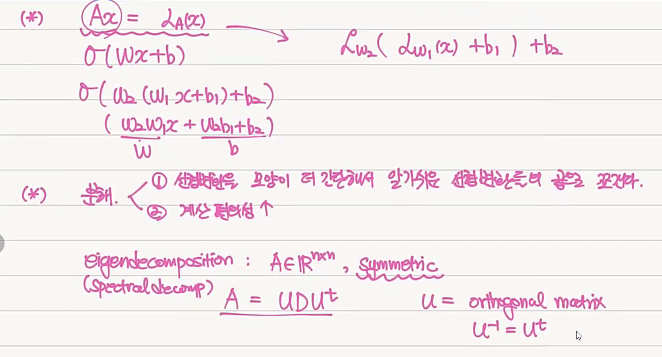
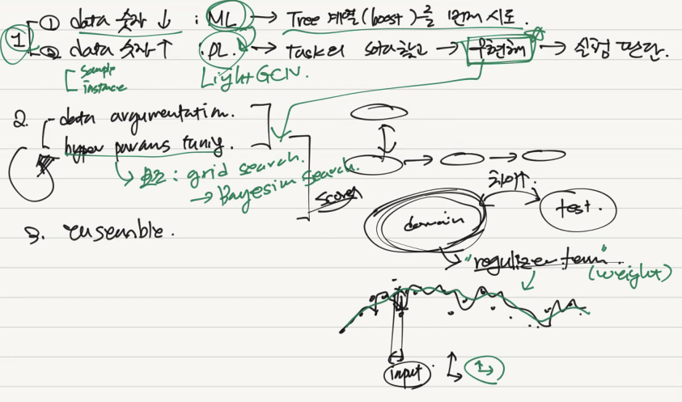

# 부스트캠프 level 2 멘토링

## 차원축소법 - 10주차 부스트캠프 멘토링
여러 차원축소법 : SVD, PCA 등에 대한 강의 정리

행렬 분해를 하는 이유?
1. 선형변환을 모양이 더 간단해서 알기쉬운 선형변환들의 곱으로 쪼갠다.
2. 계산 편의성의 증가

eigendecomposition
- $ A = UDU^{\dagger} $

### SVD (Singular Value Decomposition)
det = 0 일 때도, pseudoinverse를 얻기 위한 작업.
분산이 최대인 차원을 찾음 - PCA

### MDS 
- isometry. 거리가 같은 곳을 찾음. 길이를 유지한 상태로 더 낮은 차원으로 넣을 수 있는가?
- 그런데 보통은 길이 유지하기가 힘듬. 그래서 penalty 부여. stress function 으로 score 매김

- PCA와의 차이점? 

### t-SNE
- 비선형 방정식
- 가우시안 밀도함수를 이용.

### 차원축소법을 어디에 이용?
- outlier의 선별에 중요. 이들의 특징 파악. 
- categorical 은 one-hot 으로 표현한다면 압축이 필요.
- numerical은 

### 데이터에 적합한 차원축소법을 어떻게 판별할 수 있나?

---

## 11주차 부스트캠프 멘토링

### 대회나 프로젝트에서 data에 따라 어떻게 scheme을 그려야 하는가?

### noisy 한 데이터의 판별
- 차원축소
    - 데이터를 2d plot하여 outlier 판별, 이를 제거한다.
    - PCA, tSNE 등 
    - comp cost가 크므로 딥러닝 학습 으로 근사가능.

### GNN 개론

### Inductive Learning / Transductive Learning
- cold start 문제에 대처하기 위해 사용함.