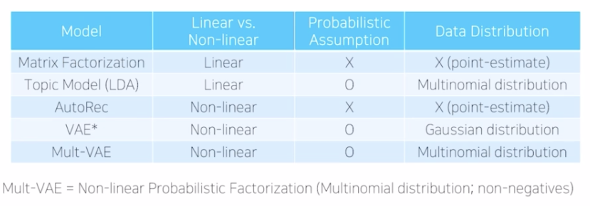

# MovieLens Recommendation - Naver Boostcamp 13주차
Memory-based / Model-based Collaborative Filtering, Deep learning in RecSys, Side-information 활용, Temporal Dynamics, 추천 시스템의 평가

## Memory-based CF
- 사용자 또는 아이템 간의 유사도를 계산하고 이를 rating 혹은 top-K ranking에 활용하는 방법
- 사용자가 아이템에 부여할 평점은 유사한 사용자나 유사한 아이템에 매겨진 평점을 기반으로 유추할 수 있다는 가정.
- 사례 : Item-to-Item CF in Amazon.com (2003년 논문)
- 비교적 옛날에 추천시스템에 적용되던 방식임

## Model-based CF
- Latent Factor Models
    - 사용자와 아이템의 저차원 표현을 학습. 

## User-free model
- user term 을 제거함으로서, 새로운 사용자에 대해 inference 가능하고 이력이 거의 없는 사용자에 대한 대응이 가능함
- MF는 sequence를 고려하지 않는데, 이에반해 sequence 시나리오 대응이 가능함.
- 휴리스틱 (코사인, 자카드 유사도) 대신에 이를 파라미터로 두어 학습함.
- SLIM : Sparse Linear Methods for Top-N Recsys. Memory based + model based CF 의 형태로, 기존 MF보다 Long-tail 추천에 더 좋은 성능을 보임.
- FISM: Factored Item Similarity Model
user term을 사용자의 기존 이력에 기반한 agg item representations 로 대체함. 데이터가 sparse 할수록 기본모델에 비해 성능 차이가 크다.

- 이외 user-free 모델들 
    1. AutoRec
    user term -> nonlinear function mapping으로 대체
    2. Item2Vec
    3. Sequential Rec Models
        사용자 ID를 사용하지 않고 아이템의 time-ordered seq를 입력으로 사용한다. 이때 user term은 RNN의 hidden-state로 표현됨.

## Deep Learning 의 Recsys에서의 장점과 한계

- 장점
    - Nonlinear Transformation : 비선형성으로 인해 복잡한 user-item interaction 포착
    - Representation Learning : FE 의 수고를 덜어주며, 비동질적 데이터와 함께 multi-modality가 가능
    - Sequence Modeling : RNN, Transformer
    - Flexibility : 다양한 네트워크 구조들을 쉽게 결합 가능

- 한계
    - Interpretability : 블랙박스로 쉽게 해석이 힘듬
    - Data Requirement : 유의미한 성능을 내기 위해 필요로 하는 데이터의 양이 많음. 하지만 RecSys는 NLP, CV에 비해 필요한 데이터가 적은 편
    - Extensive HP Tuning : 튜닝이 쉽지 않다.

## Examples of Deep Learning for CF

IDEA : user - item 관계를 모델링할때 내적 대신에 DNN 을 사용한다. MF 는 그 선형성으로 인해 관계성 표현에 한계가 있음

Autoencoder CF : 입력값을 Decoder로 재생성하게 학습함으로서 잠재적인 패턴을 학습
- training 과정 : observed parameter만 학습
- inference 과정 : 사용자의 input을 넣어주고 여기에서의 원소에 대해서만 prediction 진행.

## DL-based CF for Rating Prediction
"새로운 아이템에 대해 몇 점을 줄까?"

U/I-RBM : Restricted Boltzmann Machines for CF
-  최초로 NN을 활용한 추천모델 중 하나

AutoRec : Autoencoders for CF
- Backpropagation 과정에서 관측된 rating 과 관련 있는 노드에 대해서만 업데이트함
- Item Autorec이 User Autorec보다 더 잘 동작함. Rating per Item이 더 많기 때문. 
- 활성화 함수의 조합, Hidden layer의 뉴런 및 레이어 수를 높임에 따라 성능차이가 큼.

## DL-based CF for Top-K Ranking
"사용자의 선호 아이템을 얼마나 잘 찾아낼 수 있을까?"

Neural MF (NeuMF) : Generalized MF (GMF) + MLP 로 MF가 가진 linear model 의 표현력의 한계 극복하고자 함.

Collaborative Denoising AE 
- input data 에 노이즈 추가해서 학습

Negative Sampling : 사용하지 않은 아이템을 랜덤 샘플링해서 input data를 corruption 시킴 

Mult-VAE : ELBO term 을 사용
- Expected negative reconstruction error - Regularizer 

- KL annealing

Comparison between Mult-VAE and FMs

- Mult-VAE가 대부분에서 좋은 성능을 보임.

EASE (Embarrassingly Shallow AE)
- 아주 얕은 AE로 중간층이 그냥 벡터
- Closed-form 으로 도출되기 때문에 autograd 기능을 사용하지 않고도 numpy 함수로도 계산 가능.
- 간단하지만 좋은 성능을 보임

## Side-information
Limitations of CF
- Cold-start probem : interaction data가 충분치 않음.
- Temporal evolution : 시간의 흐름에 따른 선호도 및 특성의 변화를 반영하지 않음. 그래서 temporal factor - t를 추가하기도 함.

Content-based methods: 사용자 및 아이템의 side-information을 활용함으로서 cold-start 문제를 완화할 수 있다.
- 장점 : 이력이 존재하지 않는 새로운 아이템의 추천에 효과적
- 단점 : 비교적 뻔한 추천 결과. 새로운 사용자에 대한 추천에는 여전히 한계가 있음.

CF and CB
- Content-based Method (CB)와 CF는 상호 보완적이다. 일반적으로 CB는 개별로 쓰이기보다는 다른 방법과 결합해서 주로 사용함.

## Context-aware Rec
Context-aware Rec 
- 추천이 이루어지는 특정한 상황을 나타내는 추가 정보에 따라 추천 결과를 생성 및 조정함. (시간, 장소, Social 정보)

Factorization Machines (FM) : MF가 사용자-아이템만 이용했다면, FM은 사용자 아이템 그리고 모든 feature들을 low-dim vector 로 표현하고 이들 간의 pairwise interaction 을 모델링함. FM은 즉 MF를 일반화한 것.

Wide & Deep : wide 컴포넌트와 deep 컴포넌트를 결합해 다양한 side-info 를 자연스럽게 통합함.

DeepFM : FM component + Deep comp. DeepFM 은 FE가 필요하지 않음.

Latent Cross : **설명 내용이 잘 이해가 안감.**

## Textual Content
Collaborative Deep Learning (CDL) : BOW 를 활용한 Top-K Ranking rec 모델.
MF + SDAE (Stacked Denoising AE)

SDAE : 인풋에 noise-corrupted input. + stack

Visual BPR : item의 visual content 를 활용한 모델
pretrained CNN을 이용, 이미지 데이터를 item latent factor 와 결합함.

이외 audio info 를 이용한 연구도 있고, Social Networks 정보를 content로 활용하기도 함. (인접행렬 을 활용하는 등)

## Temporal Dynamics and RecSys

추천 시스템에서 temporal dynamics 고려하는 이유 - 상품이나 취향, 인터페이스 등이 시간의 흐름에 따라 달라짐

Autoregression : 자기 회귀. 자기자신을 y1, ..., yn까지 있을때 이를 feature로 활용하여 yn+1을 예측한다. 
- 예시 : 이동평균.
- Learning-based MA : weighted MA에서 weight를 학습하는 방법. 주기성을 모델링하는 데 보다 적합하다. 

Temporal Dynamics in Netflix Prize : 시간 term 을 추가함. [Koren (2009)]
temporally-evolving bias terms : user bias + item bias

**Long-term dynamics**
1. Time Weight CF
    - concept drift 를 고려한 연구
    - 서로 비슷한 아이템의 평점은 유사할 거싱다 (Item-based CF)
    - 그런데 평점 매긴 시간이 멀어질수록 유사도의 반영 정도를 줄여야 한다.
2. Sequential and Temporal Dynamics of Online Opinion

**Short-term dynamics**
일, 분 단위의 짧은 시간변화를 활용한 모델링 방법들

## Sequential Recommendations

### Traditional Sequential Rec models
Markov property : 다음 상태는 그 직전의 상태에만 영향을 받는다는 가정
User X Item X (previous) Item

FPMC (Factorized Personalized Markov Chains)
- MF를 이용하여 일반적 경향성을 모델링하고 Markov Chain 을 이용하여 item 의 seq pattern 을 모델링
- User정보와 직전소비 item 을 통해 다음 item 을 예측함

PRME (Personalized Ranking Metric Embedding)
- Sequential compatibility 를 유클리드 거리로 표현

FME (Factorized Markov Embedding) 
- 음악 추천을 위해 고안된 모델
- 직전 노래의 끝점과 다음 노래의 시작점 사이의 거리를 고려함.

TransRec (Translation-based Recommendation)
- item을 embed 상의 point로 표현하고 user를 translation vector로 사용하여 item sequence를 예측한다.

Seq models 간의 비교

### Deep Learning in Sequential Rec model
RNN - 장기기억 보존으로 Markov Chain 기반 모델의 단점을 보완.
- RNN cell 을 조정하여 여러가지 특성을 학습 가능 (LSTM, GRU 등)

NLP - 문장의 semantics를 모델링하기 위해 사용되었던 많은 방법들은 seq recommendation에도 적용되어 옴.

GRU4Rec
- User의 action sequence 를 session으로 나누어 이를 기반으로 추천
- user term 을 사용하는 대신, user interaction을 session 으로 나누어 NLP의 문장과 같이 다룸 (user-free)

negative sampling - 질문하기! 

NARM (Neural Attentive Rec Machine)
- User 의 행동의 주목적을 파악하기 위해, user의 취향을 global와 local level로 나눈다.
- 전체 sequence 를 보는 global, 직전 행동에 집중하는 local

**Transformer in RecSys**
SASRec (Self-Attentive Sequential Rec)
Transformer와의 차이점
- Dropout - item embedding layer에 적용
- Shared item embedding
- Training loss : negative sample을 이용한 binary crossentropy 사용

BERT4Rec
- Bidirectional Encoder Representation (BERT) 는 양방향으로 Self-attention을 적용하는 방법. NLP에서 pre-training 단계에 많이 활용된다.

**질문 : pre-training이란?

SASRec vs. BERT4Rec

**Recent extensions of Sequential Recommendations**

Self-Supervised Learning : 
과거로부터 현재를 예측하기도 하고, 과거를 현재로부터 예측하기도 하고, top에서 bottom 예측 등 여러가지 방향으로 예측을 수행함으로서 다양한 패턴 학습하게 돕는다.

Contrastive Learning :
데이터가 부족할때도 representation을 잘 학습하기 위해 다양한 seq augmentation을 동반한 self-supervised learning을 적용함.

Sequence augmentation
1. item crop
2. item mask

## 추천 시스템의 평가
1. 사용자 스터디  2. Online 평가  3. Offline 평가

- Online 평가는 주로 A/B Testing으로 이루어지며 실제 반응을 수집하여 비교함.

추천 시스템의 평가 기준
accuracy + diversity, serendipity, novelty, robustness, scalability

### 평가를 위한 실험 설계
Unbiased Evaluation을 위한 방법들
    1. implicit feedback 사용
    2. temporal global split (어떤 시점 기준으로 나누기) 
    3. align offline / online test (offline A/B test, etc.)
