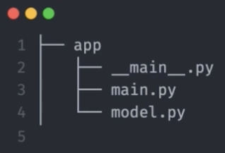
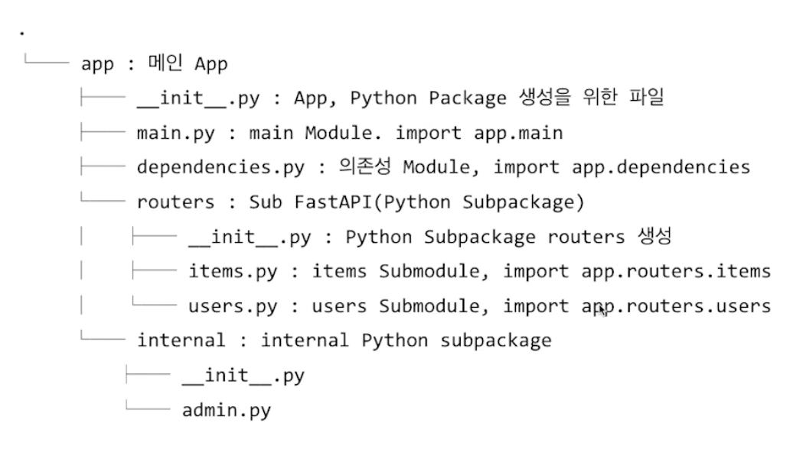

# AI Product - Naver Boostcamp 17주
Cloud, Back-end, FastAPI

## Cloud
기존은 IDC (Internet Data Center)과 같은 물리적인 공간을 만들고 운영.  

Cloud 서비스는 공간적인 제약에서 벗어나고, 개발자가 직접 설정하는 작업 등도 클라우드에서 쉽게 할 수 있게 Managed 서비스함.

클라우드 서비스의 다양한 제품
- 컴퓨팅 서비스
    - 가장 많이 사용됨. 연산을 수행하는 서비스
- Stateless Container
    - Docker container 기반으로  서버를 실행
- Object Storage
    - 저장소 역할 수행
- Database
    - PostgreSQL 등
- Data Warehouse
    - 데이터 분석에 특화됨.
- AI Platform

## Continuous Integration / Deploy, Delivery (CI/CD)
CI : 지속적 통합. 새롭게 작성한 코드 변경사항이 Build, Test 진행한 후 Test Case 통과하는지 확인. 지속적으로 코드 품질 관리.

CD : 지속적 배포. 신뢰 가능한 상태가 되면 자동으로 배포될 수 있도록 하는 과정. 

CI : 빌드, 테스트 자동화  /  CD : 배포 자동화

CI/CD 도구 : AWS Codeplay, GCP Cloud Build, **Github Action** 

### Github Action
소프트웨어 Workflow 자동화를 도와주는 도구
작업 단위 : Workflow -> Job -> Step -> Action

## Back-end

> *백엔드 프로그래밍 기초지식은 아주 많은 편이라 자주 접해서 익숙해져야 백엔드 프로그래밍을 수월하게 할 수 있음.*

**지금까지 과정 정리**
프로토타입 개발 : Voila, Streamlit
프론트 : Streamlits
백엔드 : FastAPI로 대체

### Server
마이크로서비스 아키텍쳐 (MSA) - 요리 담당, 고객담당, 비품담당 Server 를 각각 개별 Server로 구성하고 서로 통신하도록 하는 경우

### REST API
REST 형식의 API이다. 정보를 주고 받을때 널리 사용되는 형식
REST : Representational State Transfer
- Resource : Unique한 ID를 가지는 리소스, URI
- Method : 서버에 요청을 보내기 위한 방식

HTTP Method 종류
- GET, POST, PUT, PATCH, DELETE

Status Code
1xx, 2xx, .., 5xx 까지 있음. 이를 통해 현재 상태가 어떤지 판단 가능.

동기와 비동기
- 동기 (Sync) : 서버에서 요청 보낼때 응답이 돌아와야 다음 동작을 수행
- 비동기 (Async): 요청을 보낼 때 응답 상태와 상관없이 다음 동작을 수행

### Fast API
최근 떠오르는 Python Web Framework
Flask, Django 가 주도하던 시장에 등장하여 점유율을 높임.
특징 : High Performance, Easy, Productivity

FastAPI vs Flask
- FastAPI의 장점
    - Flask보다 간결한 Router 문법
    - 보다 직관적임
- 아쉬운 점
    - Flask 대비 ORM 등 DB 관련 라이브러리가 적음

프로젝트 구조

- 언더바main : 앱 실행 Entrypoint 역할
- main.py : FastAPI 의 앱과 Router 설정
- model.py 는 ML model에 대한 클래스와 함수 정의

**Poetry** : **Dependency Resolver**
- Virtualenv 생성해서 빠른 개발 가능
- 기존 파이썬 패키지에서 지원하지 않는 Build, Publish 가 가능

Poetry 프로젝트 생성하기
`poetry init` 으로 프로젝트 생성. 
- config로 빠르게 설정 가능.
- 대화 형식으로 패키지 설치 가능
- 개발 환경마다 필요한 패키지 분리 가능 (production / package)

`poetry shell` 을 이용하여 poetry shell 활성화
`poetry Install`로 라이브러리 설치
`poetry Add`는 필요한 패키지 추가하고 싶은 경우 사용

`poetry.lock`파일로 프로젝트 의존성에 따라 sync 가능

**Swagger**
만든 API를 클라이언트에서 호출하는 경우 - 문서 작성 및 설계가 협업하면서 번거로워짐
**REST API 설계 및 문서화할 때 사용**
- 다른 개발팀과 협업
- 구축된 프로젝트를 유지보수할 때 

**Path Parameter, Query Parameter**
path -> `/users?id=402` - ID가 402인 사용자 정보를 가져오고자 할때
query -> `/users?key=value`

Resource 식별해야 하는 경우 Path 가 더 적합하고, 정렬 및 필터링의 경우 Query 가 더 적합

**Request Body**
클라이언트에서 API에 데이터 보낼때 이용

### Pydantic
FastAPI 에서 class 사용할때 등장한 Pydantic
Data Validation / Settings Management 라이브러리
기존 Validation 라이브러리보다 빠름

Pydantic 의 두가지 기능
1. Validation
2. Config 관리

**Pydantic Validation**
예) Online Serving에서 input data를 validation
조건1 : 올바른 url
조건2 : 1-10 사이의 정수 입력
조건3 : 올바른 폴더 이름

기존 Python 활용한 Class 활용 시, 의미없이 코드 길어지고, 검증 로직이 장황하다.

Dataclass 활용 시, 조금 더 편하지만 검증 로직은 여전히 복잡
인스턴스 생성 시점에서 Val 수행하기 쉽지만, 여전히 Val 로직을 직접 작성해야 함. 

**Pydantic validation**을 활용하면, 훨씬 간결해진 코드 (6라인 vs Python class 52라인 vs dataclass 50라인)
- 주로 쓰이는 타입들 (http url, db url, enum 등)에 대한 Val이 만들어져 있음.
- Type Hint에 따라서 Error 발생 기능. 어디서 에러가 발생했는지 location, type, message 등을 알려줌.

Event Handler
- 이벤트가 발생 시 그 처리를 담당하는 함수
- 데코레이터를 이용함
- 앱이 실행, 종료될 때 특정함수를 실행가능
- 예) startup 할때 머신러닝 모델 Load, shutdown할때 로그 저장

API Router
- 더 큰 앱에서 많이 사용되는 기능
- API Endpoint를 정의
- Python Subpackage
- 여러 API를 연결해서 활용

Error Handling
- 어떤 에러 발생했는지 알아야 하므로 로그 수집을 위해 필수적인 기능
- HTTPException으로 구현. Error Response 의 자세한 메시지를 담을 수 있도록 코드 작성할 수 있음.

Background Tasks
- 작업이 완료시까지 기다리지 않고 백그라운드로 넘기면서 바로 응답 및 다음작업이 이루어질 수 있도록 함.
- 작업 결과물을 조회할때 Task를 어딘가에 저장해두고, GET 요청을 통해 Task 완료됐는지 확인.

Cookiecutter
- CLI 형태로 프로젝트 생성 과정을 도와줌
- 회사에서 공통 프로젝트 구조가 필요할 때 이용하기도 함
- 개인용 Cookiecutter 템플릿을 만들어 두는 것도 좋음
예) [Cookiecutter Data Science](https://github.com/drivendata/cookiecutter-data-science), [Cookiecutter fastapi](https://github.com/arthurhenrique/cookiecutter-fastapi)

프로젝트 구조 
- 완전히 처음 진행시에는 하나의 파일에 모두 코드 작성해서 FastAPI에 익숙해지는 것도 좋음
- 이후 다른 프로젝트 구조를 참조해서 코드 개선
- '클린 아키텍쳐' 류의 책을 보면서 구조에 대한 지속적 고민 필요함.

객체지향 - Pydantic Use Case 탐색해보기
