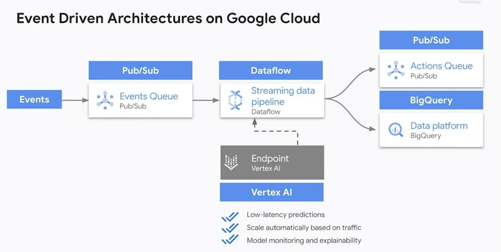

# Google Cloud Technical Series 2023

- 온프레미스란?

- Data sovereignty란?

- GCP Looker

- Real-time Data
    Realtime events -> Cloud Pub/Sub -> BigQuery

- BigQuery
    1. Machine Learning in BigQuery  
    2. Unstructured Data in BigQuery  
    3. Spark in BigQuery  
    4. Real-time data in BigQuery  

