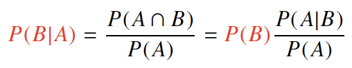
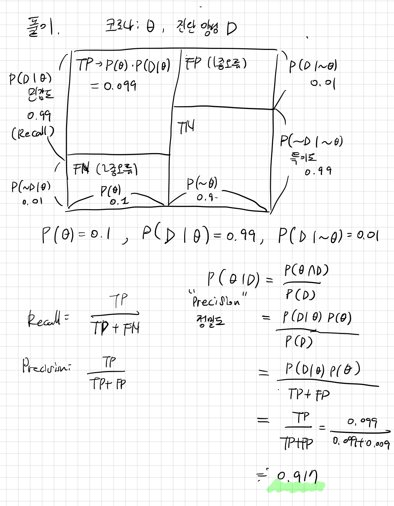

# 베이즈 정리 기초
## 조건부 확률이란?

$$P(B \vert A)$$ : 특정한 사건 A가 일어났을때 사건 B가 일어날 확률 

베이즈 정리를 이용하면, A라는 새로운 정보가 주어졌을때 이를 사전확률로 이용하여 P(B)로부터 P(B\|A)를 계산하는 방법을 제공한다. 

예측의 관점에서 베이즈 정리를 이용하게 되면, 어떤 사건이 일어날 확률을 계산할 때 다른 정보가 있다면 이를 토대로 더욱 구체적으로 예측할 수 있게 된다. 

## 베이즈 정리 예제 - 코로나바이러스
> 코로나의 발병률이 10%이고, 코로나에 실제로 걸렸을 때 검진될 확률이 99%, 실제로 걸리지 않았을 때 오검진될 확률이 1%라고 했을 때, 어떤 사람이 질병에 걸렸다고 검진결과가 나왔을 때 정말로 코로나에 감염되었을 확률은?

**베이즈 정리를 통한 정보의 갱신**
앞서 계산한 사후확률을 사전확률로 사용하여 갱신된 사후확률을 계산할 수 있다.

> 앞서 검진받았던 사람이 두 번째 검진을 받았을 때도 양성이 나왔을 때 정말로 코로나에 감염되었을 확률은?
