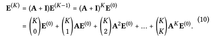

# 논문 정리 - LightGCN: Simplifying and Powering Graph Convolution Network for Recommendation

GCN을 더욱 추천에 적합하게 개선하고 경량화한 LightGCN 모델에 대한 논문을 읽고 정리하였습니다.

(오류 및 정정사항은 알려주시면 감사하겠습니다)

## Abstract
- Graph Convolution Network (GCN) 은 협업 필터링 (Collaborative Filtering, CF)에서 SOTA를 달성했지만 추천 효과의 이유는 잘 파악되지 않음
- 경험적으로 GCN에 있는 Feature transformation과 nonlinear activation 부분이 CF 성능에 오히려 악영향을 끼치는 것을 발견
- GCN을 더욱 간결하고 추천에 적합하게 절제(ablation)함 -> LightGCN 소개
- 임베딩에 대해 linear propagation + weighted sum 을 이용하여 성능 향상 이룸

## 1. Introduction
- 추천 시스템 : 유저가 특정 아이템과 상호작용하는지를 예측하는 것
- CF는 과거 유저-아이템 관계를 이용하여 예측을 수행. 이는 그래프의 관점에서, 유저당 인접 노드만 고려하는 one-hop subgraph만을 이용한 것이라 볼 수 있음.
- high-hop subgraph 를 이용하기 위해 GCN을 이용한 NGCF가 SOTA를 달성.GCN의 임베딩 방식을 그대로 사용함1. Feature Transformation   2. Neighborhood aggregation   3. Nonlinear activation
- GCN의 목적이 node classification이기 때문에 이 경우 보통 input feature가 풍부하지만,CF에서는 input feature이 유저 id밖에 없고 오히려 GCN이 학습이 잘 안되는 원인이 됨
- NGCF에 대해 본 연구에서 실험 결과 중요한 구조였던 feature transformation, nonlinear activation이 추천에서는 오히려 악영향을 끼침을 경험적으로 드러냄

## 2. Preliminaries
- NGCF 임베딩  

- Feature Transform, Non-linear activation 기능을 없애는 실험 -> 둘다 없애는게 성능 향상  

## 3. Method
### Graph Convolution
처음 임베딩  

   

첫 embedding layer를 input parameter로 가지며, 이후 임베딩은 모두 linear 하게 연결된다.  

### LightGCN 의 구조   

### self-connection
lgcn과 다르게 target node를 self-connection 하지 않는다. self-connection은 이후 서술할 layer combination operation에서 그 효과가 나타나기 때문. 이것이 대부분의 다른 graph convolution 기법들과의 차이점이라고 함.
    
### layer combination    
  
이후 임베딩 layer combination 과정을 거치게 되는데, 
NGCF가 각 임베딩 벡터를 concatenate 했다면 lightGCN은 단순 weighted sum으로 유저 및 아이템 임베딩을 나타내고 이를 이용하여 prediction하게 됨.
- 임베딩 layer을 다수로 하여 더 나중 layer이 smooth된 feature을 학습. layer들이 그래프의 다른 특징을 포괄적으로 학습하는 것을 유지
- Self-connection 효과

식에서의 alpha 값은 hyperparameter로 조정할 수 있음. 논문에서는 단순히 1/K+1로 설정함.

### Model Analysis
- Relation with Simplified GCN (SGCN)  
은 self-connection을 graph convolution 내로 통합시킨 모델. 마지막 layer 임베딩 부분이 LightGCN의 임베딩 weighted sum과 동일    

- connection with APPNP  
oversmoothing을 해결한 GCN 모델 계열 중 하나이며 LightGCN의 alpha를 조정함으로써 APPNP embedding을 표현 가능  

- LightGCN의 self-connection 역할과 oversmoothing 조정 기능을 SGCN과 APPNP와의 연관성을 통해 정당화함

### Second-order embedding smoothness

- LightGCN의 선형성과 간결함으로 인해 embedding smoothing이 어떻게 이루어지는지 볼 수 있음
- Second-order neighbor v가 u에 대해 미치는 영향  

    1) 같이 상호작용한 아이템 수가 많을수록 증가  

    2) 아이템이 상호작용한 연결성이 적을수록 증가(보다 개인화된 추천)  

    3) v에 상호작용한 아이템이 적을수록 증가  

## 4. Experiments

- LightGCN이 NGCF 대비 모든 실험 데이터에서 BPRLoss 및 NDCG@20, Recall@20에서 우위를 나타냄
- Mult-VAE, GRMF 등 당시 SOTA 들과 비교해 실험 데이터셋에서 이를 능가하는 성능을 보임

### Ablation and Effectiveness Analysis
- Layer combination을 쓰지 않았을 때 (마지막 레이어만 embedding에 활용했을 때) layer 2를 넘어가면서 성능이 급격히 저하 - high-order neighbor CF는 oversmoothing이 발생
- 반면 Layer combination 이용하면 layer 4까지 써도 성능 향상 or 유지 - layer combination 이용으로 oversmoothing 방지할 수 있음
- Amazon-Book 데이터 적용 시에는 LightGCN-single 이 우세함. 여기에서는 alpha parameter tuning으로 LightGCN 성능 개선 여지 가능성을 시사함

## 5. Related Work
- 추천에 활용되는 CF 및 Graph methods 모델에 대한 개략적 설명

## 6. Conclusion
- GCN에서 사용된 feature transformation, nonlinear activation을 제거하여 성능 향상
- LightGCN의 핵심: light graph convolution, layer combination
- weighted sum 을 이용한 layer combination을 통해 self-connection + prevent oversmoothing 
- 추천 시스템에서 해당 방법론을 발전시켜 그래프 이론의 추천시스템에서의 가능성 시사