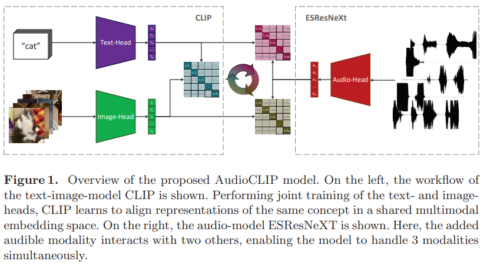

# AudioCLIP: Extending CLIP to Image, Text and Audio

AudioCLIP 논문 리뷰

[link](https://arxiv.org/pdf/2106.13043.pdf)

## Abstract
CLIP의 확장 버전으로써 텍스트, 이미지 뿐 아니라 오디오를 다룰 수 있는 AudioCLIP을 제안하는데, 오디오 모델인 ESResNeXt를 CLIP 프레임워크에 통합시켰다. 데이터셋은 AudioSet을 이용하였다. 이를 통해 bimodal, unimodal 분류 및 querying을 가능케 하면서 CLIP의 일반성을 살려 zero-shot 추론이 가능하게끔 하였다. 이를 통해 AudioCLIP은 ESC라고도 불리는 Environmental Sound Classification에서 SOTA를 달성하였고, ESC-task에서 새로운 zero-shot을 이용한 baseline을 정확도 68%로 설정하였다.  

## Introduction
오디오 분야에서 그동안의 연구는 오디오 그 자체의 모달리티 (정보 전달)에만 집중했는데, 최근에는 멀티모달 형태 (여러 정보 전달)로 오디오 관련 ai task가 이루어지고 있다. 이는 주로 text 혹은 visual 정보를 함께 전달해주는 방식으로 이루어진다. 

하지만 오디오에서 2개 이상의 모달리티를 결합하는 것은 많이 이루어지지 않았다. 또한 라벨링된 데이터가 많지 않아서 유니모달, 멀티모달 개발에 어려움이 있다. 이러한 데이터 부족으로 인해 zero / few-shot learning 접근에 대한 시도가 생겨났는데 이것은 text description을 이용한 contrastive learning을 기반으로 한다.

Contrastive learning이란?
: 데이터에 있는 패턴을 학습하기 위해 유사한 (양성) 예제와 비 유사한 (음성) 예제 사이의 차이점에 초점을 맞춰, 양성 샘플과 음성 샘플 사이의 차이를 극대화하는 방식으로 동작한다. 이러한 방식으로 모델은 같은 클래스의 샘플을 가까이, 다른 클래스의 샘플을 멀리하는 방향으로 학습하여 모델이 자연스럽게 데이터를 이해하는 데 도움을 줄 수 있다.

이 연구에서는 (성능이 높다고 주장하는) 저자의 오디오 모델인 ESResNeXt를 text-image 모델인 CLIP과 결합시켜 **tri-modal** 구조를 구현하였다. 훈련 결과, ESC에서 기존 모델 대비 우수한 성능을 보였고 오디오 분야에서 zero-shot 능력을 갖게끔 확장시켰으며, 또한 cross-modal querying을 텍스트, 이미지, 음성 중 어떠한 조합으로도 가능하게끔 하였다.

## Related Work
ESC는 알람시계, 자동차 경적, 고양이 울음소리 등 일상생활의 소리들을 적절히 라벨링하는 작업이다. 1D, 2D CNN이 raw audio의 시간-주파수 변환 작업에 이용되었는데, 1D-CNN은 해당 작업에만 특정된 구조가 적용된 반면 2D-CNN은 시각 도메인에서 가져온 형태가 도움이 됨을 보였지만 여기에선 sequential한 (순차적?) 방식으로 시각 정보가 적용되면서 한번에 한 모달리티만 적용될 수 있었다.   
여러 모달리티가 같이 적용되는 사례는 영상 관련 task에서 등장하였으며 이후 소리 분류에도 적용되었다. 하지만 bi-modal까지였고 더 많은 modality를 동시에 적용하는 것이 효과적일 것이란 연구가 등장했다. 이러한 연구들에서는 공통적으로 비교 학습 (Contrastive Learning) 을 통한 self-supervised learning을 통해 적은 라벨링 데이터를 극복할 수 있을 것으로 보았고, 그러한 방식으로 비교 학습이 zero-shot 분류에 적용될 것으로 기대했다.  
이와 연관지어 이 연구는 비교 학습을 텍스트, 시각, 오디오 모달리티에 적용하여 특정 모달리티에서의 분류 혹은 더 일반적으로 querying 및 zero-shot 추론에 적용할 수 있게 구성하였다.

## Model
ESResNeXt + ResNet-based CLIP 

### 1. CLIP
CLIP은 두 가지의 encoding heads (text / image) 로 두 subnetworks로 구성된다. 둘 모두 Natural language supervision으로 pre-trained 되고, 이를 통해 라벨을 제공해주면 추가적인 fine-tuning 없이 image 인식에 대한 일반화된 성능을 보인다.   
- text encoding 부분에서는 약간 수정된 Transformer가 이용되고 12-layer로 구성된 모델에서 input text가 49408의 길이를 갖는 형태로 표현된다. Sequence length는 76으로 제한되었다. 

- image encoding 부분에서는 Vision Transformer (ViT), 수정된 ResNet-50 이 두가지를 제안하고 있으며. 본 연구에서는 이 중 계산복잡도가 더 낮은 ResNet-based CLIP 을 이용하고 있다. 

두 CLIP-subnetwork에서는 input에서부터 embedding을 생성하고 이후 1024의 크기를 갖는 multimodal embedding 공간으로 선형 변환된다. 이 셋업에서 CLIP은 텍스트와 시각 표현의 코사인 유사도를 높이는 방향으로 학습하면서 동시에 symmetric cross entropy loss를 이용해 서로 다른 쌍의 유사도를 낮추는 방향으로 학습한다.

### 2. ESResNeXt
ResNeXt-50 을 기반으로 하였으며 훈련 가능한 시간-주파수 변환 기법을 이용한다. 30M개의 파라미터를 이용하여 학습하며 large-scale dataset인 AudioSet에서 competitive한 성능. 그리고 특정 데이터셋 UrbanSound8K, ESC-50에서 SOTA를 달성했다. 추가적으로 ESResNeXt는 multi-channel input의 implicit processing을 지원하면서, white Gaussian noise와 sample rate decrease 에 강건한 모델이다.

### 3. Hybrid Model - AudioCLIP
기존 Text, Image 를 갖는 CLIP을 더 발전시킨 모델로 Text, Image, 그리고 Audio-heads 세 개의 subnetwork를 갖는다. 기존의 CLIP이 text-to-image similarity loss를 갖는데, 본 모델에선 text-to-audio and image-to-audio similarity loss 를 추가했다 (3개의 modality를 가짐에 따른 이미지-오디오, 오디오-텍스트 조합이 새로 생겨나기 때문으로 보여진다). 세 조합 중 어떤 쌍을 이용하더라도 처리가 가능하다.

## Experimental Setup
사용한 데이터셋, 데이터 증강 방법, 훈련 과정과 하이퍼파라미터, 성능 검증 방법을 설명한다.  

### 1. Datasets

