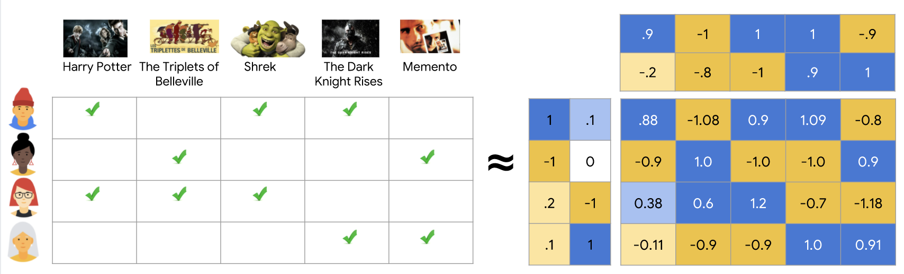
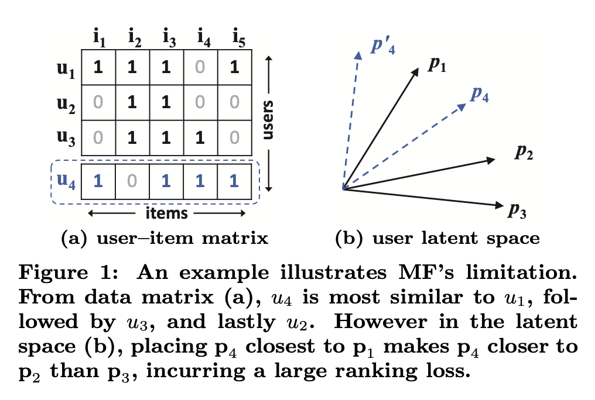
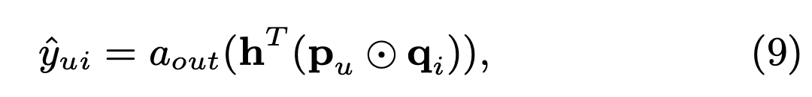
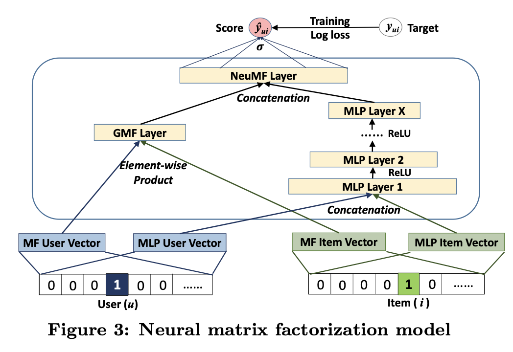

# Neural Collaborative Filtering

협업 필터링을 딥러닝 구조로써 제안한 NCF 논문에 대해 읽어보고 간단하게 정리하였습니다.

[link](https://arxiv.org/pdf/1708.05031.pdf)

## Abstract
추천 시스템에서의 핵심 과제인 협업 필터링을 Implicit feedback 데이터와 딥러닝을 활용하여 구축함. 기존 Matrix Factorization 의 단순 내적의 한계를 지적하고 이를 해결하기 위해 Neural network-based CF (NCF) 를 제안했으며, 이를 user-item implicit 데이터로 학습하여 당시의 SOTA를 달성함.

## 기존 내적 방식의 문제

Matrix Factorization은 유저와 아이템 사이의 상관관계를 유저 및 아이템 latent matrix의 곱으로 설명하는 방법이다. factorization 의미 자체가 (인수)분해를 의미하므로 '행렬 분해'로 이해하면 되겠다. matrix 를 나누는 방법에는 SVD (특이값 분해) 알고리즘이나 경사하강법으로 loss를 줄이도록 하여 latent matrix 를 만들어가는 방식이 있다. 

MF 방식은 latent 공간에 유저 및 아이템의 정보가 담기는 것인데, 다음과 같은 이유로 정보 학습이 잘 이루어지지 않을 수 있다.

자카드 유사도로 나타내면
s23(0.66) > s12(0.5) > s13(0.4) 이지만, 
u4 데이터를 보면 s41(0.6) > s43(0.4) > s42(0.2) 이다. Figure 1b를 보면 유저 latent space에서는 서로간의 유사성을 올바르게 측정할 수 없게 된다는 것을 알 수 있다.

이렇게 단순 내적으로 user-item 상관관계를 올바르게 표현하기 힘드므로 DNN을 통한 방식을 제안하였다.

## Generalized MF (GMF)

하나의 layer 로 위와 같은 식을 구성할 때, a_out이 identity 함수 그리고 h_T가 1로 구성된 단위벡터면 단순 내적이 되므로 통상적인 MF가 된다. 따라서 a_out이 비선형 함수 그리고 h_T를 학습시킴으로써 일반화된 형태의 학습가능한 MF 를 생성할 수 있게 된다.

## Multi-Layer Perceptron (MLP)
GMF 에서는 element-wise product 로 고정된 크기를 갖지만, 더 유연성을 주고 비선형성 학습을 가능하게 하기 위해 layer 를 쌓은 MLP 구조도 제안함.

결론적으로 이 논문에서는 GMF와 MLP를 합친 방식의 구조를 NeuMF 로 제안했다.

## 훈련 및 결과
Adam으로 GMF와 MLP를 각각 따로 pretrain 시키고, 두 모델을 합친 전체 구조의 학습을 vanilla SGD 로 진행함.

MovieLens-1M 및 Pinterest 데이터로 학습 진행한 결과 타 모델 대비 NDCG 및 Hit Rate 에서 높은 성능을 보임. 그리고 비선형 Layer을 많이 쌓을 수록 더 학습이 잘 되었다고 함 (선형 layer 학습의 부진으로 설명하였다.)

결론적으로, NeuMF 를 통해 추천 모델에서 단순 부가정보를 딥러닝을 통해 학습한 것이 아닌 핵심 MF 를 신경망으로 구현하여 SOTA 를 달성하였고 딥러닝이 핵심이 되는 추천 방식을 제안하는 의의를 가진 논문이라 볼 수 있다.
